#CUDA入门简要说明
CUDA是一种专门为提高并发程序开发效率而设计的计算架构。在构建高性能应用程序时，CUDA架构能充分发挥GPU的强大计算功能。
CUDA架构专门为GPU计算设计了一种全新的结构，目的是为了减轻GPU计算模型中的这些限制。在CUDA架构下，开发人员可以通过CUDA C对GPU编程。CUDA C是对标准C的一种简单扩展，学习和使用起来非常容易，并且其最大的优势在于不需要开发人员具备图形学知识。

# 第一章：为什么需要CUDA
- 专业名称：
    - 并行计算(Parallel Computing)
    - 多核革命(Multicore Revolution)
    - 图像处理器(Graphics Processing Unit,GPU)
    - 像素着色器(Pixel Shader)
    
- 学习目标：
    - 了解并行计算正在发挥越来越重要的作用
    - 了解GPU计算和CUDA的发展历程
    - 了解一些通过使用CUDA C而获得成功的应用程序

- CUDA架构是什么
    - CUDA架构包含了一个统一的着色器流水线，使得执行通用计算的程序能够对芯片上的每个数学逻辑单元(Arithmetic Logic Unit,ALU)进行排列。 
    - 由干NVIDIA希望使新的图形处理器能适用于通用计算，因此在实现这些ALU时都确保它们满足IEEE单精度数学运算的需求，
    并且可以使用一个裁剪后的指令集来执行通用计算，而不是仪限于执行图形计算。
    - 此外，GPU上的执行单元不仅能任意地读/写内存，同时还能访问由软件管理的缓存，也称为共享内存。
    - CUDA架构的所有这些功能都是为了使GPU不仅能执行传统的图形计算，还能高效地执行通用计算。

- CUDA的应用
    - 医学图像
    - 计算流体动力学
    - 环境科学

- 本章小结
    -  在学习CUDA C 时，你不需要具备OpenGL或者DirectX的知识，也不需要了解计算机图形学的背景。

# 第二章：入门

- 本章目标：
    - 下载所需的各种软件
    - 配置好编译CUDA C 代码的环境 

- 开发环境
    - 支持CUDA的图形处理器
    - NVIDIA设备驱动程序
    - CUDA开发工具箱(获得一个编译GPU代码的编译器)
    - 标准C编译器   

- 本章小结
    - 准备好CUDA C 的开发环境 

# 第三章：CUDA C简介

- 本章目标：
    - 编写第一段CUDA C 代码
    - 了解为主机(Host)编写的代码与为设备(Device)编写的代码之间的区别。
    - 如何从主机上运行设备代码。
    - 了解如何在支持CUDA的设备上使用设备内存。
    - 了解如何查询系统中支持CUDA的设备的信息。

- 第一个程序
    - 我们将CPU以及系统的内存称为主机，而将GPU及其内存称为设备，在GPU设备上执行的函数通常称为核函数(Kernel)。
    
    - 核函数调用
        - add是核函数，并带有修饰符**__global__**。
        - 对这个核函数的调用，带有修饰字符<<<1,1>>>。 
        - 代码默认是由系统的标准C编译器来编译，NVIDIA工具只是将代码交给主机编译器。
        - 现在我们看到，CUDA C为标准C增加的**__global__**修饰符，这个修饰符告诉编译器，函数应该编译为在设备而不是主机上运行。
        - 尖括号表示要将一些参数传递给运行时系统。这些参数并不是传递给设备代码的参数，而是告诉运行时如何启动设备代码。

    - 传递参数
        - 可以像调用C函数那样将参数传递给核函数。
        - 当设备执行任何有用的操作时，都需要分配内存，例如将计算值返回给主机。
        - CUDA C的简单性及其强大的功能在很大程度上都来源于它淡化来了主机代码和设备代码之间的差异。然而，程序员一定不要在主机代码中对cudaMalloc()返回的指针进行解引用(Dereference)
        - 主机代码可以将这个指针作为参数传递，对其执行算术运算，甚至可以将其转换为另一种不同的类型。但是，绝对不可以使用这个指针来读取或者写入内存。
        - 设备指针的使用限制如下：
            - 可以将cudaMalloc()分配的指针传递给在设备上执行的函数。
            - 可以在设备代码中使用cudaMalloc()分配的指针进行内存读/写操作。
            - 可以将cudaMalloc()分配的指针传递给在主机上执行的函数。 
            - 不能在主机代码中使用cudaMalloc()分配的指针进行内存读/写操作。
            - 要释放cudaMalloc()分配的内存，需要调用cudaFree()。
            - 主机指针只能访问主机代码中的内存，而设备指针只能访问设备代码中的内存。
            - 在主机代码中可以通过调用cudaMemcpy()来访问设备上的内存，这个函数调用的行为类似于标谁C中的memcpy()，只不过多了一个参数来指定设备内存指针究竟是源指针还是目标指针。
            - 在下面的实例中，cudaMemcpy()的最后一个参数为cudaMemcpyDeviceToHost，这个参数告诉运行时源指针是一个设备指针，而目标指针是一个主机指针。
            - 显然，cudaMemcpyHostToDevice将告诉运行时相反的含义。
            - 此外还可以通过传递参数cudaMemcpyDeviceToDevice来告诉运行时这两个指针都是位于设备上。
            - 如果源指针和目标指针都位于主机上，那么可以直接调用标谁C的memcpy()函数。
```c++
#include <iostream>
#include "book.h"
__global__ void add(int a, int b, int *c) {
    *c = a + b;
}

int main( void ) {
    int c;
    int *dev_c;
    HANDLE_ERROR( cudaMalloc((void**)&dev_c, sizeof(int)));

    add <<<1,1>>> (2, 7, dev_c);
    HANDLE_ERROR( cudaMemcpy( &c,
                              dev_c,
                              sizeof(int),
                              cudaMemcpyDeviceToHost));
    printf("2 + 7 = %d\n",c);
    cudaFree(dev_c);
    return 0;
}
```

- 查询设备
    - 知道设备拥有多少内存以及具备哪些功能。
    - 在拥有多个支持CUDA的设备上，确定使用的是哪一个处理器。
    - cudaGetDeviceCount()。调用cudaGetDeviceCount()后，可以对每个设备进行迭代，并查询各个设备的相关信息。CUOA运行时将返回一个cudaDeviceProp类型的结构，其中包含了设备的相关属性。
```c++
#include "../common/book.h"

int main(void)
{
    cudaDeviceProp prop;

    int count;
    HANDLE_ERROR(cudaGetDeviceCount(&count));
    for (int i = 0; i < count; i++) {
        HANDLE_ERROR(cudaGetDeviceProperties(&prop, i));
        printf("   --- General Information for device %d ---\n", i);
        printf("Name:  %s\n", prop.name);
        printf("Compute capability:  %d.%d\n", prop.major, prop.minor);
        printf("Clock rate:  %d\n", prop.clockRate);
        printf("Device copy overlap:  ");
        if (prop.deviceOverlap)
            printf("Enabled\n");
        else
            printf("Disabled\n");

        printf("Kernel execution timeout :  ");
        if (prop.kernelExecTimeoutEnabled)
            printf("Enabled\n");
        else
            printf("Disabled\n");

        printf("   --- Memory Information for device %d ---\n", i);
        printf("Total global mem:  %ld\n", prop.totalGlobalMem);
        printf("Total constant Mem:  %ld\n", prop.totalConstMem);
        printf("Max mem pitch:  %ld\n", prop.memPitch);
        printf("Texture Alignment:  %ld\n", prop.textureAlignment);

        printf("   --- MP Information for device %d ---\n", i);
        printf("Multiprocessor count:  %d\n",
            prop.multiProcessorCount);
        printf("Shared mem per mp:  %ld\n", prop.sharedMemPerBlock);
        printf("Registers per mp:  %d\n", prop.regsPerBlock);
        printf("Threads in warp:  %d\n", prop.warpSize);
        printf("Max threads per block:  %d\n",
            prop.maxThreadsPerBlock);
        printf("Max thread dimensions:  (%d, %d, %d)\n",
            prop.maxThreadsDim[0], prop.maxThreadsDim[1],
            prop.maxThreadsDim[2]);
        printf("Max grid dimensions:  (%d, %d, %d)\n",
            prop.maxGridSize[0], prop.maxGridSize[1],
            prop.maxGridSize[2]);
        printf("\n");
    }
}           
```

- 设备属性的使用
    -  首先找到我们希塑设备拥有的属性并将这些属性填充到一个cudaDeviceProp结构。
    -  在填充完cudaDeviceProp结构后，将其传递给cudaChooseDevice()，这样CUDA运行时将查找是否存在某个设备满足这些条件。
    -  cudaChooseDevice()函数将返回一个设备ID，然后我们可以将这个ID传递给cudaSetDevice()。
    -  随后，所有的设备操作都将在这个设备上执行。
```c++
#include "../common/book.h"

int main(void)
{
    cudaDeviceProp prop;
    int dev;

    HANDLE_ERROR(cudaGetDevice(&dev));
    printf(" ID of current CUDA device: %d\n", dev);

    memset(&prop, 0, sizeof(cudaDeviceProp));
    prop.major = 1;
    prop.minor = 3;
    HANDLE_ERROR(cudaChooseDevice(&dev, &prop));
    printf("ID of CUDA device closest to revision 1.3: %d\n", dev);
    HANDLE_ERROR(cudaSetDevice(dev));
}
```

- 本章小结
从本质上讲，CUDA C 只是对 标准C 进行了语言级的扩展，通过增加一些修饰符使我们可以指定哪些代码在设备上运行，以及哪些代码在主机上运行。在函数前面添加关键字**__global__**将告诉编译器把该函数放在CPU上运行。为了使用GPU的专门内存，我们还学习了与C的malloc()，memcpy()，和free()等API对应的CUDA API。这些函数的CUDA版本，包括cudaMalloc()，
cudaMemcpy()以及cudaFree()，分贝实现了分配设备内存，在设备和主机之间复制数据，以及释放内存等功能。


# 第四章：CUDA C并行编程

## 本章目标
- 了解CUDA在实现并行性时采用的一种重要方式。
- 用CUDA C编写第一段并行代码。

## CUDA并行编程
- 矢量求和运算
    - 基于CPU的矢量求和
    - 基于GPU的矢量求和
- 一个有趣的例子
    - 基于CPU的Julia集
    - 基于GPU的Julia集      

```c
// 基于CPU的矢量求和
#include "../commmon/book.h"

#define N 10
void add(int *a, int *b, int *c) {
    int tid = 0; // 这是第0个cpu，因此索引从0开始
    while(tid < N) {
        c[tid] = a[tid] + b[tid];
        tid += 1; // 由于只有一个CPU，因此每次递增1
    }
}

int main( void ) {
    int a[N], b[N], c[N];
    // 在CPU上为数组'a' 和 'b'赋值
    for (int i = 0; i < N; i++) {
        a[i] = -i;
        b[i] = i*i;
    }

    add(a, b, c);
    // 显示结果
    for (int i = 0; int < N; i++) {
        printf("%d + %d = %d\n",a[1], b[1], c[i]);
    }
    return 0;
}
```

```c
// 基于GPU的矢量求和
#include "../common/book.h"

#define N 10

__global__ void add( int *a, int *b, int *c) {
    int tid = blockIdx.x; // 计算该索引处的数据 blockIdx不需要定义，是一个内置变量
    if(tid < N)
        c[tid] = a[tid] + b[tid];
}

int main( void ) {
    int a[N], b[N], c[N];
    int *dev_a, *dev_b, *dev_c;

    // 在GPU上分配内存
    HANDLE_ERROR( cudaMalloc( (void**)&dev_a, N*sizeof(int)));
    HANDLE_ERROR( cudaMalloc( (void**)&dev_b, N*sizeof(int)));
    HANDLE_ERROR( cudaMalloc( (void**)&dev_b, N*sizeof(int)));

    //在CPU上为数组'a'和'b'赋值
    for (int i = 0; i < N; i++) {
        a[i] = -i;
        b[i] = i*i;
    }
    // 将数组'a'和'b'复制到GPU
    HANDLE_ERROR( cudaMemcpy( dev_a, a, N*sizeof(int),cudaMemcpyHostToDevice));
    HANDLE_ERROR( cudaMemcpy( dev_a, a, N*sizeof(int),cudaMemcpyHostToDevice));

    add <<<N,1>>> ( dev_a, dev_b, dev_c ); // 尖括号第一个参数表示设备在执行核函数时使用的并行线程块的数量；在这个示例中，指定这个参数为N

    // 将数组'c'从GPU复制到CPU
    HANDLE_ERROR(cudaMemcpy(c, dev_c , N*sizeof(int), cudaMemcpyDeviceToHost));

    // 显示结果
    for (int i = 0; i < N; i++) {
        printf( "%d + %d = %d\n", a[i],b[i],c[i] );
    }

    // 释放在GPU上分配的内存
    cudaFree( dev_a );
    cudaFree( dev_a );
    cudaFree( dev_a );

    return 0;
}
```

```c
// 基于CPU的Julia集
struct cuComplex {
    float r;
    float i;
    cuComplex(float a, float b): r(a), i(b) {}
    float magnitude2(void) {return r*r + i*i;}
    cuComplex operator* (const cuComplex& a) {
        return cuComplex(r*a.r - i*a.i, i*a.i + r*a.i);
    }
    cuComplex operator+ (const cuComplex& a) {
        return cuComplex(r+a.r, i+a.i);
    }
}

int julia ( int x, int y) {
    const float scale = 1.5;
    const jx = scale * (float)(DIM/2-x)/(DIM/2);
    const jy = scale * (float)(DIM/2-y)/(DIM/2);
    cuComplex c(-0.8, 0.156);
    cuComplex a(jx, jy);

    int i = 0;
    for (i = 0; i < 200; i++) {
        a = a*a + c;
        if (a.magnitude2()> 1000)
            return 0;
    }
    return 1;
}

void kernel( unsigned char *ptr) {
    for (int y = 0; y < DIM; y++) {
        for (int x = 0; x < DIM; x++) {
            int offset = x + y*DIM;

            int juliaValue = julia( x, y);
            ptr[offset*4 + 0] = 255 * juliaValue;
            ptr[offset*4 + 1] = 0;
            ptr[offset*4 + 2] = 0;
            ptr[offset*4 + 3] = 255;
        }
    }
}
int main( void ) {
    CPUBitmap bitmap( DIM, DIM );
    unsigned char *ptr = bitmap.get_ptr();

    kernel( ptr );
    bitmap.display_and_exit();
}
```

```c
// 基于GPU的Julia集
#include "../common/book.h"
#include "../common/cpu_bitmap.h"

#define DIM 1000
struct cuComplex {
    float r;
    float i;
    cuComplex (float a, float b): r(a),i(b) {}
    __device__ float magnitude2( void ) {
        return r*r + i*i;
    }

    __device__ cuComplex operator*(const cuComplex& a) {
        return cuComplex(r*a.r - i*a.i, i*a.r + r*a.i);
    }

    __device__ cuComplex operator+(const cuComplex& a) {
        return cuComplex(r+a.r, i+a.i);
    }
};

__device__ int julia(int x, int y) {
    const float scale = 1.5;
    float jx = scale * (float)(DIM/2 - x)/(DIM/2);
    float jy = scale * (float)(DIM/2 - y)/(DIM/2);

    cuComplex c(-0.8, 0.156);
    cuComplex a(jx, jy);

    int i = 0;
    for (i=0; i<200; i++) {
        a = a*a + c;
        if (a.magnitude2() > 1000) 
            return 0;
    }
    return 1;
}

__global__ void kernel (unsigned char *ptr) {
    // 将threadIdx/BlockIdx映射到像素位置
    int x = blockIdx.x;
    int y = blockIdx.y;
    int offset = x + y*gridDim.x;
} 
```

- 基本概念

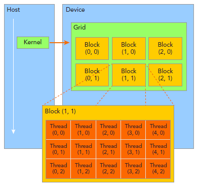

由一个单独的kernel启动的所有线程组成一个grid，grid中所有线程共享global memory。一个grid由许多block组成，block由许多线程组成，grid和block都可以是一维二维或者三维，上图是一个二维grid和二维block。

- 这里介绍几个CUDA内置变量：
    - blockIdx：block的索引，blockIdx.x表示block的x坐标。
    - threadIdx：线程索引，同理blockIdx。
    - blockDim：block维度，上图中blockDim.x=5.
    - gridDim：grid维度，同理blockDim。
一般会把grid组织成2D，block为3D。grid和block都使用dim3作为声明，例如：
dim3 block(3);
dim3 grid((nElem+block.x-1)/block.x);
需要注意的是，dim3仅为host端可见，其对应的device端类型为uint3。

- 启动CUDA Kernel，CUDA kernel的调用格式为：
    - kernel_name<<<grid, block>>>(argument list);
    - 其中grid和block即为上文中介绍的类型为dim3的变量。通过这两个变量可以配置一个kernel的线程总和，以及线程的组织形式。例如：
    - kernel_name<<<4, 8>>>(argumentt list);
    - 该行代码表明有grid为一维，有4个block，block为一维，每个block有8个线程，故此共有4*8=32个线程。
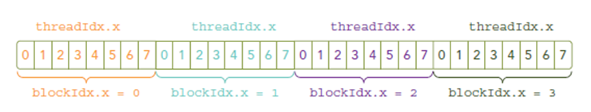

- 一些基本的描述：
    - gridDim.x-线程网络X维度上线程块的数量
    - gridDim.y-线程网络Y维度上线程块的数量
    - blockDim.x-一个线程块X维度上的线程数量
    - blockDim.y-一个线程块Y维度上的线程数量
    - blockIdx.x-线程网络X维度上的线程块索引
    - blockIdx.y-线程网络Y维度上的线程块索引
    - threadIdx.x-线程块X维度上的线程索引
    - threadIdx.y-线程块Y维度上的线程索引

- 线程索引
    - 一般，一个矩阵以线性存储在global memory中的，并以行来实现线性：
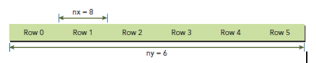

- 在kernel里，线程的唯一索引非常有用，为了确定一个线程的索引，我们以2D为例：
    - 线程和block索引
    - 矩阵中元素坐标
    - 线性global memory 的偏移 

- 首先可以将thread和block索引映射到矩阵坐标：
    - ix = threadIdx.x + blockIdx.x * blockDim.x
    - iy = threadIdx.y + blockIdx.y * blockDim.y

- 之后可以利用上述变量计算线性地址：
    - idx = iy * nx + ix

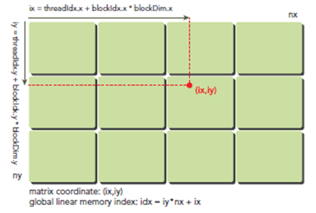

上图展示了block和thread索引，矩阵坐标以及线性地址之间的关系，谨记，相邻的thread拥有连续的threadIdx.x，也就是索引为(0,0)(1,0)(2,0)(3,0)...的thread连续，而不是(0,0)(0,1)(0,2)(0,3)...连续，跟我们线代里玩矩阵的时候不一样。

- 现在可以验证出下面的关系：
    - thread_id（2,1）block_id（1,0） coordinate（6,1） global index 14 ival 14

- 下图显示了三者之间的关系：

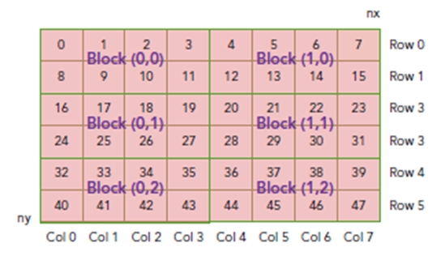


# 第五章：线程协作
在并行执行的CUDA C代码段之间实现通信和协作

## 本章目标
- 了解CUDA C中的线程
- 了解不同线程之间的通信机制
- 了解并行执行线程的同步机制 

## 并行线程块的分解 
- add <<<N,1>>>(dev_a, dev_b, dev_c);
- 在尖括号中，第二个参数表示CUDA运行时在每个线程块中创建的线程数量。上面这行代码表示在每个线程块中只启动一个线程。
- 总共启动的线程数量可按以下公式计算：N个线程块 x 1个线程/线程块 = N个并行线程
- GPU上的矢量求和由并行线程块改为并行线程
    - add<<<N,1>>>(dev_a, dev_b, dev_c); ------> add<<<1,N>>>(dev_a, dev_b, dev_c);
    - int tid = blockIdx.x; ------> int tid = threadIdx.x; 

```c++
#include "../common/book.h"

#define N 10

__global__ void add(int *a, int *b, int *c) {
    int tid = threadIdx.x;
    if (tid < N)
        c[tid] = a[tid] + b[tid];
}

int main( void ) {
    int a[N], b[N], c[N];
    int *dev_a, *dev_b, *dev_c;

    // 在GPU上分配内存
    HANDLE_ERROR( cudaMalloc( ( void** )&dev_a, N*sizeof(int) ) );
    HANDLE_ERROR( cudaMalloc( ( void** )&dev_b, N*sizeof(int) ) );
    HANDLE_ERROR( cudaMalloc( ( void** )&dev_c, N*sizeof(int) ) );

    // 在CPU上为数组'a'和'b'赋值
    for (int i = 0; i < N; i++) {
        a[i] = i;
        b[i] = i*i;
    }

    // 将数组'a'和'b'复制到GPU
    HANDLE_ERROR( cudaMemcpy(dev_a,
                            a,
                            N*sizeof(int),
                            cudaMemcpyHostToDevice));

    HANDLE_ERROR( cudaMemcpy(dev_b,
                            b,
                            N*sizeof(int),
                            cudaMemcpyHostToDevice));

    add<<<1,N>>>(dev_a, dev_b, dev_c);

    // 将数组'c'从GPU复制到cpu
    HANDLE_ERROR( cudaMemcpy(dev_b,
                            b,
                            N*sizeof(int),
                            cudaMemcpyDeviceToHost));

    // 显示结果
    for (int i = 0; i < N; i++) {
        printf(" %d + %d = %d \n ", a[i], b[i], c[i]);
    }

    // 释放在GPU上分配的内存
    cudaFree( dev_a );
    cudaFree( dev_b );
    cudaFree( dev_c );

    return 0;
}

```

- 在GPU上对更长的矢量求和(线程数不够)
    - 需要多个线程块并且每个线程块中包含了多个线程
    - 对上述代码改动两个地方：
        - 核函数中索引计算方法------> int tid = threadIdx.x + blockIdx.x*blockDim.x;  
        - 核函数的调用方式------> add<<< (N+127)/128 ,128 >>>( dev_a, dev_b, dev_c);(我们选择了每个线程块拥有128个线程)

    - 在上面的赋值语句中使用了一个新的内置变量，blockDim。对所有线程块来说，这个变量是一个常数，保存的是线程块中每一维的线程数量。由于使用的是一维线程块，因此只需要用到blockDim.x。回顾第四章的内容，在gridDim中保存了一个类似的值，即在线程格中每一维的线程块数量。此外，gridDim是二维的，而blockDim实际上是三维的。也就是说，**CUDA运行时允许启动一个二维线程格，并且线程格中的每个线程块都是一个三维的线程数组**。

```c++
#include "../common/book.h"
#define N (33*1024)

__global__ void add(int *a, int *b, int *c) {
    int tid = threadIdx.x + blockIdx.x * blockDim.x;
    while (tid < N) {
            c[tid] = a[tid] + b[tid];
            tid += blockDim.x + gridDim.x; // 加一次线程总数
        }
}

int main( void ) {
    int a[N], b[N], c[N];
    int *dev_a, *dev_b, *dev_c;

    // 在GPU上分配内存
    HANDLE_ERROR( cudaMalloc( (void**)&dev_a, N * sizeof( int )));
    HANDLE_ERROR( cudaMalloc( (void**)&dev_b, N * sizeof( int )));
    HANDLE_ERROR( cudaMalloc( (void**)&dev_c, N * sizeof( int )));

    // 在CPU上为数组'a'和'b'赋值
    for (int i = 0; i < N; i++) {
        a[i] = i;
        b[i] = i*i;
    }

    // 将数组'a'和'b'赋值到GPU
    HANDLE_ERROR( cudaMemcpy( dev_a,
                              a,
                              N*sizeof(int),
                              cudaMemcpyHostToDevice ));

    HANDLE_ERROR( cudaMemcpy( dev_b,
                              b,
                              N*sizeof(int),
                              cudaMemcpyHostToDevice ));

    add<<<128, 128>>>(dev_a, dev_b, dev_c);

    HANDLE_ERROR( cudaMemcpy( dev_b,
                              b,
                              N*sizeof(int),
                              cudaMemcpyDeviceToHost ));

    // 验证GPU确实完成了我们要求的工作
    bool success = true;
    for ( int i = 0; i < N; i++) {
        if ((a[i] + b[i]) != c[i]) {
            printf( "Error: %d + %d != %d\n",a[i], b[i], c[i]);
            success = false;
        }
    }

    if (success) printf( "We did it!\n" );

    // 释放在GPU上分配的内存
    cudaFree( dev_a );
    cudaFree( dev_b );
    cudaFree( dev_c );
}
```

- 在GPU上使用线程实现纹波效果
```c++
struct DataBlock {
    unsigned char *dev_bitmap;
    CPUAnimBitmap *bitmap;
}

// 释放在GPU上分配的内存
void cleanup( DataBlock *d ) {
    cudaFree( d->dev_bitmap );
}

__global__ void kernel( unsigned char *ptr, int ticks ) {
    // 将threadIdx/BlockIdx映射到像素位置
    int x = threadIdx.x + blockIdx.x * blockDim.x;
    int y = threadIdx.y + blockIdx.y * blockDim.y;
    int offset = x + y * blockDim.x * gridDim.x;

    // 现在计算这个位置上的位置
    float fx = x - DIM/2;
    float fy = y - DIM/2;
    float d = sqrtf( fx*fx+fy*fy );
    unsigned chhar grey = (unsigned char)(128.0f + 127.0f * cos(d/10.0f - ticks/7.0f)/(d/10.0f + 1.0f));
    ptr[offset*4 + 0] = grey;
    ptr[offset*4 + 1] = grey;
    ptr[offset*4 + 2] = grey;
    ptr[offset*4 + 3] = 255;

}
void generate_frame( DataBlock *d, int ticks) {
    dim3 blocks(DIM/16, DIM/16);
    dim3 threads(16, 16);
    kernel<<<blocks,threads>>>(d->dev_bitmap, ticks);
    HANDLE_ERROR( cudaMemcpy( d->bitmap->get_ptr(),
                              d->dev_bitmap,
                              d->bitmap->image_size(),
                              cudaMemcpyDeviceToHost ));
}

int main( void ) {
    DataBlock data;
    CPUAnimBitmap bitmap(DIM, DIM, &data);
    data.bitmap = &bitmap;
    HANDLE_ERROR( cudaMalloc( (void**)&data.dev_bitmap, bitmap.image_size()));

    bitmap.anim_and_exit( ( void (*) (void*, int))generate_frame,(void(*)(void*))cleanup );
}
```

## 共享内存和同步
CUDA C编译器对共享内存中的变量与普通变量将采取不同的处理方式。对于在GPU上启动的每个线程块，CUDA C编译器都将创建该变量的一个副本。线程块中的每个线程都共享这块内存，但线程却无法看到也不能修改其他线程的变量副本。这就实现了一种非常好的方式，使得一个线程块中的多个线程能够在计算上进行通信和协作。而且，共享内存缓冲区驻留在物理GPU上，而不是驻留在GPU之外的系统内存中，因此，在访问共享内存时的延迟要远远低于访问普通缓冲区的延迟，使得共享内存像每个线程块的高速缓存或者中间结果暂存器那样高效。

线程之间相互通信的功能或许已经令你很兴奋了，这个功能同样也使我们感到兴奋。但世上没有免费的东西，线程间的通信也不例外。如果想要在线程之间进行通信，那么还需要一种机制来实现线程之间的同步。例如，如果线程A将一个值写人到共享内存，井且我们希望线程$对这个值进行一些操作，那么只有当线程A的写入操作完成之后，线程B才能开始执行它的操作口如果没有同步，那么将发生竞态条件(Race Condition )，在这种情况下，代码执行结果的正确性将取决于硬件的不确定性。

- 点积运算
```c++
#include "../common/book.h"

#define imin(a, b) (a < b ? a : b)

const int N = 33 * 1024;
const int threadsPerBlock = 256; // 每个线程块中的线程数
const int blocksPerGrid = imin(32, (N + threadsPerBlock - 1) / threadsPerBlock); // 每个Grid中的线程块数，这里为32

__global__ void dot(float* a, float* b, float* c)
{
    __shared__ float cache[threadsPerBlock]; // 每个线程块内所有线程共享一个cache 
    int tid = threadIdx.x + blockIdx.x * blockDim.x;
    int cacheIndex = threadIdx.x;

    float temp = 0;
    // |||||||||||||||| * |||||||||||||||| * |||||||||||||||| * ||||||||||||||||
    // x0*y0+x64*y64
    while (tid < N) {
        temp += a[tid] * b[tid];
        tid += blockDim.x * gridDim.x;
    }

    // set the cache values
    cache[cacheIndex] = temp;

    // synchronize threads in this block
    __syncthreads();

    // for reductions, threadsPerBlock must be a power of 2
    // because of the following code
    int i = blockDim.x / 2;
    while (i != 0) {
        if (cacheIndex < i)
            cache[cacheIndex] += cache[cacheIndex + i];
        __syncthreads();
        i /= 2;
    }

    if (cacheIndex == 0)
        c[blockIdx.x] = cache[0];
}

int main(void)
{
    float *a, *b, c, *partial_c;
    float *dev_a, *dev_b, *dev_partial_c;

    // allocate memory on the cpu side
    a = (float*)malloc(N * sizeof(float));
    b = (float*)malloc(N * sizeof(float));
    partial_c = (float*)malloc(blocksPerGrid * sizeof(float));

    // allocate the memory on the GPU
    HANDLE_ERROR(cudaMalloc((void**)&dev_a,
        N * sizeof(float)));
    HANDLE_ERROR(cudaMalloc((void**)&dev_b,
        N * sizeof(float)));
    HANDLE_ERROR(cudaMalloc((void**)&dev_partial_c,
        blocksPerGrid * sizeof(float)));

    // fill in the host memory with data
    for (int i = 0; i < N; i++) {
        a[i] = i;
        b[i] = i * 2;
    }

    // copy the arrays 'a' and 'b' to the GPU
    HANDLE_ERROR(cudaMemcpy(dev_a, a, N * sizeof(float),
        cudaMemcpyHostToDevice));
    HANDLE_ERROR(cudaMemcpy(dev_b, b, N * sizeof(float),
        cudaMemcpyHostToDevice));

    dot<<<blocksPerGrid, threadsPerBlock>>>(dev_a, dev_b,
        dev_partial_c);

    // copy the array 'c' back from the GPU to the CPU
    HANDLE_ERROR(cudaMemcpy(partial_c, dev_partial_c,
        blocksPerGrid * sizeof(float),
        cudaMemcpyDeviceToHost));

    // finish up on the CPU side
    c = 0;
    for (int i = 0; i < blocksPerGrid; i++) {
        c += partial_c[i];
    }

#define sum_squares(x) (x * (x + 1) * (2 * x + 1) / 6)
    printf("Does GPU value %.6g = %.6g?\n", c,
        2 * sum_squares((float)(N - 1)));

    // free memory on the gpu side
    HANDLE_ERROR(cudaFree(dev_a));
    HANDLE_ERROR(cudaFree(dev_b));
    HANDLE_ERROR(cudaFree(dev_partial_c));

    // free memory on the cpu side
    free(a);
    free(b);
    free(partial_c);
}
```


- （不正确的）点积运算优化
在__syncthreads()情况中，线程发散(Thread Divergence)造成的结果有些槽糕。CUDA架构将确保，除非线程块中的每个线程都执行了_synrthreads(),否则没有任何线程能执行__syncthreads()之后的指令。遗憾的是，如果__syncthreads()位于发散分支中，那么一些线程将永远都无法执行__synrthreads()。因此，由于**要确保在每个线程执行完__syncthreads()后才能执行后面的语句**，因此硬件将使这些线程保持等待。一直等，一直等，永久地等待下去。
如果在点积运算示例中将__syncthreads()调入到if()线程块中，那么任何cacheIndex大于或等于i的线程将永远都不能执行__syncthreads()。这将使处理器挂起，因为GPU在等待某个永远都不会发生的事件。
```c++
int i = blockDim.x / 2;
while (i != 0) {
    if (cacheIndex < i)
        cache[cacheIndex] += cache[cacheIndex + i];
    __syncthreads();
    i /= 2;
}
```
上述内容是为了说明，虽然__syncthreads()是一种强大的机制，它能确保大规模并行应用程序计算出正确的结果，但由于可能会出现意想不到的结果，我们在使用它时仍然要小心谨慎。

- 基于共享内存的位图
```c++
#include "../common/book.h"
#include "../common/cpu_bitmap.h"
#include "cuda.h"

#define DIM 1024
#define PI 3.1415926535897932f

__global__ void kernel(unsigned char* ptr)
{
    // map from threadIdx/BlockIdx to pixel position
    int x = threadIdx.x + blockIdx.x * blockDim.x;
    int y = threadIdx.y + blockIdx.y * blockDim.y;
    int offset = x + y * blockDim.x * gridDim.x;

    __shared__ float shared[16][16];

    // now calculate the value at that position
    const float period = 128.0f;

    shared[threadIdx.x][threadIdx.y] = 255 * (sinf(x * 2.0f * PI / period) + 1.0f) * (sinf(y * 2.0f * PI / period) + 1.0f) / 4.0f;

    // removing this syncthreads shows graphically what happens
    // when it doesn't exist.  this is an example of why we need it.
    __syncthreads();

    ptr[offset * 4 + 0] = 0;
    ptr[offset * 4 + 1] = shared[15 - threadIdx.x][15 - threadIdx.y];
    ptr[offset * 4 + 2] = 0;
    ptr[offset * 4 + 3] = 255;
}

// globals needed by the update routine
struct DataBlock {
    unsigned char* dev_bitmap;
};

int main(void)
{
    DataBlock data;
    CPUBitmap bitmap(DIM, DIM, &data);
    unsigned char* dev_bitmap;

    HANDLE_ERROR(cudaMalloc((void**)&dev_bitmap,
        bitmap.image_size()));
    data.dev_bitmap = dev_bitmap;

    dim3 grids(DIM / 16, DIM / 16);
    dim3 threads(16, 16);
    kernel<<<grids, threads>>>(dev_bitmap);

    HANDLE_ERROR(cudaMemcpy(bitmap.get_ptr(), dev_bitmap,
        bitmap.image_size(),
        cudaMemcpyDeviceToHost));

    HANDLE_ERROR(cudaFree(dev_bitmap));

    bitmap.display_and_exit();
}
```
以上代码编译的时候使用：nvcc shared_bitmap.cu -lGL -lglut


#第六章：常量内存与事件
本章将介绍CUDA C的一些更高级的功能。具体说来，就是通过GPU上特殊的内存区域来加速应用程序的执行。我们将讨论其中的一种内存区域：常量内存(Common Memory)。此外，我们还将介绍一种增强CUDA C应用程序性能的方法，在这个过程中我们将学习到如何通过事件来测量CUDA应用程序性能。通过这些测量方法，你可以定量地分析对应用程序的某个修改是否会带来性能提升(或者性能下降)。

## 本章目标
- 了解如何在CUDA C中使用常量内存。
- 了解常量内存的性能特性。
- 学习如何使用CUDA事件来测量应用程序的性能。

## 常量内存
CUDA支持**全局内存，共享内存和常量内存**。
常量内存用于保存在核函数执行期间不会发生变化的数据。NVIDIA硬件提供了64KB的常量内存。并且对常量内存采取了不同于标准全局内存的处理方式。在某些情况中，用常量内存来替换个局内存能有效地**减少内存带宽**。

- 光线跟踪器
```c++
// 非常量内存版本
#include "../common/book.h"
#include "../common/cpu_bitmap.h"
#include "cuda.h"

#define DIM 1024

#define rnd(x) (x * rand() / RAND_MAX)
#define INF 2e10f

struct Sphere {
    float r, b, g;
    float radius;
    float x, y, z;
    __device__ float hit(float ox, float oy, float* n)
    {
        float dx = ox - x;
        float dy = oy - y;
        if (dx * dx + dy * dy < radius * radius) {
            float dz = sqrtf(radius * radius - dx * dx - dy * dy);
            *n = dz / sqrtf(radius * radius);
            return dz + z;
        }
        return -INF;
    }
};
#define SPHERES 20

__global__ void kernel(Sphere* s, unsigned char* ptr)
{
    // map from threadIdx/BlockIdx to pixel position
    int x = threadIdx.x + blockIdx.x * blockDim.x;
    int y = threadIdx.y + blockIdx.y * blockDim.y;
    int offset = x + y * blockDim.x * gridDim.x;
    float ox = (x - DIM / 2);
    float oy = (y - DIM / 2);

    float r = 0, g = 0, b = 0;
    float maxz = -INF;
    for (int i = 0; i < SPHERES; i++) {
        float n;
        float t = s[i].hit(ox, oy, &n);
        if (t > maxz) {
            float fscale = n;
            r = s[i].r * fscale;
            g = s[i].g * fscale;
            b = s[i].b * fscale;
            maxz = t;
        }
    }

    ptr[offset * 4 + 0] = (int)(r * 255);
    ptr[offset * 4 + 1] = (int)(g * 255);
    ptr[offset * 4 + 2] = (int)(b * 255);
    ptr[offset * 4 + 3] = 255;
}

// globals needed by the update routine
struct DataBlock {
    unsigned char* dev_bitmap;
    Sphere* s;
};

int main(void)
{
    DataBlock data;
    // capture the start time
    cudaEvent_t start, stop;
    HANDLE_ERROR(cudaEventCreate(&start));
    HANDLE_ERROR(cudaEventCreate(&stop));
    HANDLE_ERROR(cudaEventRecord(start, 0));

    CPUBitmap bitmap(DIM, DIM, &data);
    unsigned char* dev_bitmap;
    Sphere* s;

    // allocate memory on the GPU for the output bitmap
    HANDLE_ERROR(cudaMalloc((void**)&dev_bitmap,
        bitmap.image_size()));
    // allocate memory for the Sphere dataset
    HANDLE_ERROR(cudaMalloc((void**)&s,
        sizeof(Sphere) * SPHERES));

    // allocate temp memory, initialize it, copy to
    // memory on the GPU, then free our temp memory
    Sphere* temp_s = (Sphere*)malloc(sizeof(Sphere) * SPHERES);
    for (int i = 0; i < SPHERES; i++) {
        temp_s[i].r = rnd(1.0f);
        temp_s[i].g = rnd(1.0f);
        temp_s[i].b = rnd(1.0f);
        temp_s[i].x = rnd(1000.0f) - 500;
        temp_s[i].y = rnd(1000.0f) - 500;
        temp_s[i].z = rnd(1000.0f) - 500;
        temp_s[i].radius = rnd(100.0f) + 20;
    }
    HANDLE_ERROR(cudaMemcpy(s, temp_s,
        sizeof(Sphere) * SPHERES,
        cudaMemcpyHostToDevice));
    free(temp_s);

    // generate a bitmap from our sphere data
    dim3 grids(DIM / 16, DIM / 16);
    dim3 threads(16, 16);
    kernel<<<grids, threads>>>(s, dev_bitmap);

    // copy our bitmap back from the GPU for display
    HANDLE_ERROR(cudaMemcpy(bitmap.get_ptr(), dev_bitmap,
        bitmap.image_size(),
        cudaMemcpyDeviceToHost));

    // get stop time, and display the timing results
    HANDLE_ERROR(cudaEventRecord(stop, 0));
    HANDLE_ERROR(cudaEventSynchronize(stop));
    float elapsedTime;
    HANDLE_ERROR(cudaEventElapsedTime(&elapsedTime,
        start, stop));
    printf("Time to generate:  %3.1f ms\n", elapsedTime);

    HANDLE_ERROR(cudaEventDestroy(start));
    HANDLE_ERROR(cudaEventDestroy(stop));

    HANDLE_ERROR(cudaFree(dev_bitmap));
    HANDLE_ERROR(cudaFree(s));

    // display
    bitmap.display_and_exit();
}
```

```c++
// 常量内存版本
#include "../common/book.h"
#include "../common/cpu_bitmap.h"
#include "cuda.h"

#define DIM 1024

#define rnd(x) (x * rand() / RAND_MAX)
#define INF 2e10f

struct Sphere {
    float r, b, g;
    float radius;
    float x, y, z;
    __device__ float hit(float ox, float oy, float* n)
    {
        float dx = ox - x;
        float dy = oy - y;
        if (dx * dx + dy * dy < radius * radius) {
            float dz = sqrtf(radius * radius - dx * dx - dy * dy);
            *n = dz / sqrtf(radius * radius);
            return dz + z;
        }
        return -INF;
    }
};
#define SPHERES 20 // 定义球的个数

__constant__ Sphere s[SPHERES];

__global__ void kernel(unsigned char* ptr)
{
    // map from threadIdx/BlockIdx to pixel position
    int x = threadIdx.x + blockIdx.x * blockDim.x;
    int y = threadIdx.y + blockIdx.y * blockDim.y;
    int offset = x + y * blockDim.x * gridDim.x;
    float ox = (x - DIM / 2);
    float oy = (y - DIM / 2);

    float r = 0, g = 0, b = 0;
    float maxz = -INF;
    for (int i = 0; i < SPHERES; i++) {
        float n;
        float t = s[i].hit(ox, oy, &n);
        if (t > maxz) {
            float fscale = n;
            r = s[i].r * fscale;
            g = s[i].g * fscale;
            b = s[i].b * fscale;
            maxz = t;
        }
    }

    ptr[offset * 4 + 0] = (int)(r * 255);
    ptr[offset * 4 + 1] = (int)(g * 255);
    ptr[offset * 4 + 2] = (int)(b * 255);
    ptr[offset * 4 + 3] = 255;
}

// globals needed by the update routine
struct DataBlock {
    unsigned char* dev_bitmap;
};

int main(void)
{
    DataBlock data;
    // capture the start time
    cudaEvent_t start, stop;
    HANDLE_ERROR(cudaEventCreate(&start));
    HANDLE_ERROR(cudaEventCreate(&stop));
    HANDLE_ERROR(cudaEventRecord(start, 0));

    CPUBitmap bitmap(DIM, DIM, &data);
    unsigned char* dev_bitmap;

    // allocate memory on the GPU for the output bitmap
    HANDLE_ERROR(cudaMalloc((void**)&dev_bitmap,
        bitmap.image_size()));

    // allocate temp memory, initialize it, copy to constant
    // memory on the GPU, then free our temp memory
    Sphere* temp_s = (Sphere*)malloc(sizeof(Sphere) * SPHERES);
    for (int i = 0; i < SPHERES; i++) {
        temp_s[i].r = rnd(1.0f);
        temp_s[i].g = rnd(1.0f);
        temp_s[i].b = rnd(1.0f);
        temp_s[i].x = rnd(1000.0f) - 500;
        temp_s[i].y = rnd(1000.0f) - 500;
        temp_s[i].z = rnd(1000.0f) - 500;
        temp_s[i].radius = rnd(100.0f) + 20;
    }
    HANDLE_ERROR(cudaMemcpyToSymbol(s, temp_s,
        sizeof(Sphere) * SPHERES));
    free(temp_s);

    // generate a bitmap from our sphere data
    dim3 grids(DIM / 16, DIM / 16);
    dim3 threads(16, 16);
    kernel<<<grids, threads>>>(dev_bitmap);

    // copy our bitmap back from the GPU for display
    HANDLE_ERROR(cudaMemcpy(bitmap.get_ptr(), dev_bitmap,
        bitmap.image_size(),
        cudaMemcpyDeviceToHost));

    // get stop time, and display the timing results
    HANDLE_ERROR(cudaEventRecord(stop, 0));
    HANDLE_ERROR(cudaEventSynchronize(stop));
    float elapsedTime;
    HANDLE_ERROR(cudaEventElapsedTime(&elapsedTime,
        start, stop));
    printf("Time to generate:  %3.1f ms\n", elapsedTime);

    HANDLE_ERROR(cudaEventDestroy(start));
    HANDLE_ERROR(cudaEventDestroy(stop));

    HANDLE_ERROR(cudaFree(dev_bitmap));

    // display
    bitmap.display_and_exit();
}
```
- 两个版本之间做的一些修改：
    - Sphere *s; ------> __constant__ Sphere s[SPHERES];
    - 对main()函数的修改之一就是不再需要调用cudaMalloc()为球面数组分配空间。在下面给出另一处修改：HANDLE_ERROR( cudaMemcpyToSymbol(s, temp_s, sizeof(Sphere)*SPHERES));
    当从主机内存复制到GPU上的常量内存时，我们需要使用这个特殊版本的cudaMemcpy()。cudaMemcpyToSymbol()与参数为cudaMemcpyHostToDevice()的cudaMemcpy()之间的唯一差异在于，cudaMemcpyToSymbol()会复制到常量内存，而cudaMemcpy()会复制到全局内存。    除了_constant-修饰符和对main()的两处修改之外，其他的代码都是相同的。

- 常量内存带来的性能提升：__constant__ 将把变量的访问限制为只读。在接受了这种限制后，我们希望获得某种回报。在前面曾提到，与从全局内存中读取数据相比，从常量内存中读取相同的数据可以节约内存带宽，主要有两个方面的原因：
    - 对常量内存的单次读操作可以广播到其他的"邻近(Nearby)"线程，这将节约15次读取操作。
    - 常量内存的数据将缓存起来，因此对相同地址的连续读操作将不会产生额外的内存通信号。

- 线程束(Warp)
    - 在CUDA架构中，线程束是指一个包含32个线程的集合，这个线程集合被"编织在一起" ,井且以"步调一致(Lockstep)"的形式执行。在程序中的每一行，线程束中的每个线程都将在不同的数据上执行相同的指令。
    - 当处理常量内存时，NVIDIA硬件将把单次内存读取操作广播到每个半线程束(Half-Warp)口在半线程束中包含了ib个线程，即线程束中线程数量的一半。如果在半线程束中的每个线程都从常量内存的相同地址上读取数据，那么GPU只会产生一次读取请求并在随后将数据广播到每个线程。如果从常量内存中读取大量的数据，那么这种方式产生的内存流量只是使用全局内存时的1/16(大约6%)。
    - 但在读取常量内存时，所节约的并不仅限于减少了94%的带宽。由于这块内存的内容是不会发生变化的，因此硬件将主动把这个常量数据缓存在GPU上。在第一次从常量内存的某个地址上读取后，当其他半线程束请求同一个地址时，那么将命中缓存，这同样减少了额外的内存流量。
    - 然而，当使用常量内存时，也可能对性能产生负面影响。半线程束广播功能实际上是一把双刀剑。虽然当所有16个线程都读取相同地址时，这个功能可以极大地提升性能，但当所有i6个线程分别读取不同的地址时，它实际上会降低性能。
    - 只有当16个线程每次都只需要相同的读取请求时，才值得将这个读取操作广播到16个线程。然而.如果半线程束中的所有16个线程需要访问常量内存中不同的数据，那么这个16次不同的读取操作会被串行化，从而需要16倍的时间来发出请求。但如果从全局内存中读取，那么这些请求会同时发出。在这种情况中，从常量内存读取就慢于从全局内存中读取。性能

## 使用事件来测量性能
```c++
cudaEvent_t start;
cudaEventCreate(&start);
cudaEventRecord( start, 0 );
// 在GPU上执行一些工作

cudaEventRecord( stop, 0 );
cudaEventSynchronize( stop );
```
现在，我们已经告诉运行时阻塞后面的语句，直到GPU执行到达stop事件。当cudaEventSynchronize返回时，我们知道在stop事件之前的所有GPU工作己经完成了，因此可以安全地读取在stop中保存的时间戳。值得注意的是，由于CUDA事件是直接在GPU上实现的，因此它们不适用于对同时包含设备代码和主机码的混合代码计时。也就是说，如果你试图通过CODA事件对核函数和设备内存复制之外的代码进行计时。将得到不可靠的结果。

```c++
// 对使用非常量内存进行计时
int main(void)
{
    // 记录起始时间
    cudaEvent_t start, stop;
    HANDLE_ERROR(cudaEventCreate(&start));
    HANDLE_ERROR(cudaEventCreate(&stop));
    HANDLE_ERROR(cudaEventRecord(start, 0));

    CPUBitmap bitmap(DIM, DIM);
    unsigned char* dev_bitmap;

    // 在GPU上为输出位图分配内存
    HANDLE_ERROR(cudaMalloc((void**)&dev_bitmap, bitmap.image_size()));

    // 为Sphere数据集分配内存
    HANDLE_ERROR(cudaMalloc((void**)&s, sizeof(Sphere) * SPHERES));

    // 分配临时内存，对其进行初始化，复制到
    // GPU上的内存，然后释放临时内存

    Sphere* temp_s = (Sphere*)malloc(sizeof(Sphere) * SPHERES);
    for (int i = 0; i < SPHERES; i++) {
        temp_s[i].r = rnd(1.0f);
        temp_s[i].g = rnd(1.0f);
        temp_s[i].b = rnd(1.0f);
        temp_s[i].x = rnd(1000.0f) - 500;
        temp_s[i].y = rnd(1000.0f) - 500;
        temp_s[i].z = rnd(1000.0f) - 500;
        temp_s[i].radius = rnd(100.0f) + 20;
    }

    HANDLE_ERROR(cudaMemcpy(s, temp_s, sizeof(Sphere) * SPHERES, cudeMemcpyHostToDevice));
    free(temp_s);

    // 从球面数据中生成一张位图
    dim3 grids(DIM / 16, DIM / 16);
    dim3 threads(16, 16);
    kernel<<<grids, threads>>>(s, dev_bitmap);

    // 将位图从GPU上复制回来并显示
    HANDLE_ERROR(cudaMemcpy(bitmap.get_ptr(), dev_bitmap, bitmap.image_size(), cudaMemcpyDeviceToHost));

    // 获得结束时间，并显示计时结果
    HANDLE_ERROR(cudaEventRecord(stop, 0));
    HANDLE_ERROR(cudaEventSynchronize(stop));

    float elapsedTime;
    HANDLE_ERROR(cudaEventElapsedTime(&elapsedTime, start, stop));
    printf("Time to generate: %3.1f ms\n", elapsedTime);

    HANDLE_ERROR(cudaEventDestroy(start));
    HANDLE_ERROR(cudaEventDestroy(stop));

    // 显示位图
    bitmap.display_and_exit();

    // 释放内存
    cudaFree(dev_bitmap);
    cudaFree(s);
}
```

```c++
// 对使用常量内存进行计时
int main(void)
{
    // 记录起始时间
    cudaEvent_t start, stop;
    HANDLE_ERROR(cudaEventCreate(&start));
    HANDLE_ERROR(cudaEventCreate(&stop));
    HANDLE_ERROR(cudaEventRecord(start, 0));

    CPUBitmap bitmap(DIM, DIM);
    unsigned char* dev_bitmap;

    // 在GPU上为输出位图分配内存
    HANDLE_ERROR(cudaMalloc((void**)&dev_bitmap, bitmap.image_size()));

    // 为Sphere数据集分配内存
    HANDLE_ERROR(cudaMalloc((void**)&s, sizeof(Sphere) * SPHERES));

    // 分配临时内存，对其进行初始化，复制到
    // GPU上的内存，然后释放临时内存
    Sphere* temp_s = (Sphere*)malloc(sizeof(Sphere) * SPHERES);
    for (int i = 0; i < SPHERES; i++) {
        temp_s[i].r = rnd(1.0f);
        temp_s[i].g = rnd(1.0f);
        temp_s[i].b = rnd(1.0f);
        temp_s[i].x = rnd(1000.0f) - 500;
        temp_s[i].y = rnd(1000.0f) - 500;
        temp_s[i].z = rnd(1000.0f) - 500;
        temp_s[i].radius = rnd(100.0f) + 20;
    }

    HANDLE_ERROR(cudaMemcpyToSymbol(s, temp_s, sizeof(Sphere) * SPHERES ));
    free(temp_s);

    // 从球面数据中生成一张位图
    dim3 grids(DIM / 16, DIM / 16);
    dim3 threads(16, 16);
    kernel<<<grids, threads>>>( dev_bitmap );

    // 将位图从GPU上复制回来并显示
    HANDLE_ERROR( cudaMemcpy(bitmap.get_ptr(), dev_bitmap, bitmap.image_size(), cudaMemcpyDeviceToHost) );

    // 获得结束时间，并显示计时结果
    HANDLE_ERROR(cudaEventRecord(stop, 0));
    HANDLE_ERROR(cudaEventSynchronize( stop ));

    float elapsedTime;
    HANDLE_ERROR(cudaEventElapsedTime(&elapsedTime, start, stop));
    printf("Time to generate: %3.1f ms\n", elapsedTime);

    HANDLE_ERROR(cudaEventDestroy( start ));
    HANDLE_ERROR(cudaEventDestroy( stop ));

    // 显示位图
    bitmap.display_and_exit();

    // 释放内存
    cudaFree(dev_bitmap);
    cudaFree(s);
}
```

## 本章小结
除了在前面章节中介绍的全局内存和常员内存外，NVIDIA硬件还提供了其他类型的内存可供使用。与标准的全局常量内存相比，常量内存存在着一些限制，但在某些情况中，使用常量内存将提升应用程序的性能。特别是，当线程束中的所有线程都访问相同的只读数据时，将获得额外的性能提升。在这种数据访问模式中使用常量内存可以节约内存带宽，不仅是因为这种模式可以将读取操作在半线程束中广播，而且还为在芯片上包含了常量内存缓存。在许多算法中，内存带宽都是一种瓶颈，因此采用一些机制来改善这种情况是非常有用的。

接着我们学习了如何通过CUDA事件在GPU执行过程的特定时间上记录时间戳。看到了如问将CPU与GPU在某个事件上同步，以及如何计算在两个事件之间经历的时间。我们设计了一种方法来比较采用不停类型的内容来计算光线跟踪球面时的运行时间差异，并得出结论.对于本章的示例程序，使用常量内存将带来显著的性能提升。


# 第七章： 纹理内存
在本章中，我们将学习如何分配和使用纹理内存(Texture Memory)。和常量内存一样，纹理内存是另一种类型的只读内存，在特定的访问模式中，纹理内存同样能够提升性能并减少内存流量。
虽然纹理内存最初是针对传统的图形处理应用程序而设计的，，但是在某些GPU计算应用中同样非常有用。

## 本章目标
- 了解纹理内存的性能特性
- 了解如何在CUDA C 中使用一维纹理内存
- 了解如何在CUDA C 中使用二维纹理内存

## 纹理内存简介
与常量内存类似的是，纹理内存同样缓存在芯片上，因此在某些情况下，它能够减少对内存请求并提供更高效的内存带宽。纹理缓存是专门为那些在内存访问模式中存在大量空间局部性(Spatial Locality)的图形应用程序而设计的。在某个计算应用程序中，这意味着一个线程读取的位置可能与邻近线程读取的位置"非常接近"。

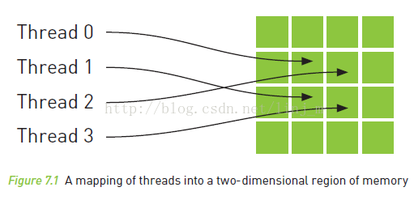

下面，我们来看看如何使用纹理内存。
- 首先，需要输入的数据声明为texture类型的引用。比如：**texture<float> textConst**;
- 然后，就是在为这三个缓冲区分配GPU内存后，需要通过**cudaBindTexture()**将这些变量绑定到内存缓存区。这相当于告诉CUDA运行时两件事：
    - 我们希望将指定的缓冲区作为纹理来使用
    - 我们希望将纹理引用作为纹理的"名字" 
    - 当用cudaBindTexture绑定后，纹理变量就设置好了，现在可以启动核函数。然而，当读取核函数中的纹理时，需要通过特殊的函数来告诉GPU将读取请求转发到纹理内存而不是标准的全局内存。因此，当读取内存时，需要使用特殊的方式：从线性内存中读取（拾取），使用的函数是**tex1Dfetch()**。 
    - 最后，当应用程序运行结束后，还要清除纹理的绑定：**cudaUnbindTexture(textConst)**;

上面谈的都是一维纹理内存，实际上也可以使用二维纹理内存。
- 二维纹理内存的声明如下：**texture<float,2> textConst**;
- 绑定函数：**cudaBindTexture2D()**
- 纹理拾取函数：**tex2D()**

## 热传导模拟
- 温度更新流程
    - 给定一个包含初始输入温度的格网，将其中作为热源的单元温度值复制到格网相应的单元中。这将覆盖这个单元之前计算出的温度，因此也就确保了"加热单元将保持恒温"这个条件。这个复制操作是在copy_const_kernel()中执行的。
    - 给定一个输人温度格网，根据等式$$ T_{NEW} = T_{OLD} + k(T_{TOP} + T_{BOTTOM} + T_{LEFT} + T_{RIGHT} - 4T_{OLD}) $$中的更新公式计算输出温度格网。这个更新操作是在blend_ kernel()中执行的。 
    - 将输人温度格网和输出温度格网交换，为下一个步骤的计算做好准备。当模拟下一个时间步时，在步骤2中计算得到的输出温度格网将成为步骤1中的输人温度格网。

在开始模拟之前，我们假设已经获得了一个格网。格网中大多数单元的温度值都是0，但有些单元包含了非0的温度值，这些单元就是拥有固定温度的热源。在模拟过程中，缓冲区中这些常量值不会发生变化，并且在每个时间步中读取。

- 
```c++
```


- 使用一维纹理内存
```c++
```

- 使用二维纹理内存
```c++
```

# 第八章： 图像互操作性

## 本章目标
- 了解图形互操作性是什么以及为什么需要使用它
- 了解如何设置某个CUDA设备的图形互操作性
- 了解如何在CUDA C核函数和OpenGL渲染函数之间共享数据

## 图形互操作
```
#include "../common/book.h"
#include "../common/cpu_bitmap.h"

#include "cuda.h"
#include "cuda_gl_interop.h"


PFNGLBINDBUFFERARBPROC    glBindBuffer     = NULL;
PFNGLDELETEBUFFERSARBPROC glDeleteBuffers  = NULL;
PFNGLGENBUFFERSARBPROC    glGenBuffers     = NULL;
PFNGLBUFFERDATAARBPROC    glBufferData     = NULL;

#define     DIM    512

GLuint  bufferObj;
cudaGraphicsResource *resource;

// based on ripple code, but uses uchar4 which is the type of data
// graphic inter op uses. see screenshot - basic2.png
__global__ void kernel( uchar4 *ptr ) {
    // map from threadIdx/BlockIdx to pixel position
    int x = threadIdx.x + blockIdx.x * blockDim.x;
    int y = threadIdx.y + blockIdx.y * blockDim.y;
    int offset = x + y * blockDim.x * gridDim.x;

    // now calculate the value at that position
    float fx = x/(float)DIM - 0.5f;
    float fy = y/(float)DIM - 0.5f;
    unsigned char   green = 128 + 127 *
                            sin( abs(fx*100) - abs(fy*100) );

    // accessing uchar4 vs unsigned char*
    ptr[offset].x = 0;
    ptr[offset].y = green;
    ptr[offset].z = 0;
    ptr[offset].w = 255;
}

static void key_func( unsigned char key, int x, int y ) {
    switch (key) {
        case 27:
            // clean up OpenGL and CUDA
            HANDLE_ERROR( cudaGraphicsUnregisterResource( resource ) );
            glBindBuffer( GL_PIXEL_UNPACK_BUFFER_ARB, 0 );
            glDeleteBuffers( 1, &bufferObj );
            exit(0);
    }
}

static void draw_func( void ) {
    // we pass zero as the last parameter, because out bufferObj is now
    // the source, and the field switches from being a pointer to a
    // bitmap to now mean an offset into a bitmap object
    glDrawPixels( DIM, DIM, GL_RGBA, GL_UNSIGNED_BYTE, 0 );
    glutSwapBuffers();
}


int main( int argc, char **argv ) {
    cudaDeviceProp  prop;
    int dev;

    memset( &prop, 0, sizeof( cudaDeviceProp ) );
    prop.major = 1;
    prop.minor = 0;
    HANDLE_ERROR( cudaChooseDevice( &dev, &prop ) );

    // tell CUDA which dev we will be using for graphic interop
    // from the programming guide:  Interoperability with OpenGL
    //     requires that the CUDA device be specified by
    //     cudaGLSetGLDevice() before any other runtime calls.

    HANDLE_ERROR( cudaGLSetGLDevice( dev ) );

    // these GLUT calls need to be made before the other OpenGL
    // calls, else we get a seg fault
    glutInit( &argc, argv );
    glutInitDisplayMode( GLUT_DOUBLE | GLUT_RGBA );
    glutInitWindowSize( DIM, DIM );
    glutCreateWindow( "bitmap" );

    glBindBuffer    = (PFNGLBINDBUFFERARBPROC)GET_PROC_ADDRESS("glBindBuffer");
    glDeleteBuffers = (PFNGLDELETEBUFFERSARBPROC)GET_PROC_ADDRESS("glDeleteBuffers");
    glGenBuffers    = (PFNGLGENBUFFERSARBPROC)GET_PROC_ADDRESS("glGenBuffers");
    glBufferData    = (PFNGLBUFFERDATAARBPROC)GET_PROC_ADDRESS("glBufferData");

    // the first three are standard OpenGL, the 4th is the CUDA reg 
    // of the bitmap these calls exist starting in OpenGL 1.5
    glGenBuffers( 1, &bufferObj );
    glBindBuffer( GL_PIXEL_UNPACK_BUFFER_ARB, bufferObj );
    glBufferData( GL_PIXEL_UNPACK_BUFFER_ARB, DIM * DIM * 4,
                  NULL, GL_DYNAMIC_DRAW_ARB );

    HANDLE_ERROR( 
        cudaGraphicsGLRegisterBuffer( &resource, 
                                      bufferObj, 
                                      cudaGraphicsMapFlagsNone ) );

    // do work with the memory dst being on the GPU, gotten via mapping
    HANDLE_ERROR( cudaGraphicsMapResources( 1, &resource, NULL ) );
    uchar4* devPtr;
    size_t  size;
    HANDLE_ERROR( 
        cudaGraphicsResourceGetMappedPointer( (void**)&devPtr, 
                                              &size, 
                                              resource) );

    dim3    grids(DIM/16,DIM/16);
    dim3    threads(16,16);
    kernel<<<grids,threads>>>( devPtr );
    HANDLE_ERROR( cudaGraphicsUnmapResources( 1, &resource, NULL ) );

    // set up GLUT and kick off main loop
    glutKeyboardFunc( key_func );
    glutDisplayFunc( draw_func );
    glutMainLoop();
}

```

## 基于图形互操作性的GPU波纹示例
GPUAnimBitmap结构
```c++
struct GPUAnimBitmap {
    Gluint bufferObj;
    cudaGraphicsResource *resource;
    int width, height;
    void *dataBlock;
    void (*fAnim)(uchar4*, void*, int);
    void (*animExit)(void*);
    void (*clickDreg)(void*,int,int,int,int);
    int dragStartX, dragStartY;
}
```

```c++
#include "../common/book.h"
#include "../common/gpu_anim.h"

#define DIM 1024

__global__ void kernel( uchar4 *ptr, int ticks ) {
    // map from threadIdx/BlockIdx to pixel position
    int x = threadIdx.x + blockIdx.x * blockDim.x;
    int y = threadIdx.y + blockIdx.y * blockDim.y;
    int offset = x + y * blockDim.x * gridDim.x;

    // now calculate the value at that position
    float fx = x - DIM/2;
    float fy = y - DIM/2;
    float d = sqrtf( fx * fx + fy * fy );
    unsigned char grey = (unsigned char)(128.0f + 127.0f *
                                         cos(d/10.0f - ticks/7.0f) /
                                         (d/10.0f + 1.0f));    
    ptr[offset].x = grey;
    ptr[offset].y = grey;
    ptr[offset].z = grey;
    ptr[offset].w = 255;
}

void generate_frame( uchar4 *pixels, void*, int ticks ) {
    dim3    grids(DIM/16,DIM/16);
    dim3    threads(16,16);
    kernel<<<grids,threads>>>( pixels, ticks );
}

int main( void ) {
    GPUAnimBitmap  bitmap( DIM, DIM, NULL );

    bitmap.anim_and_exit(
        (void (*)(uchar4*,void*,int))generate_frame, NULL );
}
```

## 基于图形互操作性的热传导
```c++
#include "../common/book.h"
#include "../common/gpu_anim.h"

#define DIM 1024
#define MAX_TEMP 1.0f
#define MIN_TEMP 0.0001f
#define SPEED   0.25f

// these exist on the GPU side
texture<float>  texConstSrc;
texture<float>  texIn;
texture<float>  texOut;


// this kernel takes in a 2-d array of floats
// it updates the value-of-interest by a scaled value based
// on itself and its nearest neighbors
__global__ void blend_kernel( float *dst,
                              bool dstOut ) {
    // map from threadIdx/BlockIdx to pixel position
    int x = threadIdx.x + blockIdx.x * blockDim.x;
    int y = threadIdx.y + blockIdx.y * blockDim.y;
    int offset = x + y * blockDim.x * gridDim.x;

    int left = offset - 1;
    int right = offset + 1;
    if (x == 0)   left++;
    if (x == DIM-1) right--; 

    int top = offset - DIM;
    int bottom = offset + DIM;
    if (y == 0)   top += DIM;
    if (y == DIM-1) bottom -= DIM;

    float   t, l, c, r, b;
    if (dstOut) {
        t = tex1Dfetch(texIn,top);
        l = tex1Dfetch(texIn,left);
        c = tex1Dfetch(texIn,offset);
        r = tex1Dfetch(texIn,right);
        b = tex1Dfetch(texIn,bottom);

    } else {
        t = tex1Dfetch(texOut,top);
        l = tex1Dfetch(texOut,left);
        c = tex1Dfetch(texOut,offset);
        r = tex1Dfetch(texOut,right);
        b = tex1Dfetch(texOut,bottom);
    }
    dst[offset] = c + SPEED * (t + b + r + l - 4 * c);
}

// NOTE - texOffsetConstSrc could either be passed as a
// parameter to this function, or passed in __constant__ memory
// if we declared it as a global above, it would be
// a parameter here: 
// __global__ void copy_const_kernel( float *iptr,
//                                    size_t texOffset )
__global__ void copy_const_kernel( float *iptr ) {
    // map from threadIdx/BlockIdx to pixel position
    int x = threadIdx.x + blockIdx.x * blockDim.x;
    int y = threadIdx.y + blockIdx.y * blockDim.y;
    int offset = x + y * blockDim.x * gridDim.x;

    float c = tex1Dfetch(texConstSrc,offset);
    if (c != 0)
        iptr[offset] = c;
}

// globals needed by the update routine
struct DataBlock {
    float           *dev_inSrc;
    float           *dev_outSrc;
    float           *dev_constSrc;

    cudaEvent_t     start, stop;
    float           totalTime;
    float           frames;
};

void anim_gpu( uchar4* outputBitmap, DataBlock *d, int ticks ) {
    HANDLE_ERROR( cudaEventRecord( d->start, 0 ) );
    dim3    blocks(DIM/16,DIM/16);
    dim3    threads(16,16);

    // since tex is global and bound, we have to use a flag to
    // select which is in/out per iteration
    volatile bool dstOut = true;
    for (int i=0; i<90; i++) {
        float   *in, *out;
        if (dstOut) {
            in  = d->dev_inSrc;
            out = d->dev_outSrc;
        } else {
            out = d->dev_inSrc;
            in  = d->dev_outSrc;
        }
        copy_const_kernel<<<blocks,threads>>>( in );
        blend_kernel<<<blocks,threads>>>( out, dstOut );
        dstOut = !dstOut;
    }
    float_to_color<<<blocks,threads>>>( outputBitmap,
                                        d->dev_inSrc );

    HANDLE_ERROR( cudaEventRecord( d->stop, 0 ) );
    HANDLE_ERROR( cudaEventSynchronize( d->stop ) );
    float   elapsedTime;
    HANDLE_ERROR( cudaEventElapsedTime( &elapsedTime,
                                        d->start, d->stop ) );
    d->totalTime += elapsedTime;
    ++d->frames;
    printf( "Average Time per frame:  %3.1f ms\n",
            d->totalTime/d->frames  );
}

// clean up memory allocated on the GPU
void anim_exit( DataBlock *d ) {
    HANDLE_ERROR( cudaUnbindTexture( texIn ) );
    HANDLE_ERROR( cudaUnbindTexture( texOut ) );
    HANDLE_ERROR( cudaUnbindTexture( texConstSrc ) );
    HANDLE_ERROR( cudaFree( d->dev_inSrc ) );
    HANDLE_ERROR( cudaFree( d->dev_outSrc ) );
    HANDLE_ERROR( cudaFree( d->dev_constSrc ) );

    HANDLE_ERROR( cudaEventDestroy( d->start ) );
    HANDLE_ERROR( cudaEventDestroy( d->stop ) );
}


int main( void ) {
    DataBlock   data;
    GPUAnimBitmap bitmap( DIM, DIM, &data );
    data.totalTime = 0;
    data.frames = 0;
    HANDLE_ERROR( cudaEventCreate( &data.start ) );
    HANDLE_ERROR( cudaEventCreate( &data.stop ) );

    int imageSize = bitmap.image_size();

    // assume float == 4 chars in size (ie rgba)
    HANDLE_ERROR( cudaMalloc( (void**)&data.dev_inSrc,
                              imageSize ) );
    HANDLE_ERROR( cudaMalloc( (void**)&data.dev_outSrc,
                              imageSize ) );
    HANDLE_ERROR( cudaMalloc( (void**)&data.dev_constSrc,
                              imageSize ) );

    HANDLE_ERROR( cudaBindTexture( NULL, texConstSrc,
                                   data.dev_constSrc,
                                   imageSize ) );

    HANDLE_ERROR( cudaBindTexture( NULL, texIn,
                                   data.dev_inSrc,
                                   imageSize ) );

    HANDLE_ERROR( cudaBindTexture( NULL, texOut,
                                   data.dev_outSrc,
                                   imageSize ) );

    // intialize the constant data
    float *temp = (float*)malloc( imageSize );
    for (int i=0; i<DIM*DIM; i++) {
        temp[i] = 0;
        int x = i % DIM;
        int y = i / DIM;
        if ((x>300) && (x<600) && (y>310) && (y<601))
            temp[i] = MAX_TEMP;
    }
    temp[DIM*100+100] = (MAX_TEMP + MIN_TEMP)/2;
    temp[DIM*700+100] = MIN_TEMP;
    temp[DIM*300+300] = MIN_TEMP;
    temp[DIM*200+700] = MIN_TEMP;
    for (int y=800; y<900; y++) {
        for (int x=400; x<500; x++) {
            temp[x+y*DIM] = MIN_TEMP;
        }
    }
    HANDLE_ERROR( cudaMemcpy( data.dev_constSrc, temp,
                              imageSize,
                              cudaMemcpyHostToDevice ) );    

    // initialize the input data
    for (int y=800; y<DIM; y++) {
        for (int x=0; x<200; x++) {
            temp[x+y*DIM] = MAX_TEMP;
        }
    }
    HANDLE_ERROR( cudaMemcpy( data.dev_inSrc, temp,
                              imageSize,
                              cudaMemcpyHostToDevice ) );
    free( temp );

    bitmap.anim_and_exit( (void (*)(uchar4*,void*,int))anim_gpu,
                           (void (*)(void*))anim_exit );
}
```


## 本章小结
虽然本书的大部分内容都是介绍如何使用GPU来实现并行的通用计算，但我们不能忘记GPU的本职工作是作为一个渲染引擎。在许多应用程序都需要使用标准的计算机图形渲染功能。GPU是图形渲染领域的主要设备，因此如果不了解CUBA运行时和图形驱动程序之间的协作。那么我们将无法充分利用这些资源的强大功能。现在，我们已经学习了这些内容，因此在显示计算得到的图形结果时将不再需要主机的介人。这不仅加速了应用程序的演染循环，而且还使主机可以同时执行其他的计算。即使没有其他计算需要执行，那么我们的系统在响应其他时间或者应用程序时也将变得更加灵敏。

# 第九章： 原子性

## 本章目标
- 了解不同NVIDIA GPU的计算
- 了解原子操作以及为什么需要使用它们
- 了解如何在CUDA C核函数中执行带有原子操作的运算

## 计算功能集
NVIDIA将GPU支持的各种功能统称为计算功能集(Compute Capability)。

## 原子操作简介
CUDA的原子操作可以理解为对一个变量进行“读取-修改-写入”这三个操作的一个最小单位的执行过程，这个执行过程不能够再分解为更小的部分，在它执行过程中，不允许其他并行线程对该变量进行读取和写入的操作。基于这个机制，原子操作实现了对在多个线程间共享的变量的互斥保护，确保任何一次对变量的操作的结果的正确性。

原子操作确保了在多个并行线程间共享的内存的读写保护，每次只能有一个线程对该变量进行读写操作，一个线程对该变量操作的时候，其他线程如果也要操作该变量，只能等待前一线程执行完成。原子操作确保了安全，代价是牺牲了性能。

## 计算直方图

- 在CPU上计算直方图
```c++
#include "../common/book.h"

#define SIZE (100 * 1024 * 1024)

int main(void)
{
    unsigned char* buffer = (unsigned char*)big_random_block(SIZE);

    // capture the start time
    clock_t start, stop;
    start = clock();

    unsigned int histo[256];
    for (int i = 0; i < 256; i++)
        histo[i] = 0;

    for (int i = 0; i < SIZE; i++)
        histo[buffer[i]]++;

    stop = clock();
    float elapsedTime = (float)(stop - start) / (float)CLOCKS_PER_SEC * 1000.0f;
    printf("Time to generate:  %3.1f ms\n", elapsedTime);

    long histoCount = 0;
    for (int i = 0; i < 256; i++) {
        histoCount += histo[i];
    }
    printf("Histogram Sum:  %ld\n", histoCount);

    free(buffer);
    return 0;
}
```


- 在GPU上计算直方图(使用全局内存原子操作)
```c++
#include "../common/book.h"

#define SIZE (100 * 1024 * 1024)

__global__ void histo_kernel(unsigned char* buffer,
    long size,
    unsigned int* histo)
{
    // calculate the starting index and the offset to the next
    // block that each thread will be processing
    int i = threadIdx.x + blockIdx.x * blockDim.x;
    int stride = blockDim.x * gridDim.x;
    while (i < size) {
        atomicAdd(&histo[buffer[i]], 1);
        i += stride;
    }
}

int main(void)
{
    unsigned char* buffer = (unsigned char*)big_random_block(SIZE);

    // capture the start time
    // starting the timer here so that we include the cost of
    // all of the operations on the GPU.
    cudaEvent_t start, stop;
    HANDLE_ERROR(cudaEventCreate(&start));
    HANDLE_ERROR(cudaEventCreate(&stop));
    HANDLE_ERROR(cudaEventRecord(start, 0));

    // allocate memory on the GPU for the file's data
    unsigned char* dev_buffer;
    unsigned int* dev_histo;
    HANDLE_ERROR(cudaMalloc((void**)&dev_buffer, SIZE));
    HANDLE_ERROR(cudaMemcpy(dev_buffer, buffer, SIZE,
        cudaMemcpyHostToDevice));

    HANDLE_ERROR(cudaMalloc((void**)&dev_histo,
        256 * sizeof(int)));
    HANDLE_ERROR(cudaMemset(dev_histo, 0,
        256 * sizeof(int)));

    // kernel launch - 2x the number of mps gave best timing
    cudaDeviceProp prop;
    HANDLE_ERROR(cudaGetDeviceProperties(&prop, 0));
    int blocks = prop.multiProcessorCount;
    histo_kernel<<<blocks * 2, 256>>>(dev_buffer, SIZE, dev_histo);

    unsigned int histo[256];
    HANDLE_ERROR(cudaMemcpy(histo, dev_histo,
        256 * sizeof(int),
        cudaMemcpyDeviceToHost));

    // get stop time, and display the timing results
    HANDLE_ERROR(cudaEventRecord(stop, 0));
    HANDLE_ERROR(cudaEventSynchronize(stop));
    float elapsedTime;
    HANDLE_ERROR(cudaEventElapsedTime(&elapsedTime,
        start, stop));
    printf("Time to generate:  %3.1f ms\n", elapsedTime);

    long histoCount = 0;
    for (int i = 0; i < 256; i++) {
        histoCount += histo[i];
    }
    printf("Histogram Sum:  %ld\n", histoCount);

    // verify that we have the same counts via CPU
    for (int i = 0; i < SIZE; i++)
        histo[buffer[i]]--;
    for (int i = 0; i < 256; i++) {
        if (histo[i] != 0)
            printf("Failure at %d!  Off by %d\n", i, histo[i]);
    }

    HANDLE_ERROR(cudaEventDestroy(start));
    HANDLE_ERROR(cudaEventDestroy(stop));
    cudaFree(dev_histo);
    cudaFree(dev_buffer);
    free(buffer);
    return 0;
}
```

- 在GPU上计算直方图(使用全局共享内存原子操作和全局内存原子操作)
```c++
#include "../common/book.h"

#define SIZE (100 * 1024 * 1024)

__global__ void histo_kernel(unsigned char* buffer,
    long size,
    unsigned int* histo)
{

    // clear out the accumulation buffer called temp
    // since we are launched with 256 threads, it is easy
    // to clear that memory with one write per thread
    __shared__ unsigned int temp[256];
    temp[threadIdx.x] = 0;
    __syncthreads();

    // calculate the starting index and the offset to the next
    // block that each thread will be processing
    int i = threadIdx.x + blockIdx.x * blockDim.x;
    int stride = blockDim.x * gridDim.x;
    while (i < size) {
        atomicAdd(&temp[buffer[i]], 1);
        i += stride;
    }
    // sync the data from the above writes to shared memory
    // then add the shared memory values to the values from
    // the other thread blocks using global memory
    // atomic adds
    // same as before, since we have 256 threads, updating the
    // global histogram is just one write per thread!
    __syncthreads();
    atomicAdd(&(histo[threadIdx.x]), temp[threadIdx.x]);
}

int main(void)
{
    unsigned char* buffer = (unsigned char*)big_random_block(SIZE);

    // capture the start time
    // starting the timer here so that we include the cost of
    // all of the operations on the GPU.  if the data were
    // already on the GPU and we just timed the kernel
    // the timing would drop from 74 ms to 15 ms.  Very fast.
    cudaEvent_t start, stop;
    HANDLE_ERROR(cudaEventCreate(&start));
    HANDLE_ERROR(cudaEventCreate(&stop));
    HANDLE_ERROR(cudaEventRecord(start, 0));

    // allocate memory on the GPU for the file's data
    unsigned char* dev_buffer;
    unsigned int* dev_histo;
    HANDLE_ERROR(cudaMalloc((void**)&dev_buffer, SIZE));
    HANDLE_ERROR(cudaMemcpy(dev_buffer, buffer, SIZE,
        cudaMemcpyHostToDevice));

    HANDLE_ERROR(cudaMalloc((void**)&dev_histo,
        256 * sizeof(int)));
    HANDLE_ERROR(cudaMemset(dev_histo, 0,
        256 * sizeof(int)));

    // kernel launch - 2x the number of mps gave best timing
    cudaDeviceProp prop;
    HANDLE_ERROR(cudaGetDeviceProperties(&prop, 0));
    int blocks = prop.multiProcessorCount;
    histo_kernel<<<blocks * 2, 256>>>(dev_buffer,
        SIZE, dev_histo);

    unsigned int histo[256];
    HANDLE_ERROR(cudaMemcpy(histo, dev_histo,
        256 * sizeof(int),
        cudaMemcpyDeviceToHost));

    // get stop time, and display the timing results
    HANDLE_ERROR(cudaEventRecord(stop, 0));
    HANDLE_ERROR(cudaEventSynchronize(stop));
    float elapsedTime;
    HANDLE_ERROR(cudaEventElapsedTime(&elapsedTime,
        start, stop));
    printf("Time to generate:  %3.1f ms\n", elapsedTime);

    long histoCount = 0;
    for (int i = 0; i < 256; i++) {
        histoCount += histo[i];
    }
    printf("Histogram Sum:  %ld\n", histoCount);

    // verify that we have the same counts via CPU
    for (int i = 0; i < SIZE; i++)
        histo[buffer[i]]--;
    for (int i = 0; i < 256; i++) {
        if (histo[i] != 0)
            printf("Failure at %d!\n", i);
    }

    HANDLE_ERROR(cudaEventDestroy(start));
    HANDLE_ERROR(cudaEventDestroy(stop));
    cudaFree(dev_histo);
    cudaFree(dev_buffer);
    free(buffer);
    return 0;
}
```

## CUDA常用的原子操作
- 1 atomicAdd()
```c++
int atomicAdd(int* address, int val);
unsigned int atomicAdd(unsigned int* address,unsigned int val);
unsigned long long int atomicAdd(unsigned long long int* address,unsigned long long int val);
```
读取位于全局或共享存储器中地址address 处的32 位或64 位字old，计算(old + val)，并将结果存储在存储器的同一地址中。这三项操作在一次原子事务中执行。该函数将返回old。只有全局存储器支持64 位字。

- 2 atomicSub()
```c++
int atomicSub(int* address, int val);
unsigned int atomicSub(unsigned int* address, unsigned int val);
```
读取位于全局或共享存储器中地址address 处的32 位字old，计算(old - val)，并将结果存储在存储器的同一地址中。这三项操作在一次原子事务中执行。该函数将返回old。

- 3 atomicExch()
```c++
int atomicExch(int* address, int val);
unsigned int atomicExch(unsigned int* address,unsigned int val);
unsigned long long int atomicExch(unsigned long long int* address,unsigned long long int val);
float atomicExch(float* address, float val);
```
读取位于全局或共享存储器中地址address 处的32 位或64 位字old，并将val 存储在存储器的同一地址中。这两项操作在一次原子事务中执行。该函数将返回old。只有全局存储器支持64 位字。

- 4 atomicMin()
```c++
int atomicMin(int* address, int val);
unsigned int atomicMin(unsigned int* address,unsigned int val);
```
读取位于全局或共享存储器中地址address 处的32 位字old，计算old 和val 的最小值，并将结果存储在存储器的同一地址中。这三项操作在一次原子事务中执行。该函数将返回old。

- 5 atomicMax()
```c++
int atomicMax(int* address, int val);
unsigned int atomicMax(unsigned int* address,unsigned int val);
```
读取位于全局或共享存储器中地址address 处的32 位字old，计算old 和val 的最大值，并将结果存储在存储器的同一地址中。这三项操作在一次原子事务中执行。该函数将返回old。

- 6 atomicInc()
```c++
unsigned int atomicInc(unsigned int* address,unsigned int val);
```
读取位于全局或共享存储器中地址address 处的32 位字old，计算 ((old >= val) ? 0 : (old+1))，并将结果存储在存储器的同一地址中。这三项操作在一次原子事务中执行。该函数将返回old。

- 7 atomicDec()
```c++
unsigned int atomicDec(unsigned int* address,unsigned int val);
```
读取位于全局或共享存储器中地址address处的32位字old，计算(((old == 0)|(old > val))?val:(old-1))，并将结果存储在存储器的同一地址中。这三项操作在一次原子事务中执行。该函数将返回old。

- 8 atomicCAS()
```c++
int atomicCAS(int* address, int compare, int val);
unsigned int atomicCAS(unsigned int* address,unsigned int compare,unsigned int val);
unsigned long long int atomicCAS(unsigned long long int* address,unsigned long long int compare,unsigned long long int val);
```
读取位于全局或共享存储器中地址address处的32位或64位字old，计算(old == compare?val:old)，并将结果存储在存储器的同一地址中。这三项操作在一次原子事务中执行。该函数将返回old（比较并交换）。只有全局存储器支持64位字。

- 9 atomicAnd()
```c++
int atomicAnd(int* address, int val);
unsigned int atomicAnd(unsigned int* address,unsigned int val);
```
读取位于全局或共享存储器中地址address 处的32 位字old，计算 (old & val)，并将结果存储在存储器的同一地址中。这三项操作在一次原子事务中执行。该函数将返回old。

-10 atomicOr()
```c++
int atomicOr(int* address, int val);
unsigned int atomicOr(unsigned int* address,unsigned int val);
```
读取位于全局或共享存储器中地址address 处的32 位字old，计算 (old | val)，并将结果存储在存储器的同一地址中。这三项操作在一次原子事务中执行。该函数将返回old。

-11 atomicXor()
```c++
int atomicXor(int* address, int val);
unsigned int atomicXor(unsigned int* address,unsigned int val);
```
读取位于全局或共享存储器中地址address 处的32 位字old，计算 (old ^ val)，并将结果存储在存储器的同一地址中。这三项操作在一次原子事务中执行。该函数将返回old。

举个例子，定义1024个线程，求这1024个线程的ID之和，每个线程都会访问总和变量sum，如果不加原子操作，执行结果是错误并且是不确定的。
```c++
#include <stdio.h>      
#include <stdlib.h>     
#include <cuda_runtime.h>    
  
#define SIZE 1024  
  
__global__ void histo_kernel(int size, unsigned int *histo)  
{  
    int i = threadIdx.x + blockIdx.x * blockDim.x;  
    if (i < size)  
    {  
        //*histo+=i;  
        atomicAdd(histo, i);  
    }  
}  
  
int main(void)  
{  
    int threadSum = 0;  
  
    //分配内存并拷贝初始数据  
    unsigned int *dev_histo;  
  
    cudaMalloc((void**)&dev_histo, sizeof(int));  
    cudaMemcpy(dev_histo, &threadSum, sizeof(int), cudaMemcpyHostToDevice);  
  
    // kernel launch - 2x the number of mps gave best timing    
    cudaDeviceProp  prop;  
    cudaGetDeviceProperties(&prop, 0);  
  
    int blocks = prop.multiProcessorCount;  
    //确保线程数足够  
    histo_kernel << <blocks * 2, (SIZE + 2 * blocks - 1) / blocks / 2 >> > (SIZE, dev_histo);  
  
    //数据拷贝回CPU内存  
    cudaMemcpy(&threadSum, dev_histo, sizeof(int), cudaMemcpyDeviceToHost);  
    printf("Threads SUM：%d\n", threadSum);  
    getchar();  
    cudaFree(dev_histo);  
    return 0;  
}  
```

## 本章小结
虽然我们经常提到通过CUDA C来编写并行程序是多么容易.但在很大程度上忽略了一些情况，而在这些情况中的大规模并行架构(例如GPU)将使得程序员的工作更为困难。例如，有成千上万个线程同时修改同一个内存地址，在这种情况中，大规模的并行机器反而会带来负担。幸运的是，在硬件中支持的原子操作可以帮助减轻这种痛苦。

然而，正如在直方图计算中看到的，有时候依赖原子操作会带来性能问题，井且这些问题只能通过对算法的某些部分进行重构来加以解决。但是在直方图示例中，我们使用了一种两阶段算法，该算法降低了在全局内存访问上竞争程度。通常，这种降低内存竞争程度的策略总能带来不错的效果，因此当你在自己的应用程序中使用原一子操作时，要记住这种策略。

# 第十章 流
## 本章目标
- 了解如何分配页锁定(Page-Locked)类型的主机内存
- 了解CUDA流的概念
- 了解如何使用CUDA流来加速应用程序

## 页琐存主机内存
- malloc()将分配标准的，可分页的(Pagable)主机内存
- cudaHostAlloc()将分配页锁定的主机内存。页锁定内存也称为固定内存(Pinned Memory)或者不可分页内存，它有一个重要的属性：操作系统将不会对这块内存分页并交换到磁盘上，从而确保了该内存时钟驻留在物理内存中。因此，操作系统能够安全地使某个应用程序访问该内存的物理地址，因为这块内存将不会被破坏或者重新定位。
- 由于GPU知道内存的物理地址，因此可以通过“直接内存访问(Direct Memory Access，DMA)”技术来在GPU和主机之间复制数据。由于DMA在执行复制时无需CPU的介入，这也就同样意味着，CPU很可能在DMA的执行中将目标内存交换到磁盘上，或者通过更新操作系统的可分页来重新定位目标内存的物理地址。CPU可能会移动可分页的数据，这就可能对DMA操作造成延迟。因此，在DMA复制过程中使用固定内存是非常中要的。事实上，当使用可分页内存进行复制时，CUDA驱动程序仍然会通过DMA把数据传输给GPU。因此，复制操作将执行两遍，第一遍从可分页内存复制到一块“临时的”页琐定内存，然后再从这个页锁定内存复制到GPU上。
- 因此，每当从可分页内存中执行复制操作时，复制速度将受限于PCIE传输速度和系统前端总线速度相对较低的一方。在某些系统中，这些总线在带宽上有着巨大的差异。因此当在GPU和主机间复制数据时，这种差异会使页锁定主机内存的性能比标准可分页内存的性能要高大约2倍。即使PCIE的速度与前端总线的速度相等，由于可分页内存需要更多一次由CPU参与的复制操作，因此会带来额外的开销。
- 然而，你也不能进入另一个极端:查找每个malloc调用井将其林换为cudaHostAlloc()调用。
- 固定内存是一把双刃剑。当使用固定内存时，你将失去虚拟内存的所有功能。特别是，在应用程序中使用每个页锁定内存时都需要分配物理内存，因为这些内存不能交换到磁盘上。这意味着。与使用标准的malloc调用相比。系统将更快地耗尽内存。因此.应用程序在物理内存较少的机器上会运行失败，而且意味着应用程序将影响在系统上运行的其他应用程序的性能。
- 这些情况井不是说不使用cudaHostAlloc()，而是提醒你应该清楚页锁定内存的隐含作用。我们建议，仅对cudaMemcpy()调用中的源内存或者目标内存，才使用页锁定内存，并且在不再需要使用它们时立即释放，而不是等到应用程序关闭时才释放。cudaHostAlloc()与到目前为止学习的其他内容一样简单。

```c++
#include "../common/book.h"

#define SIZE (64 * 1024 * 1024)

float cuda_malloc_test(int size, bool up)
{
    cudaEvent_t start, stop;
    int *a, *dev_a;
    float elapsedTime;

    HANDLE_ERROR(cudaEventCreate(&start));
    HANDLE_ERROR(cudaEventCreate(&stop));

    a = (int*)malloc(size * sizeof(*a));
    HANDLE_NULL(a);
    HANDLE_ERROR(cudaMalloc((void**)&dev_a,
        size * sizeof(*dev_a)));

    HANDLE_ERROR(cudaEventRecord(start, 0));
    for (int i = 0; i < 100; i++) {
        if (up)
            HANDLE_ERROR(cudaMemcpy(dev_a, a,
                size * sizeof(*dev_a),
                cudaMemcpyHostToDevice));
        else
            HANDLE_ERROR(cudaMemcpy(a, dev_a,
                size * sizeof(*dev_a),
                cudaMemcpyDeviceToHost));
    }
    HANDLE_ERROR(cudaEventRecord(stop, 0));
    HANDLE_ERROR(cudaEventSynchronize(stop));
    HANDLE_ERROR(cudaEventElapsedTime(&elapsedTime,
        start, stop));

    free(a);
    HANDLE_ERROR(cudaFree(dev_a));
    HANDLE_ERROR(cudaEventDestroy(start));
    HANDLE_ERROR(cudaEventDestroy(stop));

    return elapsedTime;
}

float cuda_host_alloc_test(int size, bool up)
{
    cudaEvent_t start, stop;
    int *a, *dev_a;
    float elapsedTime;

    HANDLE_ERROR(cudaEventCreate(&start));
    HANDLE_ERROR(cudaEventCreate(&stop));

    HANDLE_ERROR(cudaHostAlloc((void**)&a,
        size * sizeof(*a),
        cudaHostAllocDefault));
    HANDLE_ERROR(cudaMalloc((void**)&dev_a,
        size * sizeof(*dev_a)));

    HANDLE_ERROR(cudaEventRecord(start, 0));
    for (int i = 0; i < 100; i++) {
        if (up)
            HANDLE_ERROR(cudaMemcpy(dev_a, a,
                size * sizeof(*a),
                cudaMemcpyHostToDevice));
        else
            HANDLE_ERROR(cudaMemcpy(a, dev_a,
                size * sizeof(*a),
                cudaMemcpyDeviceToHost));
    }
    HANDLE_ERROR(cudaEventRecord(stop, 0));
    HANDLE_ERROR(cudaEventSynchronize(stop));
    HANDLE_ERROR(cudaEventElapsedTime(&elapsedTime,
        start, stop));

    HANDLE_ERROR(cudaFreeHost(a));
    HANDLE_ERROR(cudaFree(dev_a));
    HANDLE_ERROR(cudaEventDestroy(start));
    HANDLE_ERROR(cudaEventDestroy(stop));

    return elapsedTime;
}

int main(void)
{
    float elapsedTime;
    float MB = (float)100 * SIZE * sizeof(int) / 1024 / 1024;

    // try it with cudaMalloc
    elapsedTime = cuda_malloc_test(SIZE, true);
    printf("Time using cudaMalloc:  %3.1f ms\n",
        elapsedTime);
    printf("\tMB/s during copy up:  %3.1f\n",
        MB / (elapsedTime / 1000));

    elapsedTime = cuda_malloc_test(SIZE, false);
    printf("Time using cudaMalloc:  %3.1f ms\n",
        elapsedTime);
    printf("\tMB/s during copy down:  %3.1f\n",
        MB / (elapsedTime / 1000));

    // now try it with cudaHostAlloc
    elapsedTime = cuda_host_alloc_test(SIZE, true);
    printf("Time using cudaHostAlloc:  %3.1f ms\n",
        elapsedTime);
    printf("\tMB/s during copy up:  %3.1f\n",
        MB / (elapsedTime / 1000));

    elapsedTime = cuda_host_alloc_test(SIZE, false);
    printf("Time using cudaHostAlloc:  %3.1f ms\n",
        elapsedTime);
    printf("\tMB/s during copy down:  %3.1f\n",
        MB / (elapsedTime / 1000));
}
```

## CUDA流
CUDA流表示一个GPU操作队列，并且该队列中的操作将以指定的顺序执行。我们可以在流中添加一些操作，例如核函数启动、内存复制，以及事件的启动和结束等。将这些操作添加到流的顺序也就是它们的执行顺序。你可以将每个流视作GPU上的一个任务，并且这些任务可以并行执行。

## 使用单个CUDA流
```c++
#include "../common/book.h"

#define N (1024 * 1024)
#define FULL_DATA_SIZE (N * 20)

// 本例中核函数不重要，重要的是函数main()中与流相关的代码
__global__ void kernel(int* a, int* b, int* c)
{
    int idx = threadIdx.x + blockIdx.x * blockDim.x;
    if (idx < N) {
        int idx1 = (idx + 1) % 256;
        int idx2 = (idx + 2) % 256;
        float as = (a[idx] + a[idx1] + a[idx2]) / 3.0f;
        float bs = (b[idx] + b[idx1] + b[idx2]) / 3.0f;
        c[idx] = (as + bs) / 2;
    }
}

int main(void)
{
    cudaDeviceProp prop;
    int whichDevice;
    HANDLE_ERROR(cudaGetDevice(&whichDevice));
    HANDLE_ERROR(cudaGetDeviceProperties(&prop, whichDevice));
    if (!prop.deviceOverlap) {
        printf("Device will not handle overlaps, so no speed up from streams\n");
        return 0;
    }

    cudaEvent_t start, stop;
    float elapsedTime;

    cudaStream_t stream;
    int *host_a, *host_b, *host_c;
    int *dev_a, *dev_b, *dev_c;

    // start the timers
    HANDLE_ERROR(cudaEventCreate(&start));
    HANDLE_ERROR(cudaEventCreate(&stop));

    // initialize the stream
    HANDLE_ERROR(cudaStreamCreate(&stream));

    // allocate the memory on the GPU
    HANDLE_ERROR(cudaMalloc((void**)&dev_a,
        N * sizeof(int)));
    HANDLE_ERROR(cudaMalloc((void**)&dev_b,
        N * sizeof(int)));
    HANDLE_ERROR(cudaMalloc((void**)&dev_c,
        N * sizeof(int)));

    // allocate host locked memory, used to stream
    HANDLE_ERROR(cudaHostAlloc((void**)&host_a,
        FULL_DATA_SIZE * sizeof(int),
        cudaHostAllocDefault));
    HANDLE_ERROR(cudaHostAlloc((void**)&host_b,
        FULL_DATA_SIZE * sizeof(int),
        cudaHostAllocDefault));
    HANDLE_ERROR(cudaHostAlloc((void**)&host_c,
        FULL_DATA_SIZE * sizeof(int),
        cudaHostAllocDefault));

    for (int i = 0; i < FULL_DATA_SIZE; i++) {
        host_a[i] = rand();
        host_b[i] = rand();
    }

    HANDLE_ERROR(cudaEventRecord(start, 0));
    // now loop over full data, in bite-sized chunks
    for (int i = 0; i < FULL_DATA_SIZE; i += N) {
        // copy the locked memory to the device, async
        HANDLE_ERROR(cudaMemcpyAsync(dev_a, host_a + i,
            N * sizeof(int),
            cudaMemcpyHostToDevice,
            stream));
        HANDLE_ERROR(cudaMemcpyAsync(dev_b, host_b + i,
            N * sizeof(int),
            cudaMemcpyHostToDevice,
            stream));

        kernel<<<N / 256, 256, 0, stream>>>(dev_a, dev_b, dev_c);

        // copy the data from device to locked memory
        HANDLE_ERROR(cudaMemcpyAsync(host_c + i, dev_c,
            N * sizeof(int),
            cudaMemcpyDeviceToHost,
            stream));
    }
    // copy result chunk from locked to full buffer
    HANDLE_ERROR(cudaStreamSynchronize(stream));

    HANDLE_ERROR(cudaEventRecord(stop, 0));

    HANDLE_ERROR(cudaEventSynchronize(stop));
    HANDLE_ERROR(cudaEventElapsedTime(&elapsedTime,
        start, stop));
    printf("Time taken:  %3.1f ms\n", elapsedTime);

    // cleanup the streams and memory
    HANDLE_ERROR(cudaFreeHost(host_a));
    HANDLE_ERROR(cudaFreeHost(host_b));
    HANDLE_ERROR(cudaFreeHost(host_c));
    HANDLE_ERROR(cudaFree(dev_a));
    HANDLE_ERROR(cudaFree(dev_b));
    HANDLE_ERROR(cudaFree(dev_c));
    HANDLE_ERROR(cudaStreamDestroy(stream));

    return 0;
}
```

## 使用多个CUDA流
- CUDA流表示一个GPU操作队列，并且该队列中的操作以添加到队列的先后顺序执行。使用CUDA流可以实现任务级的并行，比如当GPU在执行核函数的同时，还可以在主机和设备之间交换数据(前提是GPU支持重叠，property的deviceOverlay为true)。
- cudaMemcpyAsync函数的功能是在GPU和主机之间复制数据。它是一个异步函数，即函数被调用后，只是放置一个请求，表示在流中执行一次内存复制操作。函数返回时，复制操作不一定启动或执行结束，只是该操作被放入执行队列，在下一个被放入流中的操作之前执行。

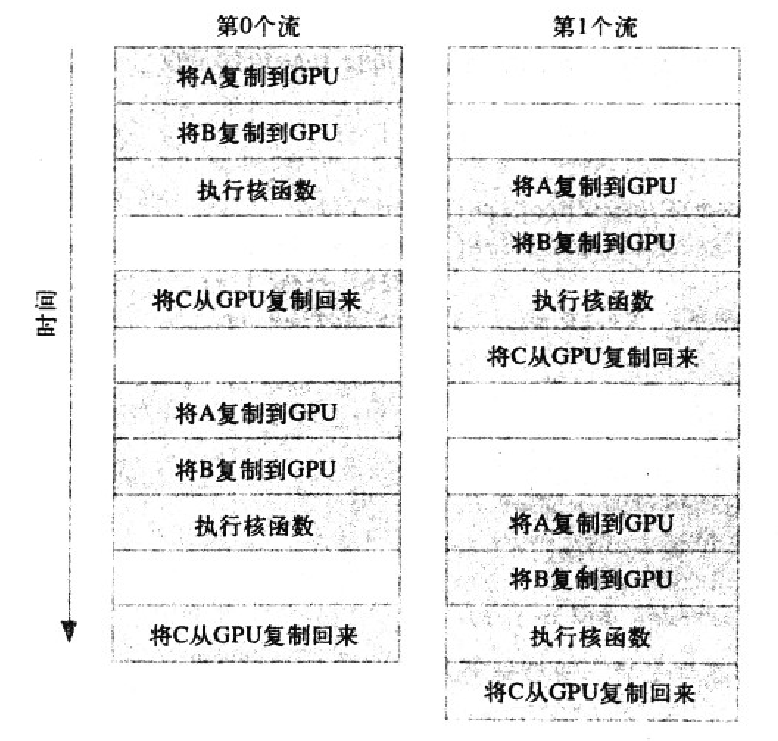

```c++
#include "../common/book.h"

#define N (1024 * 1024)
#define FULL_DATA_SIZE (N * 20)

__global__ void kernel(int* a, int* b, int* c)
{
    int idx = threadIdx.x + blockIdx.x * blockDim.x;
    if (idx < N) {
        int idx1 = (idx + 1) % 256;
        int idx2 = (idx + 2) % 256;
        float as = (a[idx] + a[idx1] + a[idx2]) / 3.0f;
        float bs = (b[idx] + b[idx1] + b[idx2]) / 3.0f;
        c[idx] = (as + bs) / 2;
    }
}

int main(void)
{
    cudaDeviceProp prop;
    int whichDevice;
    HANDLE_ERROR(cudaGetDevice(&whichDevice));
    HANDLE_ERROR(cudaGetDeviceProperties(&prop, whichDevice));
    if (!prop.deviceOverlap) {
        printf("Device will not handle overlaps, so no speed up from streams\n");
        return 0;
    }

    cudaEvent_t start, stop;
    float elapsedTime;

    cudaStream_t stream0, stream1;
    int *host_a, *host_b, *host_c;
    int *dev_a0, *dev_b0, *dev_c0;
    int *dev_a1, *dev_b1, *dev_c1;

    // start the timers
    HANDLE_ERROR(cudaEventCreate(&start));
    HANDLE_ERROR(cudaEventCreate(&stop));

    // initialize the streams
    HANDLE_ERROR(cudaStreamCreate(&stream0));
    HANDLE_ERROR(cudaStreamCreate(&stream1));

    // allocate the memory on the GPU
    HANDLE_ERROR(cudaMalloc((void**)&dev_a0,
        N * sizeof(int)));
    HANDLE_ERROR(cudaMalloc((void**)&dev_b0,
        N * sizeof(int)));
    HANDLE_ERROR(cudaMalloc((void**)&dev_c0,
        N * sizeof(int)));
    HANDLE_ERROR(cudaMalloc((void**)&dev_a1,
        N * sizeof(int)));
    HANDLE_ERROR(cudaMalloc((void**)&dev_b1,
        N * sizeof(int)));
    HANDLE_ERROR(cudaMalloc((void**)&dev_c1,
        N * sizeof(int)));

    // allocate host locked memory, used to stream
    HANDLE_ERROR(cudaHostAlloc((void**)&host_a,
        FULL_DATA_SIZE * sizeof(int),
        cudaHostAllocDefault));
    HANDLE_ERROR(cudaHostAlloc((void**)&host_b,
        FULL_DATA_SIZE * sizeof(int),
        cudaHostAllocDefault));
    HANDLE_ERROR(cudaHostAlloc((void**)&host_c,
        FULL_DATA_SIZE * sizeof(int),
        cudaHostAllocDefault));

    for (int i = 0; i < FULL_DATA_SIZE; i++) {
        host_a[i] = rand();
        host_b[i] = rand();
    }

    HANDLE_ERROR(cudaEventRecord(start, 0));
    // now loop over full data, in bite-sized chunks
    for (int i = 0; i < FULL_DATA_SIZE; i += N * 2) {
        // copy the locked memory to the device, async
        HANDLE_ERROR(cudaMemcpyAsync(dev_a0, host_a + i,
            N * sizeof(int),
            cudaMemcpyHostToDevice,
            stream0));
        HANDLE_ERROR(cudaMemcpyAsync(dev_b0, host_b + i,
            N * sizeof(int),
            cudaMemcpyHostToDevice,
            stream0));

        kernel<<<N / 256, 256, 0, stream0>>>(dev_a0, dev_b0, dev_c0);

        // copy the data from device to locked memory
        HANDLE_ERROR(cudaMemcpyAsync(host_c + i, dev_c0,
            N * sizeof(int),
            cudaMemcpyDeviceToHost,
            stream0));

        // copy the locked memory to the device, async
        HANDLE_ERROR(cudaMemcpyAsync(dev_a1, host_a + i + N,
            N * sizeof(int),
            cudaMemcpyHostToDevice,
            stream1));
        HANDLE_ERROR(cudaMemcpyAsync(dev_b1, host_b + i + N,
            N * sizeof(int),
            cudaMemcpyHostToDevice,
            stream1));

        kernel<<<N / 256, 256, 0, stream1>>>(dev_a1, dev_b1, dev_c1);

        // copy the data from device to locked memory
        HANDLE_ERROR(cudaMemcpyAsync(host_c + i + N, dev_c1,
            N * sizeof(int),
            cudaMemcpyDeviceToHost,
            stream1));
    }
    HANDLE_ERROR(cudaStreamSynchronize(stream0));
    HANDLE_ERROR(cudaStreamSynchronize(stream1));

    HANDLE_ERROR(cudaEventRecord(stop, 0));

    HANDLE_ERROR(cudaEventSynchronize(stop));
    HANDLE_ERROR(cudaEventElapsedTime(&elapsedTime,
        start, stop));
    printf("Time taken:  %3.1f ms\n", elapsedTime);

    // cleanup the streams and memory
    HANDLE_ERROR(cudaFreeHost(host_a));
    HANDLE_ERROR(cudaFreeHost(host_b));
    HANDLE_ERROR(cudaFreeHost(host_c));
    HANDLE_ERROR(cudaFree(dev_a0));
    HANDLE_ERROR(cudaFree(dev_b0));
    HANDLE_ERROR(cudaFree(dev_c0));
    HANDLE_ERROR(cudaFree(dev_a1));
    HANDLE_ERROR(cudaFree(dev_b1));
    HANDLE_ERROR(cudaFree(dev_c1));
    HANDLE_ERROR(cudaStreamDestroy(stream0));
    HANDLE_ERROR(cudaStreamDestroy(stream1));

    return 0;
}
```

## GPU的流并行机制
流并行是指我们可以创建多个流来执行多个任务， 但每个流都是一个需要按照顺序执行的操作队列。 那么我们如何实现程序加速？ 其核心就在于，在页锁定内存上的数据复制是独立于核函数执行的，即我们可以在执行核函数的同时进行数据复制。
这里的复制需要使用cudaMemcpyAsync()，一个以异步执行的函数。调用cudaMemcpyAsync()时，只是放置一个请求，表示在流中执行一次内存复制操作。当函数返回时，我们无法确保复制操作已经结束。我们能够得到的保证是，复制操作肯定会当下一个被放入流中的操作之前执行。(相比之下，cudaMemcpy()是一个同步执行函数。当函数返回时，复制操作已完成。)

以计算 a + b = c为例，假如我们创建了两个流，每个流都是按顺序执行：
复制a(主机到GPU) -> 复制b(主机到GPU) -> 核函数计算 -> 复制c(GPU到主机)

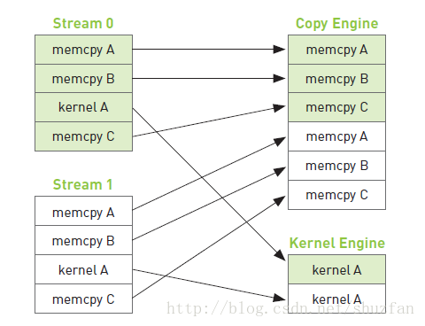

如上图，复制操作和核函数执行是分开的，但由于每个流内部需要按顺序执行，因此复制c的操作需要等待核函数执行完毕。 于是，整个程序执行的时间线如下图：(箭头表示需要等待)

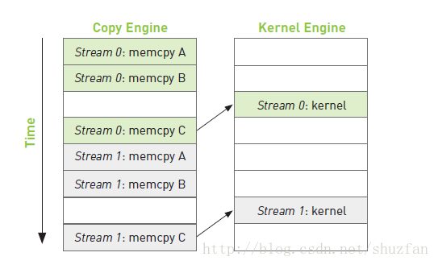

从上面的时间线我们可以启发式的思考下：如何调整每个流当中的操作顺序来获得最大的收益？ 提高重叠率。
如下图所示，假如复制一份数据的时间和执行一次核函数的时间差不多，那么我们可以采用交叉执行的策略：

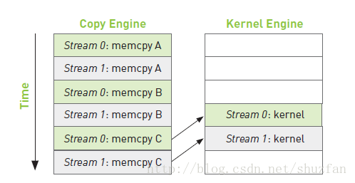

由于流0的a和b已经准备完成，因此当复制流1的b时，可以同步执行流0的核函数。 这样整个时间线，相较于之前的操作很明显少掉了两块操作。


## 流并行示例
- 与流相关的常用函数：
```c++
// 创建与销毁
cudaStream_t stream//定义流 
cudaStreamCreate(cudaStream_t * s)//创建流 
cudaStreamDestroy(cudaStream_t s)//销毁流 

//同步 
cudaStreamSynchronize()//同步单个流：等待该流上的命令都完成 
cudaDeviceSynchronize()//同步所有流：等待整个设备上流都完成 
cudaStreamWaitEvent()//等待某个事件结束后执行该流上的命令 
cudaStreamQuery()//查询一个流任务是否完成 

//回调 
cudaStreamAddCallback()//在任何点插入回调函数 

//优先级 
cudaStreamCreateWithPriority() 
cudaDeviceGetStreamPriorityRange()
```

- 下面给出一个2个流执行a + b = c的示例， 我们假设数据量非常大，需要将数据拆分，每次计算一部分。
```c++
#include "cuda_runtime.h"
#include <iostream>

using namespace std;

#define N (1024 * 256) // 每次处理的数据量
#define SIZE (N * 20) //数据总量

// 核函数，a + b = c
__global__ void add(int* a, int* b, int* c)
{
    int i = blockIdx.x * blockDim.x + threadIdx.x;
    if (i < N)
        c[i] = a[i] + b[i];
}

int main()
{
    // 获取0号GPU的属性并判断是否支持设备重叠功能
    cudaDeviceProp mprop;
    cudaGetDeviceProperties(&mprop, 0);
    if (!mprop.deviceOverlap) {
        cout << "Device not support overlaps, so stream is invalid!" << endl;
        return 0;
    }

    // 创建计时事件
    cudaEvent_t start, stop;
    cudaEventCreate(&start);
    cudaEventCreate(&stop);
    float elapsedTime;

    // 创建流
    cudaStream_t stream0, stream1;
    cudaStreamCreate(&stream0);
    cudaStreamCreate(&stream1);

    // 开辟主机页锁定内存，并随机初始化数据
    int *host_a, *host_b, *host_c;
    cudaHostAlloc((void**)&host_a, SIZE * sizeof(int), cudaHostAllocDefault);
    cudaHostAlloc((void**)&host_b, SIZE * sizeof(int), cudaHostAllocDefault);
    cudaHostAlloc((void**)&host_c, SIZE * sizeof(int), cudaHostAllocDefault);
    for (size_t i = 0; i < SIZE; i++) {
        host_a[i] = rand();
        host_b[i] = rand();
    }

    // 声明并开辟相关变量内存
    int *dev_a0, *dev_b0, *dev_c0; //用于流0的数据
    int *dev_a1, *dev_b1, *dev_c1; //用于流1的数据
    cudaMalloc((void**)&dev_a0, N * sizeof(int));
    cudaMalloc((void**)&dev_b0, N * sizeof(int));
    cudaMalloc((void**)&dev_c0, N * sizeof(int));
    cudaMalloc((void**)&dev_a1, N * sizeof(int));
    cudaMalloc((void**)&dev_b1, N * sizeof(int));
    cudaMalloc((void**)&dev_c1, N * sizeof(int));

    /************************  核心计算部分    ***************************/
    cudaEventRecord(start, 0);
    for (size_t i = 0; i < SIZE; i += 2 * N) {

        // 复制流0数据a
        cudaMemcpyAsync(dev_a0, host_a + i, N * sizeof(int), cudaMemcpyHostToDevice, stream0);
        // 复制流1数据a
        cudaMemcpyAsync(dev_a1, host_a + i + N, N * sizeof(int), cudaMemcpyHostToDevice, stream1);
        // 复制流0数据b
        cudaMemcpyAsync(dev_b0, host_b + i, N * sizeof(int), cudaMemcpyHostToDevice, stream0);
        // 复制流1数据b
        cudaMemcpyAsync(dev_b1, host_b + i + N, N * sizeof(int), cudaMemcpyHostToDevice, stream1);
        // 执行流0核函数
        add<<<N / 256, 256, 0, stream0>>>(dev_a0, dev_b0, dev_c0);
        // 执行流1核函数
        add<<<N / 256, 256, 0, stream1>>>(dev_a1, dev_b1, dev_c1);
        // 复制流0数据c
        cudaMemcpyAsync(host_c + i, dev_c0, N * sizeof(int), cudaMemcpyDeviceToHost, stream0);
        // 复制流1数据c
        cudaMemcpyAsync(host_c + i + N, dev_c1, N * sizeof(int), cudaMemcpyDeviceToHost, stream1);
    }

    // 流同步
    cudaStreamSynchronize(stream0);
    cudaStreamSynchronize(stream1);

    // 处理计时
    cudaEventSynchronize(stop);
    cudaEventRecord(stop, 0);
    cudaEventElapsedTime(&elapsedTime, start, stop);
    cout << "GPU time: " << elapsedTime << "ms" << endl;

    // 销毁所有开辟的内存
    cudaFreeHost(host_a);
    cudaFreeHost(host_b);
    cudaFreeHost(host_c);
    cudaFree(dev_a0); cudaFree(dev_b0); cudaFree(dev_c0);
    cudaFree(dev_a1); cudaFree(dev_b1); cudaFree(dev_c1);

    // 销毁流以及计时事件
    cudaStreamDestroy(stream0); cudaStreamDestroy(stream1);
    cudaEventDestroy(start);    cudaEventDestroy(stop);

    return 0;
}
```
- 启动cuda gdb:cuda-gdb a.out
- cuda-gdb调试过程中常用的命令

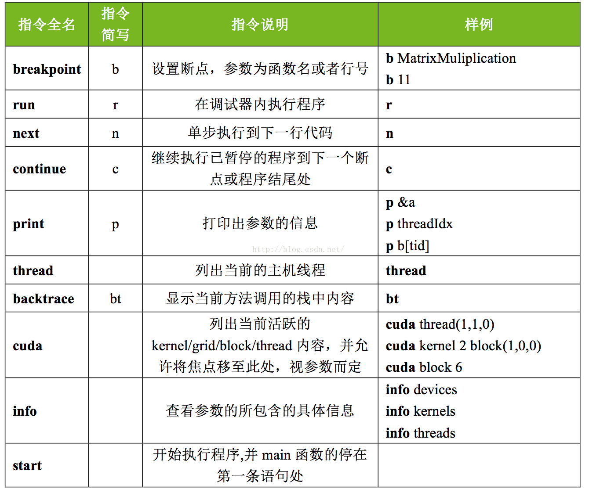

## 本章小结
在本章中，我们介绍了如何在CUDA C应用程序中实现任务级的并行性。通过使用两个（或者多个）CUDA流，我们可以使GPU在执行核函数的同时，还能在主机和GPU之间执行复制操作。然而，当采用这种执行方式时，需要注意两个因素。首先，需要通过cudaHostAlloc()来分配主机内存，因为接下来需要通过cudaMemcpyAsync()对内存复制操作进行排队，而异步复制操作需要在固定缓存执行。其次，我们要知道，添加这些操作到流中的顺序将对内存复制操作和核函数执行的重叠情况产生影响。通常，应该采用宽度优先或者轮询方式将工作分配到的流。如果没有理解硬件的排队工作原理，那么初看上去会觉得这种方式有违直觉，因此当你编写自己的应用程序时，要记住这个情况。

# 第十一章 多GPU系统上的CUDA C
了解如何利用多GPU系统中的资源。

## 本章目标
- 了解如何分配和使用零拷贝内存(Zero-Copy Memory)
- 了解如何在同一个应用程序中使用多个GPU
- 了解如何分配和使用可移动的固定内存(Portable Pinned Memory)

## 零拷贝内存
在第10章中，我们介绍了固定内存(或者说页锁定内存)，这种新型的主机内存能够确保不会交换出物理内存。我们通过调用cudaHostAlloc来分配这种内存，并且传递参数cudaHostAllocDefault来获得默认的固定内存。在前面曾提到，本章会介绍在分配固定内存时可以使用的其他参数值。除了cudaHostAllocDefault外，还可以传递的标志之一是cudaHostAllocMapped。通过 cudaHostAllocMapped分配的主机内存也是固定的，它与通过cudaHostAllocDefault分配的固定内存有着相同的属性，特别是当它不能从物理内存中交换出去或者重新定位时。但这种内存除了可以用于主机与GPU之间的内存复制外，还可以打破第3章中的主机内存规则之一:可以在CUDA C核函数中直接访问这种类型的主机内存。由于这种内存不需要复制到GPU ,因此也称为零拷贝内存。

- 通过零拷贝内存实现点积运算
通常，GPU只能访问GPU内存，而CPU也只能访问主机内存。但在某些环境中，打破这种规则或许能带来更好的效果。为了说明由GPU访问主机内存将带来哪些好处，我们来重新回顾前面的归约运算:矢量点积运算。如果你已经完整地读了本书，那么肯定还记得第一个点积运算版本:将两个输入矢量复制到CPU，对相应的元素执行乘积计算，然后将中间结果复制回到主机，并在CPU上完成求和计算。

在这个版本中，我们不需要将输入矢量显式复制到GPU。而是使用零拷贝内存从GPU中直接访问数据。这个版本的点积运算非常类似于对固定内存的性能测试程序。我们将编写两个函数，其中一个函数是对标准主机内存的测试，另一个函数将在GPU上执行归约运算，并使用零拷贝内存作为输入缓冲区和输出缓冲区。首先，我们来看看点积运算的主机内存版本。按照惯例，首先创建计时事件，然后分配输入缓冲区和输出缓冲区、并用数据填充输入缓冲区。

```c++
#include "../common/book.h"

#define imin(a, b) (a < b ? a : b)

const int N = 33 * 1024 * 1024;
const int threadsPerBlock = 256;
const int blocksPerGrid = imin(32, (N + threadsPerBlock - 1) / threadsPerBlock);

__global__ void dot(int size, float* a, float* b, float* c)
{
    __shared__ float cache[threadsPerBlock];
    int tid = threadIdx.x + blockIdx.x * blockDim.x;
    int cacheIndex = threadIdx.x;

    float temp = 0;
    while (tid < size) {
        temp += a[tid] * b[tid];
        tid += blockDim.x * gridDim.x;
    }

    // set the cache values
    cache[cacheIndex] = temp;

    // synchronize threads in this block
    __syncthreads();

    // for reductions, threadsPerBlock must be a power of 2
    // because of the following code
    int i = blockDim.x / 2;
    while (i != 0) {
        if (cacheIndex < i)
            cache[cacheIndex] += cache[cacheIndex + i];
        __syncthreads();
        i /= 2;
    }

    if (cacheIndex == 0)
        c[blockIdx.x] = cache[0];
}

float malloc_test(int size)
{
    cudaEvent_t start, stop;
    float *a, *b, c, *partial_c;
    float *dev_a, *dev_b, *dev_partial_c;
    float elapsedTime;

    HANDLE_ERROR(cudaEventCreate(&start));
    HANDLE_ERROR(cudaEventCreate(&stop));

    // allocate memory on the CPU side
    a = (float*)malloc(size * sizeof(float));
    b = (float*)malloc(size * sizeof(float));
    partial_c = (float*)malloc(blocksPerGrid * sizeof(float));

    // allocate the memory on the GPU
    HANDLE_ERROR(cudaMalloc((void**)&dev_a,
        size * sizeof(float)));
    HANDLE_ERROR(cudaMalloc((void**)&dev_b,
        size * sizeof(float)));
    HANDLE_ERROR(cudaMalloc((void**)&dev_partial_c,
        blocksPerGrid * sizeof(float)));

    // fill in the host memory with data
    for (int i = 0; i < size; i++) {
        a[i] = i;
        b[i] = i * 2;
    }

    HANDLE_ERROR(cudaEventRecord(start, 0));
    // copy the arrays 'a' and 'b' to the GPU
    HANDLE_ERROR(cudaMemcpy(dev_a, a, size * sizeof(float),
        cudaMemcpyHostToDevice));
    HANDLE_ERROR(cudaMemcpy(dev_b, b, size * sizeof(float),
        cudaMemcpyHostToDevice));

    dot<<<blocksPerGrid, threadsPerBlock>>>(size, dev_a, dev_b,
        dev_partial_c);
    // copy the array 'c' back from the GPU to the CPU
    HANDLE_ERROR(cudaMemcpy(partial_c, dev_partial_c,
        blocksPerGrid * sizeof(float),
        cudaMemcpyDeviceToHost));

    HANDLE_ERROR(cudaEventRecord(stop, 0));
    HANDLE_ERROR(cudaEventSynchronize(stop));
    HANDLE_ERROR(cudaEventElapsedTime(&elapsedTime,
        start, stop));

    // finish up on the CPU side
    c = 0;
    for (int i = 0; i < blocksPerGrid; i++) {
        c += partial_c[i];
    }

    HANDLE_ERROR(cudaFree(dev_a));
    HANDLE_ERROR(cudaFree(dev_b));
    HANDLE_ERROR(cudaFree(dev_partial_c));

    // free memory on the CPU side
    free(a);
    free(b);
    free(partial_c);

    // free events
    HANDLE_ERROR(cudaEventDestroy(start));
    HANDLE_ERROR(cudaEventDestroy(stop));

    printf("Value calculated:  %f\n", c);

    return elapsedTime;
}

float cuda_host_alloc_test(int size)
{
    cudaEvent_t start, stop;
    float *a, *b, c, *partial_c;
    float *dev_a, *dev_b, *dev_partial_c;
    float elapsedTime;

    HANDLE_ERROR(cudaEventCreate(&start));
    HANDLE_ERROR(cudaEventCreate(&stop));

    // allocate the memory on the CPU
    HANDLE_ERROR(cudaHostAlloc((void**)&a,
        size * sizeof(float),
        cudaHostAllocWriteCombined | cudaHostAllocMapped));
    HANDLE_ERROR(cudaHostAlloc((void**)&b,
        size * sizeof(float),
        cudaHostAllocWriteCombined | cudaHostAllocMapped));
    HANDLE_ERROR(cudaHostAlloc((void**)&partial_c,
        blocksPerGrid * sizeof(float),
        cudaHostAllocMapped));

    // find out the GPU pointers
    HANDLE_ERROR(cudaHostGetDevicePointer(&dev_a, a, 0));
    HANDLE_ERROR(cudaHostGetDevicePointer(&dev_b, b, 0));
    HANDLE_ERROR(cudaHostGetDevicePointer(&dev_partial_c,
        partial_c, 0));

    // fill in the host memory with data
    for (int i = 0; i < size; i++) {
        a[i] = i;
        b[i] = i * 2;
    }

    HANDLE_ERROR(cudaEventRecord(start, 0));

    dot<<<blocksPerGrid, threadsPerBlock>>>(size, dev_a, dev_b,
        dev_partial_c);

    HANDLE_ERROR(cudaThreadSynchronize());
    HANDLE_ERROR(cudaEventRecord(stop, 0));
    HANDLE_ERROR(cudaEventSynchronize(stop));
    HANDLE_ERROR(cudaEventElapsedTime(&elapsedTime,
        start, stop));

    // finish up on the CPU side
    c = 0;
    for (int i = 0; i < blocksPerGrid; i++) {
        c += partial_c[i];
    }

    HANDLE_ERROR(cudaFreeHost(a));
    HANDLE_ERROR(cudaFreeHost(b));
    HANDLE_ERROR(cudaFreeHost(partial_c));

    // free events
    HANDLE_ERROR(cudaEventDestroy(start));
    HANDLE_ERROR(cudaEventDestroy(stop));

    printf("Value calculated:  %f\n", c);

    return elapsedTime;
}

int main(void)
{
    cudaDeviceProp prop;
    int whichDevice;
    HANDLE_ERROR(cudaGetDevice(&whichDevice));
    HANDLE_ERROR(cudaGetDeviceProperties(&prop, whichDevice));
    if (prop.canMapHostMemory != 1) {
        printf("Device can not map memory.\n");
        return 0;
    }

    float elapsedTime;

    HANDLE_ERROR(cudaSetDeviceFlags(cudaDeviceMapHost));

    // try it with malloc
    elapsedTime = malloc_test(N);
    printf("Time using cudaMalloc:  %3.1f ms\n",
        elapsedTime);

    // now try it with cudaHostAlloc
    elapsedTime = cuda_host_alloc_test(N);
    printf("Time using cudaHostAlloc:  %3.1f ms\n",
        elapsedTime);
}
```

## 使用零复制的三步

- 1 启动零复制
需要在任何CUDA上下文创建之前进行下面的调用：
```c++
//Enable host mapping to device
 memoryCUDA_CALL(cudaSetDeviceFlags(cudaDeviceMapHost));
```
当CUDA上下文被创建时，驱动程序会知道它需要支持主机内存映射，没有驱动程序的支持，零复制将无法工作。如果该支持在CUDA上下文创建之后完成，内存也无法工作。请注意对cudaHostAlloc
这样的函数调用，尽管在主机内存上执行，也仍然创建一个GPU上下文。
虽然大多数设备支持零复制内存，但是一些早期的设备却不支持。显式检查：
```c++
struct cudaDeviceProp device_prop
cudaGetDeviceProperties( &device_prop, device_num );
zero_copy_supported = device_prop.canMapHostMemcpy;
```

- 2 分配主机内存
分配了主机内存，这样它就可以被映射到设备内存。我们对cudaHostAlloc函数使用额外的标志cudaHostAllocMapped就可以实现。
```c++
// Allocate zero copy pinned
cudaHostAlloc((void**)&host_data_to_device, size_in_bytes, cudaHostAllocWriteCombined|cudaHostAllocMapped);
```

- 3 将常规的主机指针转换成指向设备内存空间的指针
通过cudaHostGetDevicePointer函数：
```c++
// Conver to a GPU host
cudaHostGetDevicePointer( &dev_host_data_device, host_data_to_device, 0);
```
在这个调用中，我们将之前在主机内存空间分配的host_data_to_device
转换成GPU内存空间的指针。在GPU内核中，只使用转换后的指针，原始的指针只出现在主机执行的代码中。因此，为了之后释放内存，需要在主机上执行一个操作，其他的调用保持不变：
```c++
// Free pinned
cudaFreeHost( host_data_to_device );
```

- 4 代码参考
```c++
#include <numeric>
#include <stdio.h>
#include <stdlib.h>
void checkCUDAError(const char *msg) {
    cudaError_t err = cudaGetLastError();
    if (cudaSuccess != err) {
        fprintf(stderr, "Cuda error: %s: %s.\n", msg, cudaGetErrorString(err));
        exit(EXIT_FAILURE);
    }
}

__global__ void sumNum( int *data) {

    int i = threadIdx.x + blockIdx.x * blockDim.x;
    if(i<1000000000){
     data[i]=10;
    }
}
int main(void) {
    size_t size = 1*1000000000 * sizeof(int);//4G
    //1.启用零复制
    cudaSetDeviceFlags (cudaDeviceMapHost);
    int* data;
    //2.分配主机内存
    cudaHostAlloc((void**) &data, size,
            cudaHostAllocWriteCombined | cudaHostAllocMapped);
     checkCUDAError("cudaHostAlloc data");
    
     memset(data, 0, 1*1000000000 * sizeof(int));
    int *gpudata;
    //3.将常规的主机指针转换成指向设备内存空间的指针
    cudaHostGetDevicePointer(&gpudata, data, 0);
    checkCUDAError("cudaHostGetDevicePointer");
    //sumNum<<<1000000000/1024+1023, 1024>>>(gpudata);
    //注意！！因为下面要打印出来测试，所以要先同步数据，这个函数可以保证cpu等待gpu的kernel函数结束才往下运行。如果数据暂时用不到，
    //可以在整体结束以后再加这句话。明显等待kernel函数结束会占用程序进行的时间。
    cudaDeviceSynchronize();
    for (int i = 99999999; i < 1000000000; i=i+100000000) {
        printf("%d \n", data[i]);
    }
    //记得零拷贝的free是这个函数
    cudaFreeHost(data);
    return 0;
}
```

## 零拷贝内存的性能
零拷贝内存能够带来哪些好处?对于独立GPU和集成GPU,答案是不同的。独立GPU自己拥有专门的DRAM ,通常位于CPU之外的电路板上。例如，如果在计算机中已经安装了一块图形卡，那么这个GPU就是一个独立GPU。集成GPU是系统芯片组中内置的图形处理器，通常与CPU共享系统内存。在许多基于NVIDIA nForce媒体与通信处理器( Media and Communications Processor, MCP)构建的现代系统中，都包含了支持CUDA的集成GPU。除了nForce MCP外，基于NVIDIA新推出的ION平台的上网本、笔记本以及桌面计算机都包含了集成的和支持CUDA的GPU。对于集成GPU、使用零拷贝内存通常都会带来性能提升，因为内存在物理上与主机是共亨的。将缓冲区声明为零拷贝内存的唯一作用就是避免不必要的数据复制。但要记住，天下没有免费的午餐，所有类型的固定内存都存在一定的局限性，零拷贝内存同样不例外:每个固定内存都会占川系统的可用物理内存，这最终将降低系统的性能。

当输入内存和输出内存都只能使用一次时，那么在独立GPU上使用零拷贝内存将带来性能提升。由于GPU在设计时考虑了隐藏内存访问带来的延迟，因此这种机制在某种程度上将减轻PCIE总线上读取和写入等操作的延迟，从而会带来可观的性能提升。但由于GPU不会缓存零拷贝内存的内容，如果多次读取内存，那么最终将得不偿失，还不如一开始就将数据复制到GPU。

## 使用多个GPU
```c++
#include "../common/book.h"


#define imin(a,b) (a<b?a:b)

#define     N    (33*1024*1024)
const int threadsPerBlock = 256;
const int blocksPerGrid =
            imin( 32, (N/2+threadsPerBlock-1) / threadsPerBlock );


__global__ void dot( int size, float *a, float *b, float *c ) {
    __shared__ float cache[threadsPerBlock];
    int tid = threadIdx.x + blockIdx.x * blockDim.x;
    int cacheIndex = threadIdx.x;

    float   temp = 0;
    while (tid < size) {
        temp += a[tid] * b[tid];
        tid += blockDim.x * gridDim.x;
    }
    
    // set the cache values
    cache[cacheIndex] = temp;
    
    // synchronize threads in this block
    __syncthreads();

    // for reductions, threadsPerBlock must be a power of 2
    // because of the following code
    int i = blockDim.x/2;
    while (i != 0) {
        if (cacheIndex < i)
            cache[cacheIndex] += cache[cacheIndex + i];
        __syncthreads();
        i /= 2;
    }

    if (cacheIndex == 0)
        c[blockIdx.x] = cache[0];
}


struct DataStruct {
    int     deviceID;
    int     size;
    float   *a;
    float   *b;
    float   returnValue;
};


void* routine( void *pvoidData ) {
    DataStruct  *data = (DataStruct*)pvoidData;
    HANDLE_ERROR( cudaSetDevice( data->deviceID ) );

    int     size = data->size;
    float   *a, *b, c, *partial_c;
    float   *dev_a, *dev_b, *dev_partial_c;

    // allocate memory on the CPU side
    a = data->a;
    b = data->b;
    partial_c = (float*)malloc( blocksPerGrid*sizeof(float) );

    // allocate the memory on the GPU
    HANDLE_ERROR( cudaMalloc( (void**)&dev_a,
                              size*sizeof(float) ) );
    HANDLE_ERROR( cudaMalloc( (void**)&dev_b,
                              size*sizeof(float) ) );
    HANDLE_ERROR( cudaMalloc( (void**)&dev_partial_c,
                              blocksPerGrid*sizeof(float) ) );

    // copy the arrays 'a' and 'b' to the GPU
    HANDLE_ERROR( cudaMemcpy( dev_a, a, size*sizeof(float),
                              cudaMemcpyHostToDevice ) );
    HANDLE_ERROR( cudaMemcpy( dev_b, b, size*sizeof(float),
                              cudaMemcpyHostToDevice ) ); 

    dot<<<blocksPerGrid,threadsPerBlock>>>( size, dev_a, dev_b,
                                            dev_partial_c );
    // copy the array 'c' back from the GPU to the CPU
    HANDLE_ERROR( cudaMemcpy( partial_c, dev_partial_c,
                              blocksPerGrid*sizeof(float),
                              cudaMemcpyDeviceToHost ) );

    // finish up on the CPU side
    c = 0;
    for (int i=0; i<blocksPerGrid; i++) {
        c += partial_c[i];
    }

    HANDLE_ERROR( cudaFree( dev_a ) );
    HANDLE_ERROR( cudaFree( dev_b ) );
    HANDLE_ERROR( cudaFree( dev_partial_c ) );

    // free memory on the CPU side
    free( partial_c );

    data->returnValue = c;
    return 0;
}


int main( void ) {
    int deviceCount;
    HANDLE_ERROR( cudaGetDeviceCount( &deviceCount ) );
    if (deviceCount < 2) {
        printf( "We need at least two compute 1.0 or greater "
                "devices, but only found %d\n", deviceCount );
        return 0;
    }

    float   *a = (float*)malloc( sizeof(float) * N );
    HANDLE_NULL( a );
    float   *b = (float*)malloc( sizeof(float) * N );
    HANDLE_NULL( b );

    // fill in the host memory with data
    for (int i=0; i<N; i++) {
        a[i] = i;
        b[i] = i*2;
    }

    // prepare for multithread
    DataStruct  data[2];
    data[0].deviceID = 0;
    data[0].size = N/2;
    data[0].a = a;
    data[0].b = b;

    data[1].deviceID = 1;
    data[1].size = N/2;
    data[1].a = a + N/2;
    data[1].b = b + N/2;

    CUTThread   thread = start_thread( routine, &(data[0]) );
    routine( &(data[1]) );
    end_thread( thread );


    // free memory on the CPU side
    free( a );
    free( b );

    printf( "Value calculated:  %f\n",
            data[0].returnValue + data[1].returnValue );

    return 0;
}
```

## 可移动的固定内存
在使用多个GPU的程序中，最后一个重要的部分就是固定内存的使用。在第10章中己经介绍了，固定内存实际上是主机内存，只是该内存页锁定在物理内存中，以便防止被换出或者重定位。然而，这些内存页仅对于单个CPU线程来说是"固定的"。也就是说，如果某个线程分配了固定内存，那么这些内存只是对于分配它们的线程来说是页锁定的。如果在线程之间共享指向这块内存的指针.那么其他的线程将把这块内存视为标准的、可分页的内存。   

这种行为的副作用之一就是，当其他线程(不是分配固定内存的线程)试图在这块内存上执行cudaMemcpy()时。将按照标准的可分页内存速率来执行复制操作。在第10章中曾介绍过，这种速率大约为最高传输速度的50%。更糟糕的是，如果线程试图将一个cudaMemcpyAsync()调用放人CUDA流的队列中，那么将失败，因为cudaMemcpyAsync()需要使用固定内存。由于这块内存对于除了分配它的线程以外的其他线程来说似乎是可分页的，因此这个调用会失败，甚至导致任何后续操作都无法进行。

然而，对于这个问题有一种补救方案。我们可以将固定内存分配为可移动的，这意味着可以在主机线程之间移动这块内存，并且每个线程都将其视为固定内存。要达到这个目的，需要使用cudaHostAlloc()来分配内存，并且在调用时使用一个新的标志:cudaHostAllocPortable。这个标志可以与其他标志一起使用，例如cudaHostAllocWriteCombined和cudaHostAllacMapped。这意味着在分配主机内存时，可将其作为可移动、零拷贝以及合并式写人等的任意组合。

```c++
#include "../common/book.h"


#define imin(a,b) (a<b?a:b)

#define     N    (33*1024*1024)
const int threadsPerBlock = 256;
const int blocksPerGrid =
            imin( 32, (N/2+threadsPerBlock-1) / threadsPerBlock );


__global__ void dot( int size, float *a, float *b, float *c ) {
    __shared__ float cache[threadsPerBlock];
    int tid = threadIdx.x + blockIdx.x * blockDim.x;
    int cacheIndex = threadIdx.x;

    float   temp = 0;
    while (tid < size) {
        temp += a[tid] * b[tid];
        tid += blockDim.x * gridDim.x;
    }
    
    // set the cache values
    cache[cacheIndex] = temp;
    
    // synchronize threads in this block
    __syncthreads();

    // for reductions, threadsPerBlock must be a power of 2
    // because of the following code
    int i = blockDim.x/2;
    while (i != 0) {
        if (cacheIndex < i)
            cache[cacheIndex] += cache[cacheIndex + i];
        __syncthreads();
        i /= 2;
    }

    if (cacheIndex == 0)
        c[blockIdx.x] = cache[0];
}


struct DataStruct {
    int     deviceID;
    int     size;
    int     offset;
    float   *a;
    float   *b;
    float   returnValue;
};


void* routine( void *pvoidData ) {
    DataStruct  *data = (DataStruct*)pvoidData;
    if (data->deviceID != 0) {
        HANDLE_ERROR( cudaSetDevice( data->deviceID ) );
        HANDLE_ERROR( cudaSetDeviceFlags( cudaDeviceMapHost ) );
    }

    int     size = data->size;
    float   *a, *b, c, *partial_c;
    float   *dev_a, *dev_b, *dev_partial_c;

    // allocate memory on the CPU side
    a = data->a;
    b = data->b;
    partial_c = (float*)malloc( blocksPerGrid*sizeof(float) );

    // allocate the memory on the GPU
    HANDLE_ERROR( cudaHostGetDevicePointer( &dev_a, a, 0 ) );
    HANDLE_ERROR( cudaHostGetDevicePointer( &dev_b, b, 0 ) );
    HANDLE_ERROR( cudaMalloc( (void**)&dev_partial_c,
                              blocksPerGrid*sizeof(float) ) );

    // offset 'a' and 'b' to where this GPU is gets it data
    dev_a += data->offset;
    dev_b += data->offset;

    dot<<<blocksPerGrid,threadsPerBlock>>>( size, dev_a, dev_b,
                                            dev_partial_c );
    // copy the array 'c' back from the GPU to the CPU
    HANDLE_ERROR( cudaMemcpy( partial_c, dev_partial_c,
                              blocksPerGrid*sizeof(float),
                              cudaMemcpyDeviceToHost ) );

    // finish up on the CPU side
    c = 0;
    for (int i=0; i<blocksPerGrid; i++) {
        c += partial_c[i];
    }

    HANDLE_ERROR( cudaFree( dev_partial_c ) );

    // free memory on the CPU side
    free( partial_c );

    data->returnValue = c;
    return 0;
}


int main( void ) {
    int deviceCount;
    HANDLE_ERROR( cudaGetDeviceCount( &deviceCount ) );
    if (deviceCount < 2) {
        printf( "We need at least two compute 1.0 or greater "
                "devices, but only found %d\n", deviceCount );
        return 0;
    }

    cudaDeviceProp  prop;
    for (int i=0; i<2; i++) {
        HANDLE_ERROR( cudaGetDeviceProperties( &prop, i ) );
        if (prop.canMapHostMemory != 1) {
            printf( "Device %d can not map memory.\n", i );
            return 0;
        }
    }

    float *a, *b;
    HANDLE_ERROR( cudaSetDevice( 0 ) );
    HANDLE_ERROR( cudaSetDeviceFlags( cudaDeviceMapHost ) );
    HANDLE_ERROR( cudaHostAlloc( (void**)&a, N*sizeof(float),
                              cudaHostAllocWriteCombined |
                              cudaHostAllocPortable |
                              cudaHostAllocMapped ) );
    HANDLE_ERROR( cudaHostAlloc( (void**)&b, N*sizeof(float),
                              cudaHostAllocWriteCombined |
                              cudaHostAllocPortable      |
                              cudaHostAllocMapped ) );

    // fill in the host memory with data
    for (int i=0; i<N; i++) {
        a[i] = i;
        b[i] = i*2;
    }

    // prepare for multithread
    DataStruct  data[2];
    data[0].deviceID = 0;
    data[0].offset = 0;
    data[0].size = N/2;
    data[0].a = a;
    data[0].b = b;

    data[1].deviceID = 1;
    data[1].offset = N/2;
    data[1].size = N/2;
    data[1].a = a;
    data[1].b = b;

    CUTThread   thread = start_thread( routine, &(data[1]) );
    routine( &(data[0]) );
    end_thread( thread );


    // free memory on the CPU side
    HANDLE_ERROR( cudaFreeHost( a ) );
    HANDLE_ERROR( cudaFreeHost( b ) );

    printf( "Value calculated:  %f\n",
            data[0].returnValue + data[1].returnValue );

    return 0;
}
```

## 本章小结
我们在本章中看到了一些新的主机内存分配方式，所有这些内存都是通过cudaHostAlloc()来分配的。通过使用一组不同的标志，我们可以分配具备零拷贝、可移动或者合并式写入等属性的内存。通过使用零拷贝内存，可以避免CPU与GPU之间的显式复制操作，这对许多应用程序来说都可能会带来加速。通过使用支持线程的库，我们可以在同一个应用程序中对多个GPU进行操作，使点积运算能够跨越多个设备执行。最后，我们看到了通过可移动的固定内存使多个GPU共享固定内存。在最后一个示例中使用了可移动的固定内存，多个GPU，以及零拷贝内存，以演示第5章中点积运算的增强版。随着多GPU系统的日益普及，这些技术能帮助你充分发挥这些系统的总体计算能力。

# 第十二章 后记

## 本章目标
- 了解一些辅助开发CUDA C程序的工具
- 了解一些可以帮助你提升CUDA C开发能力的代码资源

## CUDA工具
- GUDA工具箱(CUDA Toolkit)

- CUFFT(Fast Fourier Transform)
    - 在实数值与复数值之间进行一维变换、二维变换和三维变换。
    - 以批处理的方式并行执行多个一维变换。
    - 二维变换和三维变换，其中每一维的大小范围为2到16384。
    - 一维变换，其中元素的数量最高可达8百万。
    - 实数值数据和复数值数据的就地(In-Place)变换和非就地(Out-of-Place)变换。

- CUBLAS(Basic Linear Algebra Subprograms，BLAS)

- NVIDIA GPU Computing SDK 
    - CUDA基本主题
    - CUDA高级主题
    - CUDA系统集成
    - 数据并行算法
    - 图形互操作
    - 纹理性能策略
    - 线性代数
    - 图像/视频处理
    - 计算金融
    - 数据压缩
    - 物理模拟 

- NVIDIA性能原语(NVIDIA Performance Primitives, NPP)
除了在CUFFT和CUBLAS等库中提供的函数外，NVIDIA还提供了一个函数库来执行墓于CUDA加速的数据处理操作，称为NVIDIA性能原语(NVIDIA Performance Primitives, NPP) 。当前，NPP的基本功能集合主要侧重于图像处理和视频处理，这些功能广泛适用于这些领域的开发人员。NVIDIA计划在将来进一步增强NPP的功能以便解决更广泛领域中的计算任务。

- 调试CUDA C
    - CUDA-GDB(Linux版本)
    - NVIDIA Parallel Nsight(Microsoft版本)

- CUDA Visual Profiler  
Visual Profiler是一个图形化的剖析工具，可以显示你的应用程序中CPU和GPU的活动情况，利用分析引擎帮助你寻找优化的机会。

## 参考资料
- <<Pragramming Massively Parallel Pracessers:a Hands-On Approach>>
    - 进一步熟悉CUDA架构以及NVIDIA GPU的底层工作原理 
    - CUDA U
        - 大学课程资料
        - Dr.Dobb's 

    - NVIDIA论坛

## 代码资源
- CUDA数据并行原语库
- CULAtools
- 语言封装器

## 本章小结
这就是本书的所有内容。即使在读完了前ll章的内容后，还有许多的资源可以下载、阅读、思考和编译。随着异构计算平台的日趋成熟，学习GPU计算也显得作常重要。我们希望你能学习并掌握当前最主流的并行编程环境之一CUDA。而且，我们希望你能够进一步研究出一些新方法来与计算机交互，以及处理软件面临的日益增加的信息量。你的这些研究思想和技术将把GFU计算推向更高境地。


# 附录 高级原子操作


