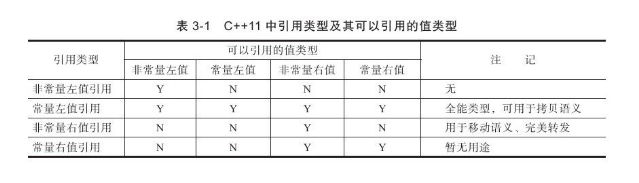

# 左值、右值

在C++11中所有的值必属于左值、右值两者之一，右值又可以细分为纯右值、将亡值。**在C++11中可以取地址的、有名字的就是左值，反之，不能取地址的、没有名字的就是右值（将亡值或纯右值）**。举个例子，int a = b+c, a就是左值，其有变量名为a，通过&a可以获取该变量的地址；表达式b+c、函数int func()的返回值是右值，在其被赋值给某一变量前，我们不能通过变量名找到它，＆(b+c)这样的操作则不会通过编译。

# 右值、将亡值

在理解C++11的右值前，先看**C++98中右值的概念：C++98中右值是纯右值，纯右值指的是临时变量值、不跟对象关联的字面量值**。临时变量指的是非引用返回的函数返回值、表达式等，例如函数int func()的返回值，表达式a+b；不跟对象关联的字面量值，例如true，2，”C”等。

C++11对C++98中的右值进行了扩充。**在C++11中右值又分为纯右值（prvalue，Pure Rvalue）和将亡值（xvalue，eXpiring Value）。**其中纯右值的概念等同于我们在C++98标准中右值的概念，指的是临时变量和不跟对象关联的字面量值；**将亡值则是C++11新增的跟右值引用相关的表达式，这样表达式通常是将要被移动的对象（移为他用）**，比如返回右值引用T&&的函数返回值、std::move的返回值，或者转换为T&&的类型转换函数的返回值。

**将亡值**可以理解为通过“盗取”其他变量内存空间的方式获取到的值。在确保其他变量不再被使用、或即将被销毁时，通过“盗取”的方式可以避免内存空间的释放和分配，能够延长变量值的生命期。

# 左值引用、右值引用
**左值引用**就是对一个左值进行引用的类型。**右值引用**就是对一个右值进行引用的类型，事实上，由于右值通常不具有名字，我们也只能通过引用的方式找到它的存在。

**右值引用**和**左值引用**都是属于引用类型。无论是声明一个左值引用还是右值引用，都必须立即进行初始化。而其原因可以理解为是引用类型本身自己并不拥有所绑定对象的内存，只是该对象的一个别名。左值引用是具名变量值的别名，而右值引用则是不具名（匿名）变量的别名。

**左值引用**通常也不能绑定到右值，但**常量左值引用**是个“万能”的引用类型。它可以接受非常量左值、常量左值、右值对其进行初始化。不过常量左值所引用的右值在它的“余生”中只能是只读的。相对地，非常量左值只能接受非常量左值对其进行初始化。

```c++
int &a = 2;       // 左值引用绑定到右值，编译失败

int b = 2;        // 非常量左值
const int &c = b; // 常量左值引用绑定到非常量左值，编译通过
const int d = 2;  // 常量左值
const int &e = c; // 常量左值引用绑定到常量左值，编译通过
const int &b =2;  // 常量左值引用绑定到右值，编程通过
```

右值值引用通常不能绑定到任何的左值，要想绑定一个左值到右值引用，通常需要std::move()将左值强制转换为右值，例如：

```c++
int a;
int &&r1 = c;             // 编译失败
int &&r2 = std::move(a);  // 编译通过
```

下表列出了在C++11中各种引用类型可以引用的值的类型。值得注意的是，只要能够绑定右值的引用类型，都能够延长右值的生命期。




# 右值引用的例子

```c++
#include <iostream>

void process_value(int& i) 
{ 
  std::cout << "LValue processed: " << i << std::endl; 
} 

void process_value(int&& i) 
{ 
  std::cout << "RValue processed: " << i << std::endl; 
} 

int main() 
{ 
  int a = 0; 
  process_value(a);
  process_value(1); 
}
```

结果如下:

```
wxl@dev:~$ g++ -std=c++11  test.cpp
wxl@dev:~$ ./a.out 
LValue processed: 0
RValue processed: 1
```

Process_value 函数被重载，分别接受左值和右值。由输出结果可以看出，临时对象是作为右值处理的。

## 下面涉及到一个问题：

如果x的类型是右值引用，指向一个右值，但x本身是左值还是右值呢？C++11对此做出了区分：

```
Things that are declared as rvalue reference can be lvalues or rvalues. The distinguishing criterion is: if it has a name, then it is an lvalue. Otherwise, it is an rvalue.
```

对上面的程序稍作修改就可以印证这个说法：

```c++
#include <iostream>

void process_value(int& i) 
{ 
  std::cout << "LValue processed: " << i << std::endl; 
} 

void process_value(int&& i) 
{ 
  std::cout << "RValue processed: "  << std::endl; 
} 

int main() 
{ 
  int a = 0; 
  process_value(a);
  int&& x = 3;
  process_value(x); 
}
```

```
wxl@dev:~$ g++ -std=c++11  test.cpp
wxl@dev:~$ ./a.out 
LValue processed: 0
LValue processed: 3
```

x 是一个右值引用，指向一个右值3，但是由于x是有名字的，所以x在这里被视为一个左值，所以在函数重载的时候选择为第一个函数。

# 右值引用的意义

直观意义：为临时变量续命，也就是为右值续命，因为右值在表达式结束后就消亡了，如果想继续使用右值，那就会动用昂贵的拷贝构造函数。（关于这部分，推荐一本书《深入理解C++11》） 
右值引用是用来支持转移语义的。转移语义可以将资源 ( 堆，系统对象等 ) 从一个对象转移到另一个对象，这样能够减少不必要的临时对象的创建、拷贝以及销毁，能够大幅度提高 C++ 应用程序的性能。临时对象的维护 ( 创建和销毁 ) 对性能有严重影响。 
转移语义是和拷贝语义相对的，可以类比文件的剪切与拷贝，当我们将文件从一个目录拷贝到另一个目录时，速度比剪切慢很多。 
通过转移语义，临时对象中的资源能够转移其它的对象里。 
在现有的 C++ 机制中，我们可以定义拷贝构造函数和赋值函数。要实现转移语义，需要定义转移构造函数，还可以定义转移赋值操作符。对于右值的拷贝和赋值会调用转移构造函数和转移赋值操作符。如果转移构造函数和转移拷贝操作符没有定义，那么就遵循现有的机制，拷贝构造函数和赋值操作符会被调用。 
普通的函数和操作符也可以利用右值引用操作符实现转移语义。

# 转移语义以及转移构造函数和转移复制运算符

以一个简单的 string 类为示例，实现拷贝构造函数和拷贝赋值操作符。

```c++
class MyString { 
 private: 
  char* _data; 
  size_t   _len; 
  void _init_data(const char *s) { 
    _data = new char[_len+1]; 
    memcpy(_data, s, _len); 
    _data[_len] = '\0'; 
  } 
 public: 
  MyString() { 
    _data = NULL; 
    _len = 0; 
  } 

  MyString(const char* p) { 
    _len = strlen (p); 
    _init_data(p); 
  } 

  MyString(const MyString& str) { 
    _len = str._len; 
    _init_data(str._data); 
    std::cout << "Copy Constructor is called! source: " << str._data << std::endl; 
  } 

  MyString& operator=(const MyString& str) { 
    if (this != &str) { 
      _len = str._len; 
      _init_data(str._data); 
    } 
    std::cout << "Copy Assignment is called! source: " << str._data << std::endl; 
    return *this; 
  } 

  virtual ~MyString() { 
    if (_data) free(_data); 
  } 
 }; 

 int main() { 
  MyString a; 
  a = MyString("Hello"); 
  std::vector<MyString> vec; 
  vec.push_back(MyString("World")); 
 }
```

这个 string 类已经基本满足我们演示的需要。在 main 函数中，实现了调用拷贝构造函数的操作和拷贝赋值操作符的操作。MyString(“Hello”) 和 MyString(“World”) 都是临时对象，也就是右值。虽然它们是临时的，但程序仍然调用了拷贝构造和拷贝赋值，造成了没有意义的资源申请和释放的操作。如果能够直接使用临时对象已经申请的资源，既能节省资源，有能节省资源申请和释放的时间。这正是定义转移语义的目的。

我们先定义转移构造函数。

```c++
MyString(MyString&& str) { 
   std::cout << "Move Constructor is called! source: " << str._data << std::endl; 
   _len = str._len; 
   _data = str._data; 
   str._len = 0; 
   str._data = NULL; 
}
```

和拷贝构造函数类似，有几点需要注意：

1. 参数（右值）的符号必须是右值引用符号，即“&&”。

2. 参数（右值）不可以是常量，因为我们需要修改右值。

3. 参数（右值）的资源链接和标记必须修改。否则，右值的析构函数就会释放资源。转移到新对象的资源也就无效了。

现在我们定义转移赋值操作符。

```c++
MyString& operator=(MyString&& str) { 
   std::cout << "Move Assignment is called! source: " << str._data << std::endl; 
   if (this != &str) { 
     _len = str._len; 
     _data = str._data; 
     str._len = 0; 
     str._data = NULL; 
   } 
   return *this; 
}
```

这里需要注意的问题和转移构造函数是一样的。

```c++
//#include "stdafx.h"
#include <iostream>
#include <vector>
#include <string.h>

using namespace std;

class MyString { 
private: 
    char* _data; 
    size_t   _len; 
    void _init_data(const char *s) { 
        _data = new char[_len+1]; 
        memcpy(_data, s, _len); 
        _data[_len] = '\0'; 
    } 
public: 
    MyString() { 
        _data = NULL; 
        _len = 0; 
    } 

    MyString(const char* p) { 
        _len = strlen (p); 
        _init_data(p); 
    } 

    MyString(const MyString& str) { 
        _len = str._len; 
        _init_data(str._data); 
        std::cout << "Copy Constructor is called! source: " << str._data << std::endl; 
    } 

    MyString& operator=(const MyString& str) { 
        if (this != &str) { 
            _len = str._len; 
            _init_data(str._data); 
        } 
        std::cout << "Copy Assignment is called! source: " << str._data << std::endl; 
        return *this; 
    } 

    virtual ~MyString() { 
        if (_data) free(_data); 
    } 

    MyString(MyString&& str) { 
        std::cout << "Move Constructor is called! source: " << str._data << std::endl; 
        _len = str._len; 
        _data = str._data; 
        str._len = 0; 
        str._data = NULL; 
    }

    MyString& operator=(MyString&& str) { 
        std::cout << "Move Assignment is called! source: " << str._data << std::endl; 
        if (this != &str) { 
            _len = str._len; 
            _data = str._data; 
            str._len = 0; 
            str._data = NULL; 
        } 
        return *this; 
    }
}; 

int main() { 
    MyString a; 
    a = MyString("Hello"); 
    std::vector<MyString> vec; 
    vec.push_back(MyString("World")); 

    //system("pause");
}
```

增加了转移构造函数和转移复制操作符后，我们的程序运行结果为 :

```
Move Assignment is called! source: Hello 
Move Constructor is called! source: World
```

由此看出，编译器区分了左值和右值，对右值调用了转移构造函数和转移赋值操作符。节省了资源，提高了程序运行的效率。

有了右值引用和转移语义，我们在设计和实现类时，对于需要动态申请大量资源的类，应该设计转移构造函数和转移赋值函数，以提高应用程序的效率。

