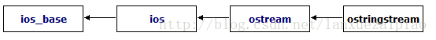

# 一、简单介绍

ostringstream是C++的一个字符集操作模板类，定义在sstream.h头文件中。ostringstream类通常用于执行C风格的串流的输出操作，格式化字符串，避免申请大量的缓冲区，替代sprintf。

**派生关系图**：



# 二、ostringstream的基本使用

ostringstream的构造函数形式：
```c++
// 首先, C++中的explicit关键字只能用于修饰只有一个参数的类构造函数, 它的作用是表明该构造函数是显示的, 而非隐式的, 
// 跟它相对应的另一个关键字是implicit, 意思是隐藏的,类构造函数默认情况下即声明为implicit(隐式).
explicit ostringstream ( openmode which = ios_base::out );
explicit ostringstream ( const string & str, openmode which = ios_base::out );
```

有时候，我们需要格式化一个字符串，但通常并不知道需要多大的缓冲区。为了保险常常申请大量的缓冲区以防止缓冲区过小造成字符串无法全部存储。这时我们可以考虑使用ostringstream类，该类能够根据内容自动分配内存，并且其对内存的管理也是相当的到位。取得std::ostringstream里的内容可以通过str()和str(string&)成员函数。

# 三、注意事项

std::ostringstream::str()返回的是临时对象，不能对其直接操作。

例如会有如下误用：

const char *  pBuffer  =  oss.str().c_str();
注意pBuffer指向的内存已被析构！！


# 四、代码测试

```c++
#include "stdafx.h"
#include <string>  
#include <iostream>
#include <sstream>
using namespace std;  
  
int main()  
{  
    ostringstream ostr1; // 构造方式1  
    ostringstream ostr2("abc"); // 构造方式2  
  
/*---------------------------------------------------------------------------- 
*** 方法str()将缓冲区的内容复制到一个string对象中，并返回 
----------------------------------------------------------------------------*/  
    ostr1 << "ostr1 " << 2012 << endl; // 格式化，此处endl也将格式化进ostr1中  
    cout << ostr1.str();   
  
/*---------------------------------------------------------------------------- 
*** 建议：在用put()方法时，先查看当前put pointer的值，防止误写 
----------------------------------------------------------------------------*/  
    long curPos = ostr2.tellp(); //返回当前插入的索引位置(即put pointer的值)，从0开始   
    cout << "curPos = " << curPos << endl;  
  
    ostr2.seekp(2); // 手动设置put pointer的值  
    ostr2.put('g');     // 在put pointer的位置上写入'g'，并将put pointer指向下一个字符位置  
    cout << ostr2.str() << endl;  
      
  
/*---------------------------------------------------------------------------- 
*** 重复使用同一个ostringstream对象时，建议： 
*** 1：调用clear()清除当前错误控制状态，其原型为 void clear (iostate state=goodbit); 
*** 2：调用str("")将缓冲区清零，清除脏数据 
----------------------------------------------------------------------------*/  
    ostr2.clear();  
    ostr2.str("");  
  
    cout << ostr2.str() << endl;  
    ostr2.str("_def");  
    cout << ostr2.str() << endl;  
    ostr2 << "gggghh";    // 覆盖原有的数据，并自动增加缓冲区  
    cout << ostr2.str() << endl;
    ostr2.str("");   // 若不加这句则运行时错误，因为_df所用空间小于gggghh，导致读取脏数据
    ostr2.str("_df");  
    cout << ostr2.str() << endl;

    // 输出随机内存值，危险
    const char* buf = ostr2.str().c_str();  
    cout << buf << endl;

    // 正确输出_df
    string ss = ostr2.str();
    const char *buffer = ss.c_str();
    cout << buffer << endl;

    system("pause");

    return 0;
}
```