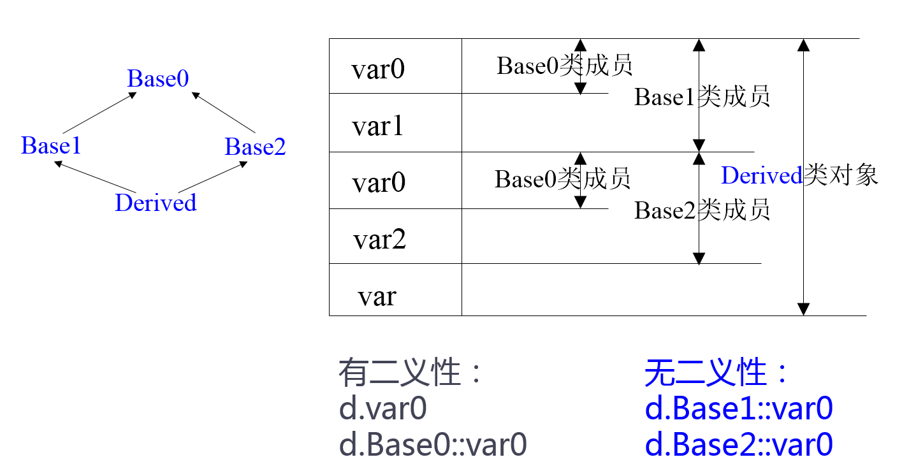
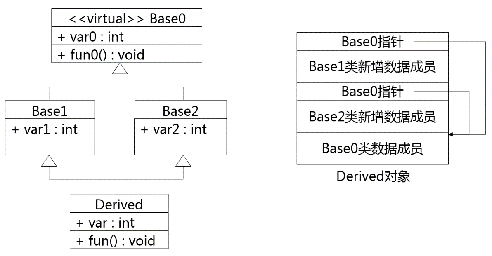

# 本章主要内容
- 继承与派生的基本概念
- 单继承与多继承
- 类成员的访问控制
- 派生类对象的构造和析构
- 派生类与基类对象的类型转换
- 类成员的标识与访问
- 虚继承

# 继承的基本概念和语法

## 继承与派生概念
- 继承与派生是同一过程从不同的角度看
    - 保持已有类的特性而构造新类的过程称为**继承**
    - 在已有类的基础上新增自己的特性而产生新类的过程称为**派生**

- 被继承的已有类称为**基类**（或父类）
- 派生出的新类称为**派生类**（或子类）
- 直接参与派生出某类的基类称为**直接基类**
- 基类的基类甚至更高层的基类称为**间接基类**

## 继承与派生的目的
- 继承的目的：实现设计与代码的重用。
- 派生的目的：当新的问题出现，原有程序无法解决（或不能完全解决）时，需要对原有程序进行改造。

## 单继承时派生类的定义

- 语法：

```c++
class 派生类名: 继承方式 基类名
{
    成员声明;
}

```

- 例：

```c++
class Derived: public Base
{
public:
    Derived();
    ~Derived();
};
```

## 多继承时派生的定义

- 语法：

```c++
class 派生类名: 继承方式1 基类名1, 继承方式2 基类名2,...
{
    成员声明;
}

注意：每一个“继承方式”，只用于限制对紧随其后之基类的继承。
```

- 例：
```c++
class Derived: public Base1, private Baase2
{
public: 
    Derived();
    ~Derived();
};
```

## 派生类的构成
- 吸收基类成员
    - 默认情况下派生类包含了全部基类中除构造和析构函数之外的所有成员。
    - C++11规定可以使用using语句继承基类构造函数。
- 改造基类成员
    - 如果派生类声明了一个和某基类成员同名的新成员，派生的新成员就隐藏或覆盖了外层同名成员
- 添加新的成员
    - 派生类增加新成员使派生类在功能上有所发展 


# 继承方式简介及公有继承 

## 不同继承方式的影响主要体现在：

- 派生类**成员**对基类成员的访问权限
- 通过派生类**对象**对基类成员的访问权限

## 三种继承方式

- 公有继承
- 私有继承
- 保护继承

## 公有继承（public）

- 继承的访问控制
    - 基类的public和protected成员：访问属性在派生类中保持不变；
    - 基类的private成员：不可直接访问。

- 访问权限
    - 派生类中的成员函数：可以直接访问基类中的public和protected成员，但不能直接访问基类的private成员；
    - 通过派生类的对象：只能访问public成员
## 例7-1 公有继承举例

```c++
//Point.h
#ifndef _POINT_H
#define _POINT_H
class Point { // 基类Point类的定义
public:       // 公有函数成员
    void initPoint( float x = 0, float y = 0 )
        { this->x = x; this->y = y; }
    void move( float offX, float offY )
        { x += offX; y += offY; }
    float getX() const { return x; }
    float getY() const { return y; }

private:   // 私有数据成员
    float x, y;
};
#endif // _POINT_H

// Rectangle.h
#ifndef _RECTANGLE_H
#define _RECTANGLE_H
#include "Point.h"
class Rectangle:public Point {  // 派生类定义部分
public:   // 新增公有函数成员
    void initRectangle( float x, float y, float w, float h ) {
        initPoint(x,y); // 调用基类公有成员函数
        this->w = w;
        this->h = h;
    }

    float getH() const { return h; }
    float getW() const { return w; }

private:  // 新增私有数据成员
    float w, h;  
};
#endif // _RECTANGLE_H

#include <iostream>
#include <cmath>
using namespace std;
#include "Rectangle.h"

int main() {
    Rectangle rect;
    // 设置矩形的数据
    rect.initRectangle(2,3,20,10);
    rect.move(3,2); // 移动矩形位置
    cout << "The data of rect(x,y,w,h): " << endl;
    // 输出矩形的特征参数
    cout << rect.getX() << ","
         << rect.getY() << ","
         << rect.getW() << ","
         << rect.getH() << endl;
    return 0;
}
```


# 私有继承和保护继承

## 私有继承
- 继承的访问控制
    - 基类的public和protected成员：都以private身份出现在派生类中；
    - 基类的private成员：不可直接访问。

- 访问权限
    - 派生类中的成员函数：可以直接访问基类中的public和protected成员，但不能直接访问基类的private成员；
    - 通过派生类的对象：不能直接访问从基类继承的任何成员。

## 例7-2 私有继承举例

```c++
//Point.h
#ifndef _POINT_H
#define _POINT_H

class Point {  // 基类Piont的定义
public: // 公有函数成员
    void initPoint( float x = 0, float y = 0 )
        { this->x = x; this->y = y; }

    void move ( float offX, float offY )
        { x += offX; y+= offY; }

    float getX() const { return x; }
    float getY() const { return y; }

private: // 私有数据成员
    float x, y;
};
#endif //_POINT_H

//Rectangle.h
#ifndef _RECTANGLE_H 
#define _RECTANGLE_H

#include "Point.h"

class Rectangle: private Point {  // 派生类定义部分
public:
    void initRectangle( float x, float y, float w, float h ) {
        initPoint(x, y); // 调用基类公有成员函数
        this->w = w;
        this->h = h;
    }
    void move( float offX, float offY ) { Point::move( offX, offY ); }
    float getX() const { return Point::getX(); }
    float getY() const { return Point::getY(); }
    float getH() const { return h; }
    float getW() const { return w; }

private: // 新增私有数据成员
    float w, h;
};
#endif // _RECTANGLE_H

#include "stdafx.h"
#include "Rectangle.h"
#include <iostream>
#include <cmath>
using namespace std;

int main( int argc, char* argv[] ) {
    Rectangle rect; // 定义Rectangle类的对象
    rect.initRectangle( 2, 3, 20, 10 ); // 设置矩形的数据
    rect.move(3,2); // 移动矩形位置
    cout << "The data of rect(x,y,w,h): " << endl;
    cout << rect.getX() << ", "  // 输出矩形的特征参数
         << rect.getY() << ", "
         << rect.getW() << ", "
         << rect.getH() << endl;

    system("pause");

    return 0;
}
```

## 保护继承（protected）
- 继承的访问控制
    - 基类的public和protected成员：都以protected身份出现在派生类中；
    - 基类的private成员：不可直接访问。

- 访问权限
    - 派生类中的成员函数：可以直接访问基类中的public和protected成员，但不能直接访问基类的private成员；
    - 通过派生类的对象：不能直接访问从基类继承的任何成员。 

## protected成员的特点与作用

- 对建立其所在类对象的模板来说，它与private成员的性质相同。
- 对于其派生类来说，它与public成员的性质相同。
- 既实现了数据隐藏，又方便继承，实现代码重用。

## protected 成员举例（补7-1）

```c++
class A {
protected:
    int x;
};

int main() {
    A a;
    a.x = 5; // 错误
}
/****************************************/
class A {
protected:
    int x; 
};

class B:public A {
public:
    void function();
};

void B::function() {
    x = 5; // 正确
}
```

## 多继承举例（补7-2）
```c++
class A {
public:
    void setA(int);
    void showA() const;

private:
    int a;
};

class B {
public:
    void setB(int);
    void showB() const;

private:
    int b;
};

class C:public A, private B {
public:
    void setC(int, int, int);
    void showC() const;

private:
    int c;
};

void A::setA(int x) {
    a = x;
}

void B::set(int x) {
    b = x;
}

void C::setC(int x, int y, int z) {
    // 派生类成员直接访问基类的
    // 公有成员
    setA(x);
    setB(y);
    c = z;
}

// 其他函数实现略
int main() {
    C obj;
    obj.setA(5);
    obj.showA();
    obj.setC(6,7,9);
    obj.showC();

    // obj.setB(6); 错误
    // obj.showB(); 错误
    return 0;
}
```


# 类型转换
- **公有**派生类对象可以被当作基类的对象使用，反之则不可。
    - 派生类的对象可以隐含地转化为基类对象；
    - 派生类的对象可以初始化基类的引用；
    - 派生类的指针可以隐含转化为基类的指针。
- 通过基类对象名、指针只能使用从基类继承的成员。

## 例7-3类型转换规则举例
```c++
#include "stdafx.h"
#include <iostream>
using namespace std;

class Base1 { // 基类Base1定义
public:
    void display() const {
        cout << "Base1::display()" << endl;
    }
};

class Base2: public Base1 { // 公有派生类Base2定义
public:
    void display() const {
        cout << "Base2::display()" << endl;
    }
};

class Derived: public Base2 { // 公有派生类Derived定义
public:
    void display() const {
        cout << "Derived::display()" << endl;
    }
};

void fun(Base1 *ptr) {
    ptr->display(); // "对象指针->成员名"
}

int main(int argc, char* argv[]) { // 主函数
    Base1 base1; // 声明Base1类对象
    Base2 base2; // 声明Base2类对象
    Derived derived; // 声明Derived类对象

    fun(&base1); // 用Base1对象的指针调用fun函数
    fun(&base2); // 用Base2对象的指针调用fun函数
    fun(&derived); // 用Derived对象的指针调用fun函数

    system("pause");

    return 0;
}
```

运行结果：

```c++
Base1::display()
Base1::display()
Base1::display()
```

结论：不要重新定义继承而来的非虚函数


# 派生类的构造函数

## 默认情况
- 基类的构造函数不被继承。
- 派生类需要定义自己的构造函数。

## C++11规定
- 可以使用using语句继承基类构造函数。
- 但是只能初始化从基类继承的成员。
    - 派生类新增成员可以通过类内初始值进行初始化。
- 语法形式：
    - using B::B;

## 建议
- 如果派生类有自己新增的成员，且需要通过构造函数初始化，则派生类要自定义构造函数。

## 若不继承基类的构造函数
- 派生类新增成员：派生类定义构造函数初始化；
- 继承来的成员：自动调整基类构造函数进行初始化；
- 派生类的构造函数需要给基类的构造函数**传递参数**。

## 单继承
- 派生类只有一个直接基类的情况，是单继承。单继承时，派生类的构造函数只需要给一个直接基类构造函数传递参数。

## 单继承时构造函数的定义语法

```c++
派生类名::派生类名(基类所需的形参, 本类成员所需的形参):
基类名(参数表), 本类成员初始化列表
{
    // 其他初始化;
};
```

## 单继承时的构造函数举例(补7-3)
```c++
#include "stdafx.h"
#include <iostream>
using namespace std;

class B {
public:
    B();
    B(int i);
    ~B();
    void print() const;

private:
    int b;
};

B::B() {
    b = 0;
    cout << "B's default constructor called." << endl;
}

B::B(int i) {
    b = i;
    cout << "B's constructor called." << endl;
}

B::~B() {
    cout << "B's destructor called." << endl;
}

void B::print() const {
    cout << b << endl;
}

class C:public B{
public:
    C();
    C(int i, int j);
    ~C();
    void print() const;

private:
    int c;
};

C::C() {
    c = 0;
    cout << "C's default constructor called." << endl;
}

C::C(int i, int j):B(i),c(j) {
    cout << "C's constructor called." << endl;
}

C::~C(){
    cout << "C's destructor called." << endl;
}

void C::print() const {
    B::print();
    cout << c << endl;
}

int main() {
    C obj(5, 6);
    obj.print();

    system("pause");
    return 0;
}
```

## 多继承
- 多继承时，有多个直接基类，如果不继承基类的构造函数，派生类构造函数需要给所有基类构造函数传递参数。我们来看一下语法规定

## 多继承时构造函数的定义语法
```c++
派生类名::派生类名(参数表):
基类名1(基类1初始化参数表),
基类名2(基类2初始化参数表),
...
基类名n(基类n初始化参数表),
本类成员初始化列表
{
    // 其他初始化;
};
```

## 派生类与基类的构造函数
- 当基类有默认构造函数时
    - 派生类构造函数可以不向基类构造函数传递参数。
    - 构造派生类的对象时，基类的默认构造函数将被调用。

- 如需执行基类中带参数的构造函数
    - 派生类构造函数应为基类构造函数提供参数。

## 多继承且有对象成员时派生的构造函数定义语法

```c++
派生类名::派生类名(形参表):
基类名1(参数),基类名2(参数),...,基类名n(参数),
本类成员(含对象成员)初始化列表
{
    // 其他初始化
};
```

## 构造函数的执行顺序
- 1.调用基类构造函数
    - 顺序按照它们被继承时声明的顺序（从左向右）
- 2.对初始化列表中成员进行初始化。
    - 顺序按照它们在类中定义的顺序。
    - 对象成员初始化时自动调用其所属类的构造函数。由初始化列表提供参数。
-3. 执行派生类的构造函数体中的内容。

# 派生类构造函数举例

例7-4 派生类构造函数举例：
```c++
#include "stdafx.h"
#include <iostream>

using namespace std;
class Base1 { // 基类Base1，构造函数有参数
    public:
        Base1(int i)
        {
            cout << "Constructing Base1 " << i << endl;
        }
};

class Base2 { // 基类Base2，构造函数有参数
    public:
        Base2(int j)
        {
            cout << "Constructing Base2 " << j << endl;
        }
};

class Base3 { // 基类Base3，构造函数有参数
    public:
        Base3()
        {
            cout << "Constructing Base3 " << endl;
        }
};

class Derived:public Base2, public Base1, public Base3 {
public:
    Derived(int a, int b, int c, int d): Base1(a), member2(d), member1(c),Base2(b)
    // 此处的次序与构造函数的执行次序无关
    {}

private:
    Base1 member1;
    Base2 member2;
    Base3 member3;
};

int main() {
    Derived obj(1, 2, 3, 4);

    system("pause");
    return 0;
}
```

# 派生类复制构造函数

## 派生类未定义复制构造函数的情况
- 编译器会在需要时生成一个隐含的复制构造函数；
- 先调用基类的复制构造函数；
- 再为派生类新增的成员执行复制。

## 派生类定义了复制构造函数的情况
- 一般都要为基类的复制构造函数传递参数。
- 复制构造函数只能接受一个参数，既用来初始化派生类定义的成员，也将被传递给基类的复制构造函数。
- 基类的复制构造函数形参类型是基类对象的引用，实参可以是派生类对象的引用。
- 例如：C::C(const C &c1):B(c1){...}

# 派生类的析构函数
- 析构函数不被继承，派生类如果需要，要自行声明析构函数。
- 声明方法与无继承关系时类的析构函数相同。
- 不需要显式地调用基类的析构函数，系统会自动隐式调用。
- 先执行派生类析构函数的函数体，再调用基类的析构函数。

## 例7-5 派生类对象析构举例
```c++
#include <iostream>
using namespace std;
class Base1 {
public:
    Base1(int i) {
        cout << "Constructing Base1 " << i << endl;
    }
    ~Base1() {
        cout << "Destructing Base1 " << endl;
    }
};

class Base2 {
public:
    Base2(int j) {
        cout << "Constructing Base2 " << j << endl;
    }
    ~Base2() {
        cout << "Destructing Base2 " << endl;
    }
};

class Base3 {
public:
    Base3() {
        cout << "Constructing Base3 " << endl;
    }
    ~Base3() {
        cout << "Destructing Base3 " << endl;
    }
};

class Derived:public Base2, public Base1, public Base3 {
public:
    Derived(int a, int b, int c, int d):Base1(a),member2(d),member1(c),Base2(b){}

private:
    Base1 member1;
    Base2 member2;
    Base3 member3;
};

int main() {
    Derived obj(1, 2, 3, 4);
    return 0;
}
```

# 访问从基类继承的成员

## 作用域限定

当派生类与基类中有相同成员时：
- 若未特别限定，则通过派生类对象使用的是派生类中的同名成员。
- 若要通过派生类对象访问基类中被隐藏的同名成员，应使用基类名和作用域操作符(::)来限定。

## 例7-6多继承同名隐藏举例

```c++
#include "stdafx.h"
#include <iostream>
using namespace std;
class Base1 {
public:
    int var;
    void fun() { cout << "Member of Base1" << endl; }
};

class Base2 {
public:
    int var;
    void fun() { cout << "Member of Base2" << endl; }
};

class Derived:public Base1, public Base2 {
public:
    int var;
    void fun() { cout << "Member of Derived" << endl; }
};

int main() {
    Derived d;
    Derived *p = &d;

    // 访问Derived类成员
    d.Base1::var = 2;
    d.Base1::fun();

    // 访问Base2基类成员
    p->Base2::var = 3;
    p->Base2::fun();

    system("pause");

    return 0;
}
```

## 二义性问题
- 如果从不同基类继承了同名成员，但是在派生类中没有定义同名成员，“派生类对象名或引用名.成员名”、“派生类指针->成员名”访问成员存在二义性问题
- 解决方式：用类名限定

## 二义性问题举例
```c++
class A {
public:
    void f();
};

class B {
public:
    void f();
    void g();
};

class C:public A, public B{
public:
    void g();
    void h();
};
```

如果定义:C c1;

 则c1.f()具有二义性；而c1.g()无二义性(同名隐藏)

## 例7-7 多继承时的二义性和冗余问题

```c++
// 7_7.cpp
#include "stdafx.h"
#include <iostream>
using namespace std;

class Base0{ // 定义基类Base0
public:
    int var0;
    void fun0() { cout << "Member of Base0" << endl; }
};

class Base1:public Base0 { // 定义派生类Base1
public: // 新增外部接口
    int var1;
};

class Base2:public Base0 { // 定义派生类Base2
public: // 新增外部接口
    int var2;
};

class Derived:public Base1, public Base2 {
public:
    int var;
    void fun() { cout << "Member of Derived" << endl; }
};

int main() { // 程序主函数
    Derived d;
    d.Base1::var0 = 2;
    d.Base1::fun0();
    d.Base2::var0 = 3;
    d.Base2::fun0();

    system("pause");

    return 0;
}
```

## Derived类对象d的存储结构示意图



# 虚继承

## 需要解决的问题
- 当派生类从多个基类派生，而这些基类有共同基类，则在访问此共同基类中的成员时，将产生冗余，并有可能因冗余带来不一致性。
- 虚基类声明
    - 以 virtual 说明基类继承方式
    - 例： class B1:virtual public B
- 作用
    - 主要用来解决多继承时可能发生的对同一基类继承多次而产生的二义性问题
    - 为最远的派生类提供唯一的基类成员，而不重复产生多次复制
- 注意：
    - 在第一级继承时就要将共同基类设计为虚基类。

## 例7-8 虚基类举例



```c++
#include "stdafx.h"
#include <iostream>
using namespace std;
class Base0 {
public:
    int var0;
    void fun0() { cout << "Member of Base0" << endl; }
};

class Base1:virtual public Base0 {
public:
    int var1;
};

class Base2:virtual public Base0 {
public:
    int var2;
};

class Derived:public Base1,public Base2{
// 定义派生类Derived
public:
    int var;
    void fun() {
        cout << "Member of Derived" << endl;
    }
};

int main() {
    Derived d;
    d.var0 = 2; // 直接访问虚基类的数据成员
    d.fun0(); // 直接访问虚基类的函数成员

    system("pause");
    return 0;
}
```

## 虚基类及其派生类构造函数
- 建立对象时所指定的类称为最远派生类
- 虚基类的成员是由最远派生类的构造函数通过调用虚基类的构造函数进行初始化的。
- 在整个继承结构中，直接或者间接继承虚基类的所有派生类，都必须在构造函数的成员初始化表中为虚基类的构造函数列出参数。如果未列出，则表示调用该虚基类的默认构造函数。
- 在建立对象时，只有最远派生类的构造函数调用虚基类的构造函数，其他类对虚基类构造函数的调用被忽略。

## 有虚基类时的构造函数举例（补7-4）

```c++
#include "stdafx.h"
#include <iostream>
using namespace std;

class Base0 {
public:
    Base0(int var):var0(var){ cout << "Base0" << endl; }
    int var0;
    void fun0() { cout << "Member of Base0" << endl; }
};

class Base1:virtual public Base0 {
public:
    Base1(int var):Base0(var) { cout << "Base1" << endl; }
    int var1;
};

class Base2:virtual public Base0 {
public:
    Base2(int var):Base0(var) { cout << "Base2" << endl; }
    int var2;
};

class Derived:public Base1, public Base2 {
public:
    Derived(int var):Base0(var), Base1(var), Base2(var){}
    int var;
    void fun() { cout << "Member of Derived" << endl; }
};

int main() {
    Derived d(1);
    d.var0 = 2;
    d.fun0();

    system("pause");
    return 0;
}
```

# 第七章编程作业

## C7-1 账户类

题目描述：
定义一个基类Account，数据成员包含string类变量userName用于保存账户主人姓名，函数成员包括默认构造函数、带参构造函数用于初始化数据成员和输出姓名的成员函PrintName()。从Account类派生出CreditAccount类，增加整型数据成员credit用于记录该用户信用额度，函数成员包括带参构造函数用于初始化数据成员和输出账户信息的成员函数PrintInfo()。要求：在函数PrintInfo()中需要调用基类的成员函数PrintName()。

```c++
#include "stdafx.h"
#include <iostream>
#include <string>
using namespace std;

class Account
{
private:
    string userName;

public:
    Account(){};
    Account( string name );
    void  PrintUserName();
};

class CreditAccount : public Account
{

public:
    CreditAccount( string name, int credit);
    void PrintInfo();
private:
    int credit;
};

//请实现Account构造函数Account(char *name)
Account::Account( string name ) {
    userName = name;
}

//请实现Account的PrintUserName()函数
void Account::PrintUserName() {
    cout << userName << endl;
}

//请实现CreditAccount类的构造函数CreditAccount(char* name, long number)
CreditAccount::CreditAccount(string name, int number):Account(name){
    credit = number;
}

//请实现CreditAccount类的PrintInfo()函数
void CreditAccount::PrintInfo() {
    PrintUserName();
    cout << credit;
}

int main()
{
    CreditAccount a("I Love CPP", 10000);
    a.PrintInfo();

    system("pause");
    return 0;
}
```

## C7-2 多继承

题目描述：

下面的代码声明了三个基类Base1、Base2和Base3，然后从这三个基类按照公有方式派生出类Derived。在每个类中分别定义带一个整型参数的构造函数和析构函数输出提示信息，构造函数的提示信息中需要包含整型参数的数值。请将下面的代码补充完整，使得输出结果与样例输出相同，注意：测试数据有多组。

```c++
#include "stdafx.h"
#include <iostream>
using namespace std;

class Base1
{
public:
    Base1(int x);
    ~Base1();
};

class Base2
{
public:
    Base2(int x);
    ~Base2();
};
class Base3
{
public:
    Base3(int x);
    ~Base3();
};

class Derived: public Base2,public Base1,public Base3//继承上面3个类
{
public:
    Derived(int x1, int x2, int x3, int x4);
    ~Derived();
};

Base1::Base1(int x)
{
    cout<<"Base1 constructor called "<<x<<endl;
}

Base1::~Base1()
{
    cout<<"Base1 destructor called"<<endl;
}
//依照Base1类中的代码实现其它类的构造函数和析构函数

Base2::Base2(int y)
{
    cout<<"Base2 constructor called "<<y<<endl;
}

Base2::~Base2()
{
    cout<<"Base2 destructor called"<<endl;
}

Base3::Base3(int z)
{
    cout<<"Base3 constructor called "<<z<<endl;
}

Base3::~Base3()
{
    cout<<"Base3 destructor called"<<endl;
}

Derived::Derived(int x1, int x2, int x3, int x4):Base2(x3),Base1(x2),Base3(x4) {
    cout << "Derived constructor called " << x1 << endl;
}

Derived::~Derived() {
    cout << "Derived destructor called" << endl;
}


int main()
{
    int x[4];
    for (int i = 0; i < 4; ++i)
        cin >> x[i];
    Derived d(x[0], x[1], x[2], x[3]);

    return 0;
}
```


## C7-3 用类实现A+B

题目描述：

下面的代码声明了两个基类Base1和Base2，然后从这两个基类按照公有方式派生出类Derived。基类和派生类都各自包含一个公有成员x，并且Base1和Base2各有接受一个整型参数的构造函数，Derived的构造函数接受Base1和Base2的对象引用a，b来初始化Derived类对象，并令x为Base1::x和Base2::x之和。请将下面的代码补充完成，使得输出符合要求。

```c++
#include "stdafx.h"
#include <iostream>
using namespace std;
 
struct Base1
{
    int x;
    Base1(int m);
};
 
struct Base2
{
    int x;
    Base2(int n);
};
 
struct Derived:public Base1, public Base2
{
    int x;
    Derived(Base1& a, Base2& b);
};

//请实现Base1，Base2, Derived的构造函数
Base1::Base1(int m) {
    x = m;    
}

Base2::Base2(int m) {
    x = m;
}

Derived::Derived(Base1 &a, Base2 &b):Base1(a.x),Base2(b.x) {

    x = Base1::x + Base2::x;
}
int main()
{
    int x, y;
    cin >> x >> y;
    Base1 a(x);
    Base2 b(y);
    Derived d(a, b);
    cout << d.Base1::x << "+" << d.Base2::x << "=" << d.x << endl;
    return 0;
}
```


