# 本章主要内容
- 函数模板与类模板
- 线性群体
- 群体数据的组织

# 函数模板

- 思考：如果重载的函数，其解决问题的逻辑是一致的、函数体语句相同，只是处理的数据类型不同，那么写多个相同的函数体，是重复劳动，而且还可能因为代码的冗
余造成不一致性。
- 解决：使用模板

## 例：求绝对值函数的模板
- 问题：整数类型和浮点数类型求绝对值的算法，需要写两种重载函数吗？

```c++
int abs( int x ) {
    return x < 0 ? -x : x;
}

double abs( double x ) {
    return x < 0 ? -x : x;
}
```

- 解决：函数模板
    - 创建一个通用功能的函数；
    - 支持多种不同形参；
    - 简化重载函数的函数体设计。

```c++
template <typename T>
T abs( T x ){
    return x<0 ? -x:x;
}
```

```c++
#include "stdafx.h"
#include <iostream>
using namespace std;
template<typename T>
T abs( T x ) {
    return x < 0? -x : x;
} 

int main() {
    int n = -5;
    double d = -5.5;
    cout << abs(n) << endl; // int 类型参数，推导出调用时T类型应为int 调用的实际上是 int abs( int x ){ return x < 0 ? -x : x; }

    system("pause");
    return 0;
}
```

## 函数模板定义语法

- 语法形式：

```
template<模板参数表>
函数定义
```

- 模板参数表的内容
    - 类型参数：class(或typename)标识符
    - 常量参数：类型说明符 标识符
    - 模板参数：template<参数表>class 标识符

# 例9-1 函数模板的示例

```c++
// 9_1.cpp
#include <iostream>
using namespace std;

template<class T> // 定义函数模板
void outputArray( const T *array, int count ) {
    for ( int i = 0; i < count; i++ )
        cout << array[i] << endl; //如果数组元素是类的对象，需要该对象所属类重载了流插入运算符“<<”
    cout << endl;
}

int main() {
    const int A_COUNT = 8, B_COUNT = 8, C_COUNT = 20;
    int a[A_COUNT] = {1,2,3,4,5,6,7,8};
    double b[B_COUNT] = {1.1,2.2,3.3,4.4,5.5,6.6,7.7,8.8};
    char c[C_COUNT] = "Welcome!";

    cout << "a array contains: " << endl;
    outputArray(a,A_COUNT);
    cout << " b array contains:" << endl;
    outputArray(b, B_COUNT);
    cout << " c array contains:" << endl;
    outputArray(c, C_COUNT);
    return 0;
}
```

## 注意
- 一个函数模板并非自动可以处理所有类型的数据
- 只有能够进行函数模板中运算的类型，可以作为类型实参
- 自定义的类，需要重载模板中的运算符，才能作为类型实参

# 类模板

## 类模板的作用
- 使用类模板使用户可以为类声明一种模式，使得类中的某些数据成员、某些成员函数的参数、某些成员函数的返回值，能取任意类型（包括基本类型的和用户自定义类
型）。

## 类模板的声明
- 类模板：

```c++
template <模板参数表>
class 类名
{类成员声明};
```

- 如果需要在类模板以外定义其成员函数，则要采用以下的形式：

```c++
template <模板参数表>
返回值的类型名 类名<模板参数标识符列表>::函数名（参数表）
```

## 例9-2 类模板示例

```c++
#include "stdafx.h"
#include <iostream>
#include <cstdlib>
using namespace std;


struct Student {
    int id; // 学号
    float gpa; // 平均分
};

template <class T>
class Store { // 类模板：实现对任意类型数据进行存取
private:
    T item; // item用于存放任意类型的数据
    bool haveValue; // haveValue标记item是否已经被存入内容
public:
    Store();
    T& getElem(); // 提取数据函数
    void putElem( const T &x ); // 存入数据函数
};

template <class T>
Store<T>::Store():haveValue(false){}
template <class T>
T& Store<T>::getElem() {
    // 如试图提取未初始化的数据，则终止程序
    if (!haveValue) {
        cout << "No item present!" << endl;
        exit(1); // 使程序完全退出，返回到操作系统。
    }
    return item; // 返回item中存放的数据
}

template <class T>
void Store<T>::putElem( const T &x ) {
    // 将haveValue置为true，表示item中已存入数值
    haveValue = true;
    item = x; // 将x值存入item
}

int main() {
    Store<int> s1, s2;
    s1.putElem(3);
    s2.putElem(-7);
    cout << s1.getElem() << " " << s2.getElem() << endl;

    Student g = { 1000, 23 };
    Store<Student> s3;
    s3.putElem(g);
    cout << "The student id is " << s3.getElem().id << endl;

    Store<double> d;
    cout << "Retrieving object D... ";
    cout << d.getElem() << endl;
    //d未初始化，执行函数D.getElement()时导致程序终止
    system("pause");
}
```

```
Store<int>
```

翻译成：

```c++
class Store {
private:
    int item; 
    bool haveValue;
public:
    Store();
    int &getElem();
    void putElem( const int &x );
};
```

```
Store<Student>
```

翻译成：

```c++
class Store {
private:
    Student item;
    bool haveValue;

public:
    Store();
    Student &getElem();
    void putElem( const Student &x );
};
```

# 线性群体的概念

- **群体**是指由多个数据元素组成的集合体。群体可以分为两个大类：**线性群体**和**非线性群体**。
- 线性群体中的元素按位置排列有序，可以区分为第个一元素、第二个元素等。

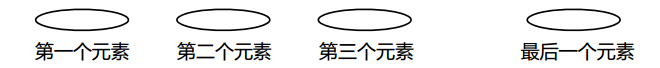

- 非线性群体不用位置顺序来标识元素。
- 线性群体中的元素次序与其逻辑位置关系是对应的。在线性群体中，又可以按照访问元素的不同方法分为**直接访问**、**顺序访问**和**索引访问**。
- 在本章我们只介绍直接访问和顺序访问。

# 数组类模板

- 静态数组是具有固定元素个数的群体，其中的元素可以通过下标直接访问。
    - 缺点：大小在编译时就已经确定，在运行时无法修改。
- 动态数组由一系列位置连续的，任意数量相同的元素组成。
    - 优点：其元素个数可在程序运行时改变。
- vector就是用类模板实现的动态数组。

## 例 9-3 动态数组类模板程序

```c++
#ifndef ARRAY_H
#define ARRAY_H

#include <cassert>

template <class T> // 数组类模板定义
class Array {
private:
    T* list; // 用于存放动态分配的数组内存首地址
    int size; // 数组大小(元素个数)

public:
    Array( int sz = 50 ); // 构造函数
    Array( const Array<T> &a ); // 复制构造函数
    ~Array(); // 析构函数
    Array<T>& operator=( const Array<T> &rhs ); // 重载"="
    T& operator[](int i); // 重载"[]"
    const T& operator[](int i) const; // 重载"[]" 常函数
    operator T*(); // 重载到T*类型的转换
    operator const T*() const;
    int getSize() const; // 取数组的大小
    void resize( int sz ); // 修改数组的大小
};

template <class T>
Array<T>::Array(int sz) { //构造函数
    assert(sz >= 0); // sz为数组大小(元素个数)，应当非负
    size = sz; // 将元素个数赋值给变量size
    list = new T[size]; //动态分配size个T类型的元素空间
}

template <class T>
Array<T>::Array( const Array<T> &a ) { // 复制构造函数
    size = a.size; // 从对象a取得数组大小，并赋值给当前对象的成员
    list = new T[size]; // 动态分配n个T类型的元素空间
    for (int i = 0; i<size; i++) // 从对象a复制数组元素到本对象
        list[i] = a.list[i];
}

template <class T>
Array<T>::~Array() { // 析构函数
    delete[] list;
}

template <class T>
Array<T>& Array<T>::operator = ( const Array<T> &rhs ) {
    if ( this != &rhs ){ // 首先判断不是同一个对象
        if ( size != rhs.size ) {// 如果本对象中数组大小与rhs不同，则删除数组原有内存，然后重新分配
            delete[] list; // 删除数组原有内存
            size = rhs.size; // 设置本对象的数组大小
            list = new T[size]; // 重新分配size个元素的内存
        }
        // 从对象rhs复制数组元素到本对象中
        for ( int i = 0; i < size; i++ ) {
            list[i] = rhs.list[i];
        }
    }
    return *this; // 返回当前对象的引用
}

template <class T>
T& Array<T>::operator[](int i) { // 重载"[]"
    assert( i >= 0 && i < size ); // 先检查下标是否越界
    return list[i]; // 返回下标为n的数组元素
}

template <class T>
const T& Array<T>::operator[](int i) const { // 重载"[]" 常函数
    assert( i >= 0 && i < size ); // 先检查下标是否越界
    return list[i]; // 返回下标为n的数组元素
}

template <class T>
Array<T>::operator T*() { // 重载到T*类型的转换 语法规定是没有返回值的
    return list; // 返回当前对象中私有数组的首地址
}

template <class T>
Array<T>::operator const T*() const {
    return list; // 返回当前对象中私有数组的首地址
}

template <class T>
int Array<T>::getSize() const {  // 获取当前数组的大小
    return size;
}

template <class T>
void  Array<T>::resize( int sz ) { // 修改数组的大小
    assert( sz >= 0 ); // 检查sz是否非负
    if ( sz == size ) // 如果指定的大小与原有大小一样，什么也不做
    { return; }

    T* newlist = new T[sz]; // 申请新的数组内存
    int n = (sz < size) ? sz : size; // 将sz与size中较小的一个赋值给n

    // 将原有数组中的前n个元素复制到新数组中
    for ( int i = 0; i < n; i++ ) {
        newlist[i] = list[i];
    }

    delete[] list; // 删除原数组
    list = newlist; // 使list指向新数组
    size = sz; // 更新size
}

#endif // ARRAY_H
```

## 为什么有的函数返回引用？

- 如果一个函数的返回值是一个对象的值，就是右值，不能成为左值。
-  如果返回值为引用。由于引用是对象的别名，通过引用可以改变对象的值，因此是左值。

## 深层复制

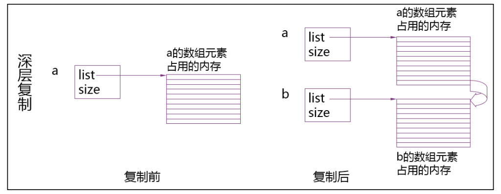

## 指针转换运算符的作用

```c++
#include <iostream>
using namespace std;

void read( int *p, int n ) {
    for ( int i = 0; i < n; i++ )
        cin >> p[i];
}

int main() {

    int a[10];
    read(a, 10);
    return 0;
}
```

```c++
#include "Array.h"
#include <iostream>
using namespace std;

void read( int *p, int n ) {
    for ( int i = 0; i < n; i++ )
        cin >> p[i];
}

int main() {
    Array<int> a(10);
    read(a, 10);
    return 0;
}
```


## 例9-4数组类应用举例

- 例9-4Array类的应用
    - 求范围2~N中的质数，N在程序运行时由键盘输入。

```c++
#include <iostream>
#include <iomanip>
#include "Array.h"
using namespace std;

int main() {
    // 用来存放质数的数组，初始状态有10个元素
    Array<int> a(10);
    int n, count = 0;
    cout << "Enter a value >= 2 as upper limit for prime numbers: ";
    //cin >> n;

    n = 50;

    for ( int i = 2; i <= n; i++ ) { // 检查i是否能够被比它小的质数整除
        bool isPrime = true;
        for ( int j = 0; j < count; j++ )
            // 若i 被 a[j]整除,说明i不是质数
            if ( i % a[j] == 0 ) {
                isPrime = false; break;
            }

            if (isPrime) {
                if ( count == a.getSize() )
                    a.resize( count*2 );
                a[count++] = i;
            }
    }

    for ( int i = 0; i < count; i++ )
        cout << setw(8) << a[i];
    cout << endl;

    system("pause");
    return 0;
}
```


# 链表的概念与结点类模板

## 顺序访问的线性群体------链表类
- 链表是一种动态数据结构，可以用来表示顺序访问的线性群体。
- 链表是系列结点组成的，结点可以在运行时动态生成。
- 每一个结点包括数据域和指向链表中下一个结点的指针（即下一个结点的地址）。
- 如果链表每个结点中只有一个指向后继结点的指针，则该链表称为单链表。

## 单链表

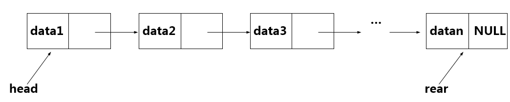

## 单链表的结点类模板

```c++
template <class T>
class Node {
public:
    T data;
    Node( const T& item, Node<T>* next = 0 );
    void insertAfter(Node<T>* p);
    Node<T>* deleteAfter();
    Node<T>* nextNode();
    const Node<T>* nextNode() const;
private:
    Node<T>* next;   
};
```

## 在结点之后插入一个结点

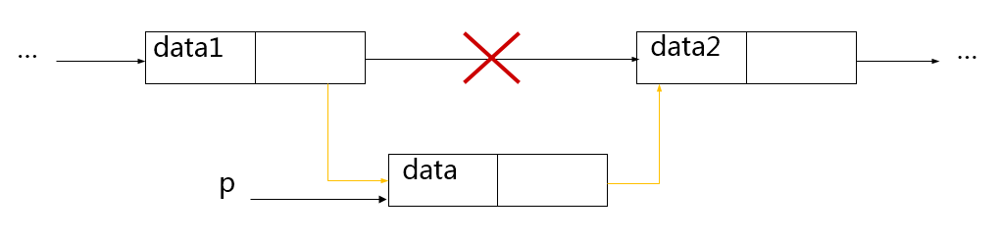

```c++
template <class T>
void Node<T>::insertAfter(Node<T> *p) {
    // p 节点指针域指向当前节点的后继节点
    p->next = next;
    next = p; // 当前结点的指针域指向p
}
```

## 删除结点之后的结点

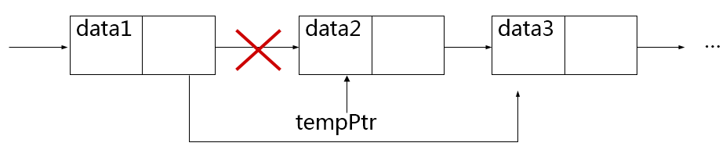

```c++
template <class T>
Node<T>* Node<T>::deleteAfter(void) {
    Node<T>* tempPtr = next;
    if ( next == 0 )
        return 0;
    next = tempPtr->next;
    return tempPtr;
}
```

## 例9-5 结点类模板

```c++
// Node.h
#ifndef NODE_H
#define NODE_H
// 类模板定义
template <class T>
class Node {
public:
    T data; // 结点的数据成员，放在public里面方便访问
    Node( const T& data, Node<T>* next = 0 ); // 构造函数
    void insertAfter(Node<T>* p); // 在当前结点后面插入一个新的结点
    Node<T>* deleteAfter(); // 删除当前结点后面的一个结点
    Node<T>* nextNode(); // 取出后继结点的地址
    const Node<T>* nextNode() const; // 取出后继结点的地址

private:
    Node<T>* next; // 指向后继的指针
};

// 类的实现部分

// 构造函数，初始化数据和指针成员
template <class T>
Node<T>::Node( const T& data, Node<T>* next ):data(data),next(next) {}

// 返回后继结点的指针
template <class T>
Node<T>* Node<T>::nextNode() {
    return next;
}

// 返回后继结点的指针
template <class T>
const Node<T>* Node<T>::nextNode() const {
    return next;
}

// 在当前结点之后插入一个结点p
template <class T>
void Node<T>::insertAfter(Node<T>* p) {
    p->next = next; // p结点指针域指向当前结点的后继结点
    next = p; // 当前结点的指针域指向p
}

// 删除当前结点后面的一个结点
template <class T>
Node<T>* Node<T>::deleteAfter() {
    Node<T>* tempPtr = next; // 将欲删除的结点地址存储到tempPtr中
    if (next == 0) // 如果当前结点没有后继结点，则返回空指针
        return 0;
    next = tempPtr->next; // 使当前结点的指针域指向tempPtr的后继结点
    return tempPtr;
} 
#endif // NODE_H
```

## 链表的基本操作

- 生成链表
- 插入结点
- 查找结点
- 删除结点
- 遍历结点
- 清空结点

## 例9-6 链表类模板

```c++
//LinkedList.h
#ifndef LINKEDLIST_H
#define LINKEDLIST_H
#include "Node.h"

template <class T>
class LinkedList {
private:
    // 数据成员：
    Node<T> *front, *rear; // 表头和表尾指针
    Node<T> *prevPtr, *currPtr; // 记录表当前遍历位置的指针，由插入和删除操作更新
    int size; // 表中的元素个数
    int position; // 当前元素在表中的位置序号。由函数reset使用

    // 函数成员：
    // 生成新结点，数据域为item,指针域为ptrNext
    Node<T>* newNode( const T &item, Node<T> *ptrNext=NULL );

    // 释放结点
    void freeNode(Node<T> *p);

    // 将链表L拷贝到当前表(假设当前表为空)。
    // 被拷贝构造函数、operator=调用
    void copy( const LinkedList<T>& L );

public:
    LinkedList(); // 构造函数
    LinkedList( const LinkedList<T>& L ); // 拷贝构造函数
    ~LinkedList(); // 析构函数
    LinkedList<T>& operator=( const LinkedList<T> &L ); // 重载赋值运算符

    int getSize() const; // 返回链表中元素个数
    bool isEmpty() const; // 链表是否为空

    void reset( int pos = 0 ); // 初始化游标的位置
    void next(); // 使游标移动到下一个结点
    bool endOfList() const; // 游标是否到了链尾
    int currentPosition() const; // 返回游标当前的位置

    void insertFront( const T& item ); // 在表头插入结点
    void insertRear( const T& item ); // 在表尾添加结点
    void insertAt( const T& item ); // 在当前结点之前插入结点
    void insertAfter( const T& item ); // 在当前结点之后插入结点

    T deleteFront(); // 删除头结点
    void deleteCurrent(); // 删除当前结点

    T& data(); // 返回对当前结点成员数据的引用
    const T& data() const; //返回对当前结点成员数据的常引用

    // 清空链表：释放所有结点的内存空间。被析构函数、operator= 调用
    void clear();
};

template <class T> // 生成新结点
Node<T>* LinkedList<T>::newNode( const T &item, Node<T> *ptrNext=NULL ) {
    Node<T>* p;
    p = new Node<T>(item, ptrNext);
    if ( p == NULL )
    {
        cout << "Memory allocation failure!\n";
        exit(1);
    }
    return p;
}

template <class T> // 释放结点
void LinkedList<T>::freeNode( Node<T>* p ) { // 释放结点
    delete p;
}

template <class T> //链表复制函数
void LinkedList<T>::copy( const LinkedList<T>& L ) { 
    Node<T>* p = L.front; // P用来遍历L
    int pos;
    while ( p != NULL ) // 将L中的每一个元素插入到当前链表最后
    {
        insertRear(p->data);
        p = p->nextNode();
    }
    if ( position == -1 ) // 如果链表为空，返回
        return;
    // 在新链表中重新设置prevPtr和currPtr
    prevPtr = NULL;
    currPtr = front;
    for ( pos = 0; pos != position; pos++ ) {
        prevPtr = currPtr;
        currPtr = currPtr->nextNode();
    }
}

template <class T> // //构造一个新链表，将有关指针设置为空，size为0，position为-1
LinkedList<T>::LinkedList():front(NULL),rear(NULL),prevPtr(NULL),
currPtr(NULL),size(0),position(-1){}

template <class T> // 拷贝构造函数
LinkedList<T>::LinkedList( const LinkedList<T>& L ) // 拷贝构造函数
{
    front = rear = NULL;
    prevPtr = currPtr = NULL;
    size = 0;
    position = -1;
    copy(L);
}

template <class T> // 析构函数
LinkedList<T>::~LinkedList() {
    clear();
}

template <class T> // 重载"="
LinkedList<T>& LinkedList<T>::operator=( const LinkedList<T>& L )
{
    if ( this == &L ) // 不能将链表赋给它自身
        return *this;
    clear();
    copy(L);
    return *this;
}

template <class T> // 返回链表大小的函数
int LinkedList<T>::getSize() const {
    return size;
}

template <class T> // 判断链表是否为空
bool LinkedList<T>::isEmpty() const {
    return size == 0;
}

template <class T> // 将链表当前位置设置为pos
void LinkedList<T>::reset( int pos )
{
    int startPos;
    if (front == NULL ) // 如果链表为空，返回
        return;
    if ( pos < 0 || pos > size -1 ) {// 如果指定位置不合法，中止程序
        cerr << "Reset:Invalid list position: " << pos << endl;
        return;
    }

    // 设置与遍历链表有关的成员
    if ( pos == 0 ) // 如果pos为0，将指针重新设置到表头
    {
        prevPtr = NULL;
        currPtr = front;
        position = 0;
    }
    else // 重新设置currPtr,prePtr和position
    {
        currPtr = front->nextNode();
        prevPtr = front;
        startPos = 1;
        for ( position = startPos; position != pos; position++ ) {
            prevPtr = currPtr;
            currPtr = currPtr->nextNode();
        } 
    }
}

template <class T> // 将prevPtr和currPtr向前移动一个结点
void LinkedList<T>::next() 
{
    if (currPtr != NULL ) {
        prevPtr = currPtr;
        currPtr = currPtr->nextNode();
        position++;
    }
}

template <class T> // 判断是否已达表尾
bool LinkedList<T>::endOfList() const // 判断是否已达表尾
{
    return currPtr == NULL;
}

template <class T> // 返回当前结点的位置
int LinkedList<T>::currentPosition() const
{
    return position;
} 

template <class T> // 将item插入在表头
void LinkedList<T>::insertFront( const T& item )
{
    if (front != NULL ) // 如果链表不空则调用Reset
        reset();
    insertAt(item); // 在表头插入
}

template <class T> // 在表尾插入结点
void LinkedList<T>::insertRear( const T& item ) 
{
    Node<T> *nNode;
    prevPtr = rear;
    nNode = newNode(item); // 创建新结点
    if ( rear == NULL ) // 如果表空则插入在表头
        front = rear = nNode;
    else
    {
        rear->insertAfter(nNode);
        rear = nNode;
    }
    currPtr = rear;
    position = size;
    size++;
}

template <class T>
void LinkedList<T>::insertAt(const T& item ) // 将item插入在链表当前位置
{
    Node<T> *nNode;
    if (prevPtr==NULL) //  插入在链表头，包括将结点插入到空表中
    {
        nNode = newNode(item, front);
        front = nNode;
    }
    else // 插入到链表之中. 将结点置于prevPtr之后
    {
        nNode = newNode(item);
        prevPtr->insertAfter(nNode);
    }
    if ( prevPtr == rear ) // 正在向空表中插入，或者是插入到非空表的表尾
    {
        rear = nNode; //更新rear
        position = size; //更新position
    }
    currPtr = nNode; // 更新currPtr
    size++;
}

template <class T>
void LinkedList<T>::insertAfter(const T& item) // 将item 插入到链表当前位置之后
{
    Node<T> *p;
    p = newNode(item);
    if ( front == NULL ) // 向空表中插入
    {
        front = currPtr = rear = p;
        position = 0;
    }
    else // 插入到最后一个结点之后
    {
        if (currPtr == NULL)
            currPtr = prevPtr;
        currPtr->insertAfter(p);
        if (currPtr == rear)
        {
            rear = p;
            position = size;
        }
        else 
            position++;
        prevPtr = currPtr;
        currPtr = p;
    }
    size++; // 使链表长度增值
}

template <class T>
T LinkedList<T>::deleteFront() // 删除表头结点
{
    T item;
    reset();
    if ( front == NULL )
    {
        cerr << "Invalid deletion!" << endl;
        exit(1);
    }
    item = currPtr->data;
    deleteCurrent();
    return item;
}

template <class T>
void LinkedList<T>::deleteCurrent() // 删除链表当前位置的结点
{
    Node<T> *p;
    if ( currPtr == NULL ) // 如果表空或达到表尾则出错
    {
        cerr << "Invalid deletion!" << endl;
        exit(1);
    }
    if ( prevPtr == NULL ) // 删除将发生在表头或链表之中
    {
        p = front; // 保存头结点地址
        front = front->nextNode(); // 将其从链表中分离
    }
    else // 分离prevPtr之后的一个内部结点，保存其地址
        p = prevPtr->deleteAfter();

    if ( p == rear ) // 如果表尾结点被删除
    {
        rear = prevPtr; //新的表尾是prevPtr
        position--; //position自减
    }
    currPtr = p->nextNode(); // 使currPtr越过被删除的结点
    freeNode(p); // 释放结点，并
    size--;//使链表长度自减
}

template <class T>
T& LinkedList<T>::data() // 返回一个当前结点数值的引用
{
    if (size == 0 || currPtr == NULL) // 如果链表为空或已经完成遍历则出错
    {
        cerr << "Data: invalid reference!" << endl;
        exit(1);
    }
    return currPtr->data;
}

template <class T>
void LinkedList<T>::clear() // 清除链表
{
    Node<T> *currPosition, *nextPosition;
    currPosition = front;
    while (currPosition != NULL)
    {
        nextPosition = currPosition->nextNode(); //取得下一结点的地址
        freeNode(currPosition); //删除当前结点
        currPosition = nextPosition; //当前指针移动到下一结点
    }
    front = rear = NULL;
    prevPtr = currPtr = NULL;
    size = 0;
    position = -1;
}

#endif // LINKEDLIST_H
```

## 例9-7 链表类应用举例

从键盘输入10个整数，用这些整数值作为结点数据，生成一个链表，按顺序输出链表中结点的数值。然后从键盘输入一个待查找整数，在链表中查找该整数，若找到则删除该整
数所在的结点（如果出现多次，全部删除），然后输出删除结点以后的链表。在程序结束之前清空链表。

```c++
#include "stdafx.h"
#include <iostream>
#include "LinkedList.h"
using namespace std;
int main() {

    LinkedList<int> list;
    for ( int i = 0; i < 10; i++ ) {
        int item;
        cin >> item;
        list.insertFront(item);
    }
    cout << "List: ";
    list.reset();
    while (!list.endOfList()) {
        cout << list.data() << " ";
        list.next();
    }

    cout << endl;
    int key;
    cout << "Please enter some integer needed to be deleted: ";
    cin >> key;
    list.reset();
    while (!list.endOfList()) {
        if (list.data() == key)
            list.deleteCurrent();
        else
            list.next();
    }
    cout << "List: ";
    list.reset();
    while (!list.endOfList()) {
        cout << list.data() << " ";
        list.next();
    }
    cout << endl;

    system("pause");
    return 0;
}
```


# 栈类

栈是只能从一端访问的线性群体，可以访问的这一端称为栈顶，另一端称为栈底。栈是一种后进先出的数据结构。

## 栈示意图

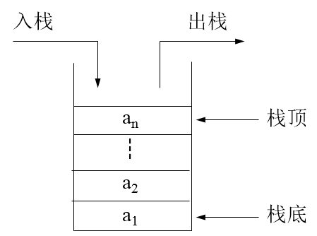

## 栈的应用举例------表达式处理

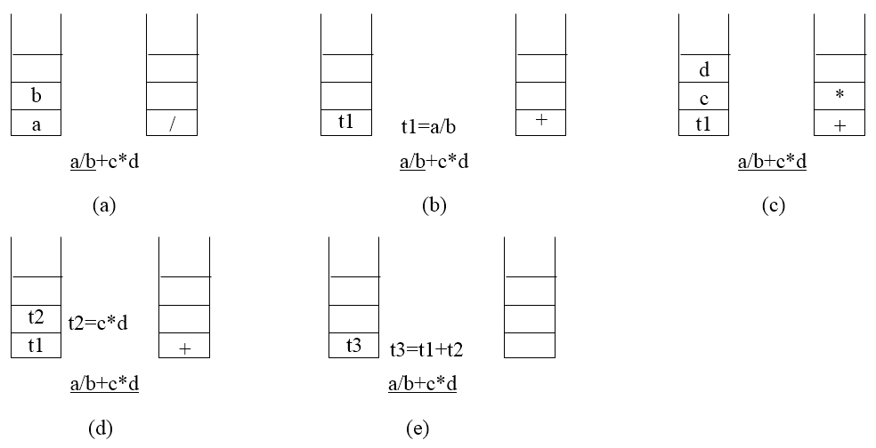

## 栈的基本状态

- 栈空
- 栈满
- 一般状态

## 栈空
- 栈中没有元素(以数组容纳的栈为例)

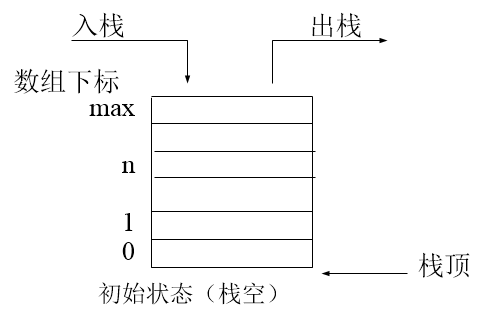

## 栈满
- 栈中元素个数达到上限（以数组容纳的栈为例）

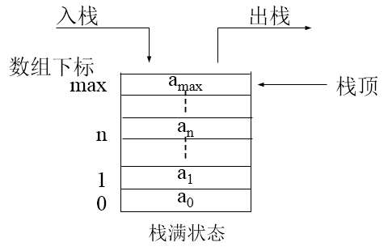

## 一般状态
-  栈中有元素，但未达到栈满状态（以数组容纳的栈为例）

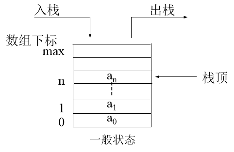

## 栈的基本操作
- 初始化
- 入栈
- 出栈
- 清空栈
- 访问栈顶元素
- 检测栈的状态(满、空)

## 例9-8 栈类模板

```c++
// Stack.h
#ifndef STACK_H
#define STACK_H
#include <cassert>
template <class T, int SIZE = 50>
class Stack {
private:
    T list[SIZE];
    int top;
public:
    Stack();
    void push( const T& item );
    T pop();
    void clear();
    const T& peek() const;
    bool isEmpty() const;
    bool isFull() const;
};

// 模板的实现
template <class T, int SIZE>
Stack<T,SIZE>::Stack():top(-1){}

template <class T, int SIZE>
void Stack<T,SIZE>::push(const T &item) {
    assert(!isFull());
    list[++top] = item;
}

template <class T, int SIZE>
T Stack<T,SIZE>::pop() {
    assert(!isEmpty());
    return list[top--];
}

template <class T, int SIZE>
const T& Stack<T,SIZE>::peek() const {
    assert(!isEmpty());
    return list[top]; // 返回栈顶元素
}

template <class T, int SIZE>
bool Stack<T,SIZE>::isEmpty() const {
    return top == -1;
}

template <class T, int SIZE>
bool Stack<T,SIZE>::isFull() const {
    return top == SIZE - 1;
}

template <class T, int SIZE>
void Stack<T,SIZE>::clear() {
    top = -1;
}
#endif // STACH_H
```

# 例9-9 栈的应用

## 例 9-9 一个简单的整数计算器

实现一个简单的整数计算器，能够进行加、减、乘、除和乘方运算。使用时算式采用后缀输入法，每个操作数、操作符之间都以空白符分隔。例如，若要计算"3+5"则输入"3 5
+"。乘方运算符用"^"表示。每次运算在前次结果基础上进行，若要将前次运算结果清除，可键入"c"。当键入"q"时程序结束。

```c++
//Calculator.h
#ifndef CALCULATOR_H
#define CALCULATOR_H
#include "Stack.h" // 包含栈类模板定义文件

class Calculator { // 计算器类
private:
    Stack<double> s; // 操作数栈
    void enter(double num); // 将操作数num压入栈
    // 连续将两个操作数弹出栈，放在opnd1和opnd2中
    bool getTwoOperands(double &opnd1,double &opnd2);
    void compute(char op); // 执行由操作符op指定的运算

public:
    void run(); // 运行计算器程序
    void clear(); // 清空操作数栈
};
#endif // CALCULATOR_H
```

```c++
// Calculator.cpp
#include "Calculator.h"
#include <iostream>
#include <sstream>
#include <cmath>
using namespace std;

// 工具函数，用于将字符串转换为实数
inline double stringToDouble( const string &str ) {
    istringstream stream( str ); // 字符串输入流
    double result;
    stream >> result;
    return result;
}

void Calculator::enter(double num) { // 将操作数num压入栈
    s.push(num);
}

bool Calculator::getTwoOperands(double &opnd1,double &opnd2) {
    if (s.isEmpty()) { //检查栈是否空
        cerr << "Missing operand!" << endl;
        return false;
    }
    opnd1 = s.pop(); // 将右操作数弹出栈
    if (s.isEmpty()) {
        cerr << "Missing operand!" << endl;
        return false;
    }
    opnd2 = s.pop(); // 将左操作数弹出栈
    return true;
}

void Calculator::compute(char op) { //执行运算
    double operand1, operand2;
    bool result = getTwoOperands(operand1, operand2);
    if (result) { //如果成功，执行运算并将运算结果压入栈
        switch(op) {
        case '+': s.push(operand2 + operand1); break;
        case '-': s.push(operand2 - operand1); break;
        case '*': s.push(operand2 * operand1); break;
        case '/': 
            if (operand1 == 0) { //检查除数是否为0
                cerr << "Divided by 0!" << endl;
                s.clear(); //除数为0时清空栈
            } 
            else
                s.push(operand2 / operand1);
            break;

        case '^': s.push(pow(operand2, operand1)); break;
        default: cerr << "Unrecognized operator!" << endl; break;
        }
        cout << "= " << s.peek() << " "; //输出本次运算结果
    } else
        s.clear(); //操作数不够，清空栈
}


void Calculator::run() { //读入并处理后缀表达式
    string str;
    while (cin >> str, str != "q") {
        switch(str[0]) {
        case 'c': s.clear(); break;
        case '-': //遇'-'需判断是减号还是负号
            if (str.size() > 1)
                enter(stringToDouble(str));
            else
                compute(str[0]);
            break;
        case '+': //遇到其它操作符时
        case '*':
        case '/':
        case '^':
            compute(str[0]); break;
        default: //若读入的是操作数，转换为整型后压入栈
            enter(stringToDouble(str)); break;
        }
    }
}

void Calculator::clear() {//清空操作数栈
    s.clear();
}
```


```c++
// Stack_test.cpp
#include "stdafx.h"
#include "Calculator.h"
#include "Calculator.cpp"

int main(int argc, char* argv[])
{
    Calculator c;
    c.run();

    system("pause");
    return 0;
}
```

# 队列类模板

队列是只能向一端添加元素，从另一端删除元素的线性群体

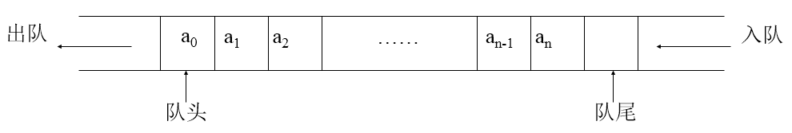

## 队列的基本状态
- 队空
- 队满
- 一般状态

## 队空
- 队列中没有元素（以数组容纳的队列为例）

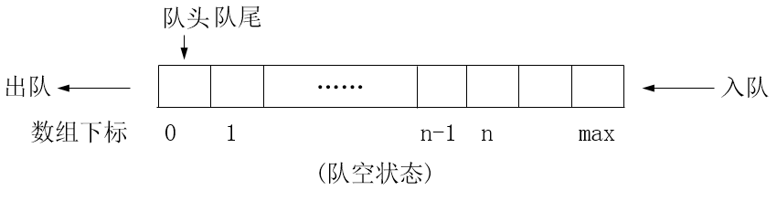

## 队满
- 队列中元素个数达到上限（以数组容纳的队列为例）

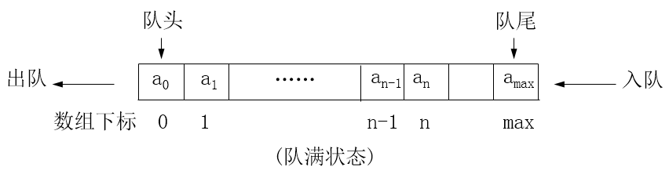

## 一般状态
- 队列中有元素，但未达到队满状态（以数组容纳的队列为例）

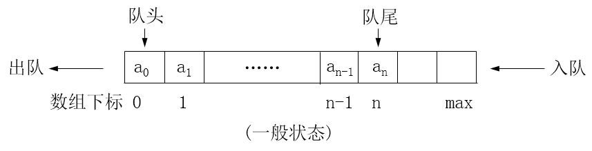

## 循环队列
- 在想象中将数组弯曲成环形，元素出队时，后继元素不移动，每当队尾达到数组最后一个元素时，便再回到数组开头。

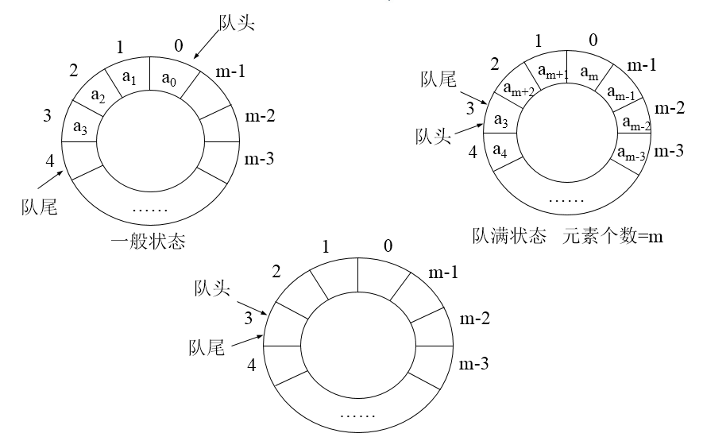

## 例9-10队列类模板

```c++
//Queue.h
#ifndef QUEUE_H
#define QUEUE_H
#include <cassert>
// 类模板的定义
template <class T, int SIZE = 50>
class Queue {
private:
    int front, rear, count; // 队头指针、队尾指针、元素个数
    T list[SIZE]; // 队列元素数组

public:
    Queue(); // 构造函数，初始化队头指针、队尾指针、元素个数
    void insert( const T& item ); // 新元素入队
    T remove(); // 元素出队
    void clear(); // 清空队列
    const T& getFront() const; // 访问队首元素
    // 测试队列状态
    int getLength() const; // 求队列长度
    bool isEmpty() const; // 判断队列空否
    bool isFull() const; // 判断队列满否
};

// 构造函数，初始化队头指针、队尾指针、元素个数
template <class T, int SIZE>
Queue<T,SIZE>::Queue():front(0),rear(0),count(0){}

template <class T, int SIZE>
void Queue<T,SIZE>::insert(const T& item) { // 向队尾插入元素
    assert( count != SIZE );
    count++; // 元素个数增1
    list[rear] = item; // 向队尾插入元素
    rear = (rear + 1) % SIZE; // 队尾指针增1，用取余运算实现循环队列
}

template <class T, int SIZE>
T Queue<T,SIZE>::remove() {
    assert( count != 0 );
    int temp = front; // 记录下原先的队首指针
    count--; // 元素个数自减
    front = (front + 1) % SIZE; // 队首指针增1。取余以实现循环队列
    return list[temp]; // 返回首元素值
}

template <class T, int SIZE>
const T& Queue<T,SIZE>::getFront() const {
    return list[front];
}

template <class T, int SIZE>
int Queue<T,SIZE>::getLength() const { // 返回队列元素个数
    return count;
}

template <class T, int SIZE>
bool Queue<T,SIZE>::isEmpty() const { // 测试队空否
    return count == 0;
}

template <class T, int SIZE>
bool Queue<T,SIZE>::isFull() const { // 测试队满否
    return count == SIZE;
}

template <class T, int SIZE>
void Queue<T,SIZE>::clear() { // 清空队列
    count = 0;
    front = 0;
    rear = 0;
}
#endif // QUEUE_H
```


# 排序概述

- 排序是将一个数据元素的任意序列，重新排列成一个按关键字有序的序列。
- 数据元素：数据的基本单位。在计算机中通常作为一个整体进行考虑。一个数据元素可由若干数据项组成。
- 关键字：数据元素中某个数据项的值，用它可以标识（识别）一个数据元素。
- 在排序过程中需要完成两种基本操作：
    - 比较两个数的大小
    - 调整元素在序列中的位置

## 内部排序与外部排序
- 内部排序：待排序的数据元素存放在计算机内存中进行的排序过程。
- 外部排序：待排序的数据元素数量很大，以致内存中一次不能容纳全部数据，在排序过程中尚需对外存进行访问的排序过程。

## 几种简单的内部排序方法
- 插入排序
- 选择排序
- 交换排序

# 插入排序

## 插入排序的基本思想
- 每一步将一个待排序元素按其关键字值的大小插入到已排序序列的适当位置上，直到待排序元素插入完为止。

## 插入排序的示意图

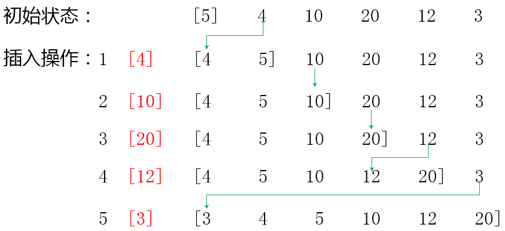

## 例 9-11 直接插入排序函数模板

```c++
#ifndef INSERTIONSORT_H
#define INSERTIONSORT_H
template <typename T>
void insertionSort( T a[], int n ) {
    int i, j;
    T temp;
    for ( i = 1; i < n; i++) {
        j = i;
        temp = a[i];
        while (j > 0 && temp < a[j - 1]) {
            a[j] = a[j - 1];
            j--;
        }
        a[j] = temp;
    }
}

#endif // INSERTIONSORT_H
```


# 选择排序

## 选择排序的基本思想
-  每次从待排序序列中选择一个关键字最小的元素，（当需要按关键字升序排列时），顺序排在已排序序列的最后，直至全部排完。

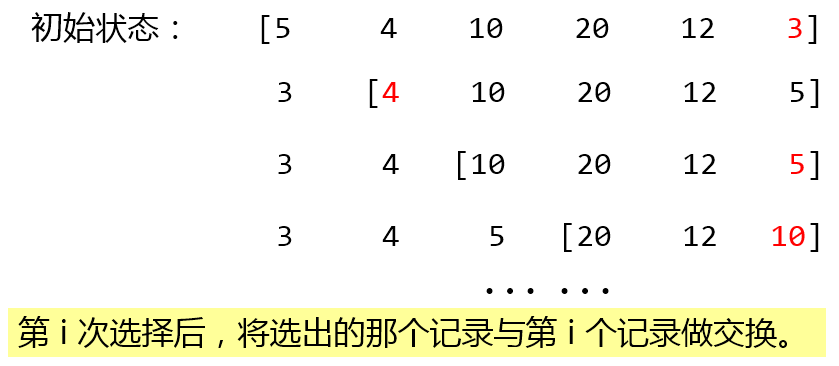

## 例 9-12 简单选择排序函数模板

```c++
#ifndef SELECTIONSORT_H
#define SELECTIONSORT_H
template <class T>
void mySwap(T& x, T& y) {
    T temp = x;
    x = y;
    y = temp;
}

template <class T>
void selectionSort(T a[], int n) {
    for ( int i = 0; i < n - 1; i++ ) {
        int leastIndex = i;
        for ( int j = i + 1; j < n; j++ )
            if (a[j] < a[leastIndex])
                leastIndex = j;
        mySwap(a[i],a[leastIndex]);
    }
}
#endif // SELECTIONSORT_H
```

# 交换排序

## 交换排序的基本思想
- 两两比较待排序序列中的元素，并交换不满足顺序要求的各对元素，直到全部满足顺序要求为止。
## 最简单的交换排序方法------起泡排序
- 起泡排序举例：对整数序列8 5 2 4 3按照升序排序

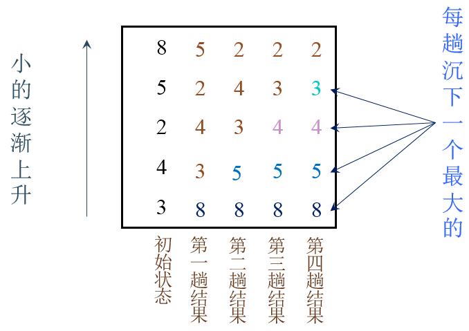

## 对具有n个元素的序列按升序进行起泡排序的步骤：
-  首先将第一个元素与第二个元素进行比较，若为逆序，则将两元素交换。然后比较第二、第三个元素，依次类推，直到第n-1和第n个元素进行了比较和交换。此过程称
为第一趟起泡排序。经过第一趟，最大的元素便被交换到第n个位置。
- 对前n-1个元素进行第二趟起泡排序，将其中最大元素交换到第n-1个位置。
- 如此继续，直到某一趟排序未发生任何交换时，排序完毕。对n个元素的序列，起泡排序最多需要进行n-1趟。

# 例 9-13 起泡排序函数模板
```c++
#ifndef BUBBLESORT_H
#define BUBBLESORT_H

#ifndef MYSWAP
#define MYSWAP
template <class T>
void mySwap(T& x, T& y) {
    T temp = x;
    x = y;
    y = temp;
}
#endif // MYSWAP

template <class T>
void bubbleSort(T a[], int n) {
    for ( int i = 0; i < n - 1; i++ ) {
        for ( int j = 0; j < n - 1 - i; j++ )
            if ( a[j] < a[j+1] )
                mySwap(a[j], a[j+1]);
    }
}
#endif // BUBBLESORT_H
```

# 查找

## 顺序查找
- 顺序查找的基本思想：

从序列的首元素开始，逐个元素与待查找的关键字进行比较，直到找到相等的。若整个序列中没有与待查找关键字相等的元素，就是查找不成功。

## 例9-14顺序查找函数模板

```c++
#ifndef SEQSEARCH_H
#define SEQSEARCH_H
template <class T>
int seqSearh(const T list[], int n, const T& key) {
    for (int i = 0; i < n; i++)
        if (list[i] == key)
            return i;
    return -1;
}
#endif // SEQSEARCH_H
```


## 折半查找(二分法查找)算法
- 对于已按关键字排序的序列，经过一次比较，可将序列分割成两部分，然后只在有可能包含待查元素的一部分继续查找，并根据试探结构继续分割，逐步缩小查找范围，直至找到或者找不到为止。

## 折半查找算法示例：
- 用折半查找法，在下列序列中查找值为21的元素：

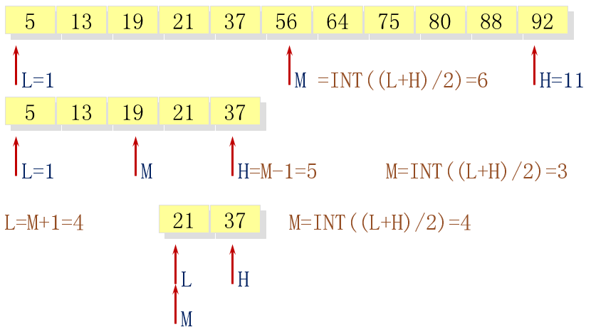

- 用折半查找法，在下列序列中查找值为20的元素：

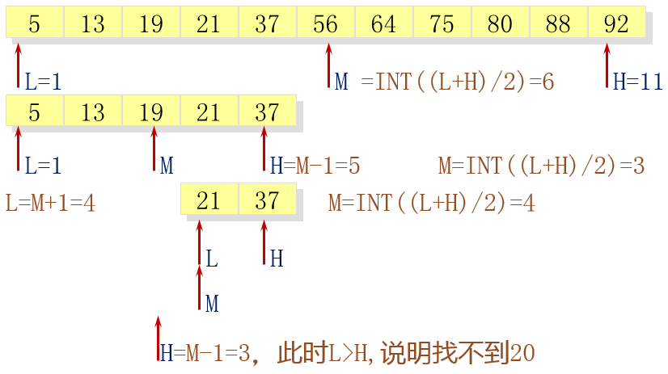

## 例9-15 折半查找函数模板

```c++
#ifndef BINSEARCH_H
#define BINSEARCH_H
template <class T>
int binSearch(const T list[], int n, const T& key) {
    int low = 0;
    int high = n - 1;
    int mid;
    while ( low < high ) {
        mid = (low + high)/2;
        if ( list[mid] == key )
            return mid;
        else if ( list[mid] < key )
            low = mid + 1; 
        else 
            high = mid - 1;
    }
    return -1;
}
#endif // BINSEARCH_H
```


# 小结

## 主要内容
- 模板
    - 函数模板
    - 类模板
- 群体类和群体数据的组织
    - 线性群体
        - 数组、链表、栈、队列
    - 排序
    - 查找

# 第九章编程作业

## C9-1 数组求和

题目描述：
编写一个模板函数getSum，接收一个数组，返回该数组所有元素的和。部分代码已给出，请将代码填补完整。

```c++
#include <iostream>
using namespace std;
 
/*请在这里填充代码*/
template <class T>
T getSum( T arr[], int num ) {
    T sum = 0;
    for ( int i = 0; i < num; i++ ) {
        sum += arr[i];
    }
    return sum;
}
 
int main()
{
       int n, m;
       cin >> n >> m;
       int* arr_int = new int[n];
       double* arr_double = new double[m];
       for (int i = 0; i < n; ++i)
              cin >> arr_int[i];
       for (int i = 0; i < m; ++i)
              cin >> arr_double[i];
       cout << getSum(arr_int, n) << endl;
       cout << getSum(arr_double, m) << endl;
       return 0;
}
```

## C9-2 折半查找

题目描述：
编写一个折半查找的模板函数binSearch()，接收一个数组，数组长度和要查找的元素key，按查找顺序输出查找过程中访问的所有元素下标。部分代码已给出，请将代码填补完整。

```c++
#include "stdafx.h"
#include <iostream>

using namespace std;
template <class T>
int binSearch(const T list[], int n, const T& key) {
    int low = 0;
    int high = n - 1;
    int mid;
    while ( low <= high ) {
        mid = (low + high)/2;
        cout << mid << endl;
        if ( list[mid] == key ) {
            return mid;
        }
        else if ( list[mid] < key )
            low = mid + 1; 
        else 
            high = mid - 1;
    }
    return -1;
}

int main(int argc, char* argv[])
{
    int n, m;
    int key1;
    double key2;
    cin >> n >> m >> key1 >> key2;
    int* arr_int = new int[n];
    double* arr_double = new double[m];
    for (int i = 0; i < n; ++i)
        cin >> arr_int[i];
    for (int i = 0; i < m; ++i)
        cin >> arr_double[i];
    binSearch(arr_int, n, key1);
    binSearch(arr_double, m, key2);

    system("pause");
    return 0;
}
```

## C9-3 括号匹配

题目描述：
栈的应用非常广泛。请先实现一个栈模板类（定义已在下面给出），然后利用这个栈类解决下面的问题：

给定一个字符串，长度小于1000，其中只包含左右括号和大小写英文字母。请编写程序判断输入的字符串里的左右括号是否全部是匹配的，匹配规则即从内到外左括号都与其右边距离最近的右括号匹配。如匹配，输出“Yes”,否则，输出“No”。栈模板类定义如下：

```c++
#include <iostream>
#include <string>
using namespace std;

template <class T, int MAX = 1000>
class Stack
{
private:
    T list[MAX + 1];
    int top;
public:
    Stack();
    void push(const T& item); // 将item压栈
    T pop(); // 将栈顶元素弹出栈
    const T& peek() const; // 访问栈顶元素
    bool isEmpty() const; // 判断是否栈空
};
// 请完成栈模板类的实现，并解决括号匹配问题
```

```c++
// C9-3.cpp : 定义控制台应用程序的入口点。
//

#include "stdafx.h"

#include <iostream> 
#include <cstdlib>
#include <cassert>
#include <iomanip>
#include <sstream>

using namespace std;

template<class T, int MAX = 1000>
class CStack
{
private:
    T list[MAX + 1];
    int top;
public:
    CStack();
    void push(const T&item);
    T pop();
    const T& peek() const;
    bool isEmpty() const;
};

template <class T, int MAX>
CStack<T, MAX>::CStack() : top(-1) { }

template <class T, int MAX>
void CStack<T, MAX>::push(const T&item)
{
    list[++top] = item;
}

template <class T, int MAX>
T CStack<T, MAX>::pop()
{
    if (isEmpty()) return -1;
    return list[top--];
}

template <class T, int MAX>
const T& CStack<T, MAX>::peek() const
{
    if (isEmpty()) return -1;
    return list[top];
}

template <class T, int MAX>
bool CStack<T, MAX>::isEmpty() const
{
    return top == -1;
}

int main()
{
    CStack<char> s;
    string str;
    char ch;
    bool flag = true;

    cin >> str;

    for (int i = 0; i < str.size(); i++)
    {
        ch = str[i];
        switch (ch)
        {
        case '(': s.push(ch); break;
        case ')': if (s.peek() != -1) s.pop();
                  else
                  {
                      flag = false;
                  }
                  break;
        default: break;
        }

        if (!flag) break;
    }

    if (flag) cout << "Yes" << endl;
    else cout << "No" << endl;

    return 0;
}
```


