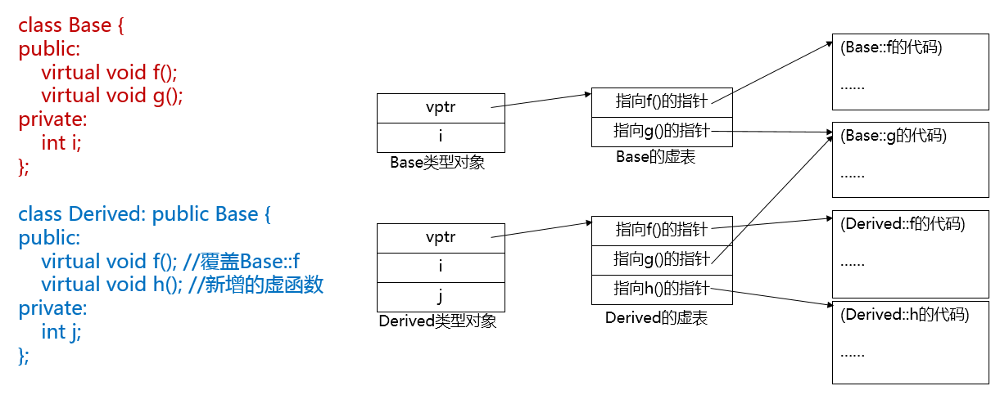
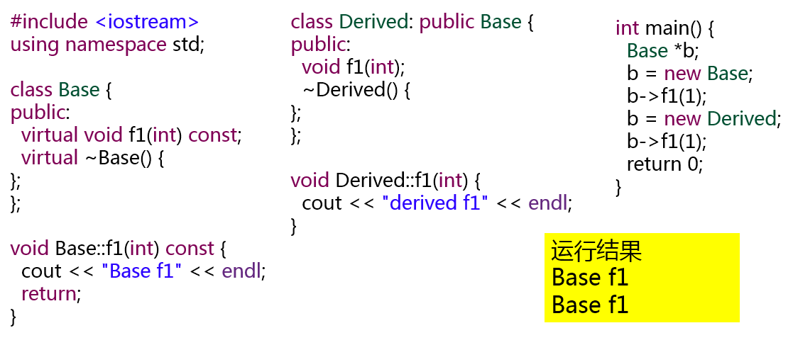

# 本章主要内容
## 什么是多态性
- 操作接口具有表现多种形态的能力
    - 能根据操作环境的不同采用不同的处理方式。
    - 一组具有相同基本语义的方法能在同一接口下为不同的对象服务。

## 多态的实现
- 绑定机制
    - 绑定是将一个标识符号和一个存储地址联系在一起的过程
- 编译时的多态通过静态绑定实现
    - 绑定工作在编译连接阶段完成
- 运行时的多态通过动态绑定实现
    - 绑定工作在程序运行阶段完成     

## 运算符重载
问题：函数重载就体现了静态多态性。运算符也是同样的符号经过重载可以作用于不同的数据类型。对基本类型已经重载了，是否也可以为类重载运算符呢？其实很多同学关心，能不能在对象上用加减乘除运算符呢？能不能用cout和插入运算符输出整个对象呢？

- 与函数重载的原理一样，可以通过定义运算符函数，为类重载运算符
- 这一章我们要介绍运算符重载的语法，并且以复数类、时钟类为例，演示如何重载运算符：复数加减运算、时钟自增1秒（前置、后置++）、用cout和插入运算符输出整个对象。
- 我们可以让自定义的复数类也能像整数和浮点数一样用+号和-号来进行运算、让我们熟悉的Clock类能通过前置、后置++来自增1秒、更神奇的是用cout和插入运算符来输出整个对象！这一切都是通过运算符重载来实现的。

## 虚函数
问题：第7章中那个没能实现的“通用显示”函数，一直让很多同学不解，基类指针明明指向的是派生类对象，为什么运行时就不能自动找到派生类定义的函数呢？
- 这一章就为大家接开这个谜底：如何让程序能在运行时根据指针指向的实际对象，找到该对象的函数。
- 这就要用到虚函数和动态绑定，也就是C++的动态多态性。
- 这并不复杂，其实就是“virtual”关键字。

# 运算符重载的规则

- 思考：用“+”、“-”能够实现复数的加减运算吗？
- 实现复数加减运算的方法 —— 重载“+”、“-”运算符
- 运算符重载是对已有的运算符赋予多重含义，使同一个运算符作用于不同类型的数据时导致不同的行为。
- C++ 几乎可以重载全部的运算符，而且只能够重载C++中已经有的。
    - 不能重载的运算符：“.”、“.*”、“::”、“?:”
- 重载之后运算符的优先级和结合性都不会改变。
- 运算符重载是针对新类型数据的实际需要，对原有运算符进行适当的改造。例如：
    - 使复数类的对象可以用“+”运算符实现加法；
    - 是时钟类对象可以用“++”运算符实现时间增加1秒。
- 重载为类的非静态成员函数；
- 重载为非成员函数。

# 运算符重载为成员函数

## 重载为类成员的运算符函数定义形式

```c++
函数类型 operator 运算符(形参)
{
    ......
}
参数个数 = 原操作数个数-1 (后置++、--除外)
```

## 双目运算符重载规则
- 如果运算符重载规则
    - 如果要重载B为类成员函数，使之能够实现表达式oprd1 B oprd2，其中oprd1为A类对象，则B应被重载为A类的成员函数，形参类型应该是oprd2所属的类型。
    - 经重载后，表达式 oprd1 B oprd2 相当于 oprd1.operator B(oprd2)

## 例8-1 复数类加减法运算符重载为成员函数

- 要求：
    - 将+、-运算重载为复数类的成员函数。
- 规则：
    - 实部和虚部分别相加减。
- 操作数:
    - 两个操作数都是复数类的对象。

源代码：

```c++
#include "stdafx.h"
#include <iostream>
using namespace std;
class Complex {
public:
    Complex(double r = 0.0, double i = 0.0):real(r), imag(i) {}
    // 运算符+重载成员函数
    Complex operator + ( const Complex &c2) const;
    // 运算符-重载成员函数
    Complex operator - (const Complex &c2) const;

    void display() const; // 输出复数

private:
    double real; // 复数实部
    double imag; // 复数虚部
};

Complex Complex::operator+(const Complex &c2) const {
    // 创建一个临时无名对象作为返回值
    return Complex(real+c2.real, imag+c2.imag);
}

Complex Complex::operator-(const Complex &c2) const {
    // 创建一个临时无名对象作为返回值
    return Complex(real-c2.real, imag-c2.imag);
}

void Complex::display() const {
    cout << "(" << real << ", " << imag << ")" << endl;
}

int main() {
    Complex c1(5,4), c2(2,10), c3;
    cout << "c1 = "; c1.display();
    cout << "c2 = "; c2.display();
    c3 = c1 - c2; // 使用重载运算符完成复数减法
    cout << "c3 = c1 - c2 = "; c3.display();
    c3 = c1 + c2; //使用重载运算符完成复数加法
    cout << "c3 = c1 + c2 = "; c3.display();

    system("pause");
    return 0;
}
```

## 前置单目运算符重载规则
- 如果要重载 U 为类成员函数，使之能够实现表达式 U oprd，其中 oprd 为A类对象，则 U 应被重载为 A 类的成员函数，无形参。
- 经重载后，表达式U oprd 相当于 oprd.operator U()

## 后置单目运算符 ++和--重载规则
- 如果要重载 ++或--为类成员函数，使之能够实现表达式 oprd++ 或 oprd-- ，其中 oprd 为A类对象，则 ++或-- 应被重载为 A 类的成员函数，且具有一个 int 类
型形参。
- 经重载后，表达式 oprd++ 相当于 oprd.operator ++(0)

## 例8-2 重载前置++和后置++为时钟类成员函数
- 前置单目运算符，重载函数没有形参
- 后置++运算符，重载函数需要有一个int形参
- 操作数是时钟类的对象。
- 实现时间增加1秒钟。

源代码：
```c++
#include "stdafx.h"
#include <iostream>
using namespace std;
class Clock {
public:
    Clock();

    Clock(unsigned int h, unsigned int m, unsigned int s) {
        if (0 <= h && h < 24 && 0 <= m && m < 60 && 0 <= s && s < 60) {
            this->hour   = h;
            this->minute = m;
            this->second = s;
        }

        else 
            cout << "Time error!"; 
    }

    Clock( Clock &c ) {
            this->hour    = c.hour;
            this->minute  = c.minute;
            this->second  = c.second;
    }

    ~Clock(){}

    void showTime() const;

    // 前置++需要返回引用，因为重载自加运算符后可以返回对象的引用， 
    // 以方便在表达式中连续使用。而后置++返回的不是引用，所以不能进行连续使用
    Clock& operator++();   // 前置++运算符 
    Clock operator++(int); // 后置++运算符
    
    

private:
    int hour;
    int minute;
    int second;
};

Clock& Clock::operator ++() {
    second++;
    if (second >= 60) {
        second -= 60;
        minute++;
    }

    if ( minute >= 60) {
        minute -= 60;
        hour = (hour + 1) % 24;
    }

    return *this;
}

Clock Clock::operator ++(int) {
    //注意形参表中的整型参数
    Clock old = *this;
    ++(*this); //调用前置“++”运算符
    return old;
    
}

void Clock::showTime() const { // 显示时间
    cout << hour << ":" << minute << ":" << second << endl;
}

int main() {
    Clock myClock(23, 59, 59);
    cout << "First time output: ";
    myClock.showTime();
    cout << "Show myClock++: ";
    (myClock++).showTime();
    cout << "Show ++myClock: ";
    (++myClock).showTime();

    system("pause");
    return 0;
}
```

# 运算符重载为非成员函数

有些运算符不能重载为成员函数，例如二元运算符的左操作数不是对象，或者是不能由我们重载运算符的对象

## 运算符重载为非成员函数的规则

- 函数的形参代表依自左至右次序排列的各操作数。
- 重载为非成员函数时参数个数=原操作数个数（后置++、--除外）
- 至少应该有一个自定义类型的参数。
- 后置单目运算符 ++和--的重载函数，形参列表中要增加一个int，但不必写形参名。
- 如果在运算符的重载函数中需要操作某类对象的私有成员，可以将此函数声明为该类的友元。
- 双目运算符 B重载后，表达式oprd1 B oprd2等同于operator B(oprd1,oprd2 )
- 前置单目运算符 B重载后，表达式 B oprd等同于operator B(oprd )
- 后置单目运算符 ++和--重载后，表达式 oprd B等同于operator B(oprd,0 )

## 例 8-3 重载 Complex 的加减法和“<<”运算符为非成员函数

- 将+、 ‐（双目）重载为非成员函数，并将其声明为复数类的友元，两个操作数都是复数类的常引用。
- 将<<（双目）重载为非成员函数，并将其声明为复数类的友元，它的左操作数是**std::ostream**引用，右操作数为复数类的常引用，返回std::ostream引用，用以
支持下面形式的输出：**cout << a << b;**  该输出调用的是：**operator << (operator << (cout, a), b);**

源代码：
```c++
// 8_3.cpp
#include "stdafx.h"
#include <iostream>
#include <fstream>
using namespace std;

class Complex {
public:
    Complex(double r = 0.0, double i = 0.0):real(r),imag(i) {}
    friend Complex  operator+( const Complex &c1, const Complex &c2 );
    friend Complex  operator-( const Complex &c1, const Complex &c2 );
    friend Complex  operator*( const Complex &c1, const Complex &c2 );
    friend ofstream& operator<<( ofstream &os, const Complex &c );

private:
    double real; // 复数实部
    double imag; // 复数虚部
};

Complex operator+( const Complex& c1, const Complex& c2) {
    Complex temp;
    temp.real = c1.real + c2.real;
    temp.imag = c1.imag + c2.imag;

    return temp;
}

Complex operator-( const Complex& c1, const Complex& c2) {
    Complex temp;
    temp.real = c1.real - c2.real;
    temp.imag = c1.imag - c2.imag;

    return temp;
}

Complex operator*( const Complex& c1, const Complex& c2) {
    Complex temp;
    temp.real = c1.real * c2.real - c1.imag * c2.imag;
    temp.imag = c1.real * c2.imag + c1.imag * c2.real;

    return temp;
} 

ofstream& operator<<( ofstream& os, const Complex& c ) {
    os << "(" << c.real << ", " << c.imag << ")";

    return os;
}


int main( int argc, char* argv[] ) {
    Complex c1(2.3,4.5);
    Complex c2(1.4,6.4);
    Complex c3 = c1 * c2;
    ofstream out_file("output_file.txt");
    out_file << c3 << endl;

    system("pause");
}
```


# 虚函数

问题：还记得第七章的例子吗？

## 例7-3类型转换规则举例

```c++
#include "stdafx.h"
#include <iostream>
using namespace std;
class Base1 { // 基类Base1定义
public:
    void display() const {
        cout << "Base1::display()" << endl;
    }
};

class Base2:public Base1 { //公有派生类Base2定义
public:
    void display() const {
        cout << "Base2::display()" << endl;
    }
};

class Derived: public Base2 { //公有派生类Derived定义
public:
    void display() const {
        cout << "Derived::display()" << endl;
    }
};

void fun(Base1* ptr) { //参数为指向基类对象的指针
    ptr->display(); //"对象指针->成员名"
}

int main() { //主函数
    Base1 base1; //声明Base1类对象
    Base2 base2; //声明Base2类对象
    Derived derived; //声明Derived类对象

    fun(&base1); //用Base1对象的指针调用fun函数
    fun(&base2); //用Base2对象的指针调用fun函数
    fun(&derived); //用Derived对象的指针调用fun函数

    system("pause");
    
    return 0;
}
```

## 例 8-4 通过虚函数实现运行时多态

现在我们来改进一下第七章的程序
```c++
#include "stdafx.h"
#include <iostream>
using namespace std;
class Base1 { // 基类Base1定义
public:
    virtual void display() const {
        cout << "Base1::display()" << endl;
    }
};

class Base2:public Base1 { //公有派生类Base2定义
public:
    virtual void display() const {
        cout << "Base2::display()" << endl;
    }
};

class Derived: public Base2 { //公有派生类Derived定义
public:
    virtual void display() const {
        cout << "Derived::display()" << endl;
    }
};

void fun(Base1* ptr) { //参数为指向基类对象的指针
    ptr->display(); //"对象指针->成员名"
}

int main() { //主函数
    Base1 base1; //声明Base1类对象
    Base2 base2; //声明Base2类对象
    Derived derived; //声明Derived类对象

    fun(&base1); //用Base1对象的指针调用fun函数
    fun(&base2); //用Base2对象的指针调用fun函数
    fun(&derived); //用Derived对象的指针调用fun函数

    system("pause");
    
    return 0;
}
```

## 初识虚函数

- 用virtual关键字说明的函数
- 虚函数是实现运行时多态性基础
- C++的虚函数是动态绑定的函数
- 虚函数必须是非静态的成员函数，虚函数经过派生之后，就可以实现运行过程中的多态。
- 一般成员函数可以是虚函数
- 构造函数不能是虚函数
- 析构函数可以是虚函数

## 一般虚函数成员

- 虚函数的声明：virtual 函数类型 函数名(形参表)
- 虚函数声明只能出现在类定义中的函数原型声明中，而不能在成员函数实现的时候。
- 在派生类中可以对基类中的成员函数进行覆盖。
- 虚函数一般不声明为内联函数，因为对虚函数的调用需要动态绑定，而对内联函数的处理是静态的。

## virtual关键字

- 派生类可以不显式地用virtual声明虚函数，这时系统就会用以下规则来判断派生类的一个函数成员是不是虚函数：
    - 该函数是否与基类的虚函数有相同的名称、参数个数及对应参数类型；
    - 该函数是否与基类的虚函数有相同的返回值或者满足类型兼容规则的指针、引用型的返回值；
    - 如果从名称、参数及返回值三个方面检查之后，派生类的函数满足上述条件，就会自动确定为虚函数。这时，派生类的虚函数便覆盖了基类的虚函数。
    - 派生类中的虚函数还会隐藏基类中同名函数的所有其它重载形式。
    - 一般习惯于在派生类的函数中也使用virtual关键字，以增加程序的可读性。

## 虚析构函数

为什么需要虚析构函数？

-  可能通过基类指针删除派生类对象；
-  如果你打算允许其他人通过基类指针调用对象的析构函数（通过delete这样做是正常的），就需要让基类的析构函数成为虚函数，否则执行delete的结果是不确定的。

## 一个不使用虚析构函数的例子

源代码：

```c++
#include "stdafx.h"
#include <iostream>
using namespace std;

class Base {
public:
    ~Base(); // 不是虚函数
};

Base::~Base() {
    cout << "Base destructor" << endl;
}

class Derived:public Base {
public:
    Derived();
    ~Derived(); //不是虚函数
private:
    int *p;
};

Derived::Derived() {
    p = new int(0);
}
Derived::~Derived() {
    cout << "Derived destructor" << endl;
    delete p;
}

void fun(Base* b) {
    delete b; // 静态绑定，只会调用~Base()
}

int main() {
    Base *b = new Derived();
    fun(b);

    system("pause");
    return 0;
}
```

运行结果： Base destructor

## 使用虚析构函数的例子

```c++
#include "stdafx.h"
#include <iostream>
using namespace std;

class Base {
public:
    virtual ~Base(); // 不是虚函数
};

Base::~Base() {
    cout << "Base destructor" << endl;
}

class Derived:public Base {
public:
    Derived();
    virtual ~Derived(); //不是虚函数
private:
    int *p;
};

Derived::Derived() {
    p = new int(0);
}
Derived::~Derived() {
    cout << "Derived destructor" << endl;
    delete p;
}

void fun(Base* b) {
    delete b; // 静态绑定，只会调用~Base()
}

int main() {
    Base *b = new Derived();
    fun(b);

    system("pause");
    return 0;
}
```

运行结果： 

Derived destructor
Base destructor

## 虚表与动态绑定

- 虚表
    - 每个多态类有一个虚表(virtual table)
    - 虚表中有当前类的各个虚函数的入口地址
    - 每个对象有一个指向当前类的虚表的指针（虚指针vptr）

- 动态绑定的实现
    - 构造函数中为对象的虚指针赋值
    - 通过多态类型的指针或引用调用成员函数时，通过虚指针找到虚表，进而找到所调用的虚函数的入口地址
    - 通过该入口地址调用虚函数

## 虚表示意图



# 抽象类

- 纯虚函数
    - 纯虚函数是一个在基类中声明的虚函数，它在该基类中没有定义具体的操作内容，要求各派生类根据实际需要定义自己的版本，纯虚函数的声明格式为：virtual 函数类型 函数名(参数表) = 0;
    - 带有纯虚函数的类称为抽象类
- 抽象类
    - 带有纯虚函数的类称为抽象类：

```c++
class 类名
{
    virtual 类型 函数名(参数表) = 0;
    // 其他成员......
}
```

## 抽象类作用
- 抽象类为抽象和设计的目的而声明
- 将有关的数据和行为组织在一个继承层次结构中，保证派生类具有要求的行为。
- 对于暂时无法实现的函数，可以声明为纯虚函数，留给派生类去实现。

## 注意
- 抽象类只能作为基类来使用。
- 不能定义抽象类的对象。

## 例8-6 抽象类举例
```c++
// 8_6.cpp
#include "stdafx.h"
#include <iostream>
using namespace std;

class Base1 {
public:
    virtual void display() const = 0;
};

class Base2: public Base1 {
public:
    virtual void display() const; // 覆盖基类的虚函数
}; 

void Base2::display() const {
    cout << "Base2::display()" << endl;
}

class Derived: public Base2 {
public:
    virtual void display() const; // 覆盖基类的虚函数
}; 

void Derived::display() const {
    cout << "Derived::display()" << endl;
}

void fun( Base1 *ptr) {
    ptr->display();
}

int main() {
    Base2 base2;
    Derived derived;
    fun(&base2);
    fun(&derived);

    system("pause");
    return 0;
}
```

# C++11: override 与 final

## override
- 多态行为的基础：基类声明虚函数，继承类声明一个函数覆盖该虚函数
- 覆盖要求： 函数签名（signatture）完全一致
- 函数签名包括：函数名 参数列表 const

下列程序就仅仅因为疏忽漏写了const，导致多态行为没有如期进行



## 显式函数覆盖

- C++11 引入显式函数覆盖，在编译期而非运行期捕获此类错误。
- 在虚函数显式重载中运用，编译器会检查基类是否存在一虚拟函数，与派生类中带有声明override的虚拟函数，有相同的函数签名（signature）；若不存在，则会回报错误。

## final

- C++11 提供的final，用来避免类被继承，或是基类的函数被改写

例：

```c++
struct Base1 final { };
struct Derived1 : Base1 { }; // 编译错误：Base1为final，不允许被继承
struct Base2 {
virtual void f() final;
};
struct Derived2 : Base2 {
void f(); // 编译错误：Base2::f 为final，不允许被覆盖
};
```

说明：
```
C++中的struct对C中的struct进行了扩充，它已经不再只是一个包含不同数据类型的数据结构了，它已经获取了太多的功能。
struct能包含成员函数吗？ 能！
struct能继承吗？ 能！！
struct能实现多态吗？ 能！！！ 
既然这些它都能实现，那它和class还能有什么区别？
最本质的一个区别就是默认的访问控制： 
默认的继承访问权限
struct是public的，class是private的。

struct A
{
  char a;
}；
struct B : A
{
  char b;
}；

这个时候B是public继承A的。
如果都将上面的struct改成class，那么B是private继承A的。这就是默认的继承访问权限。 
所以我们在平时写类继承的时候，通常会这样写：
class B : public A
就是为了指明是public继承，而不是用默认的private继承。

还有一个区别：“class”这个关键字还用于定义模板参数，就像“typename”。但关键字“struct”不用于定义模板参数。这一点在Stanley B.Lippman写的Inside the C++ Object Model有过说明。 
```

# 小结

## 主要内容
- 多态性的概念、运算符重载、虚函数、纯虚函数、抽象类、override 和 final

## 达到的目标
- 掌握运算符重载原理和方法
- 理解动态多态性的原理，掌握通过虚函数实现的多态性的方法
- 掌握纯虚函数和抽象类的概念和设计方法

# 第八章编程作业

## C8-1 复数加减乘除

题目描述：求两个复数的加减乘除。要求使用c++ class编写程序。可以创建如下class

```c++
#include "stdafx.h"
#include <cstdio>
#include <cstring>
#include <iostream>
#include <algorithm>

using namespace std;

class Complex{
public:
    Complex(double r = 0.0, double i = 0.0): real(r), imag(i) {};
    Complex operator+ (const Complex &c2) const;
    Complex operator- (const Complex &c2) const;
    
    /*实现下面三个函数*/
    Complex operator* (const Complex &c2) const;
    Complex operator/ (const Complex &c2) const;
    friend ostream & operator<< (ostream &out, const Complex &c);

private:
    double real;
    double imag;
};

Complex Complex::operator+ (const Complex &c2) const {
    return Complex(real + c2.real, imag + c2.imag);
}

Complex Complex::operator- (const Complex &c2) const {
    return Complex(real - c2.real, imag - c2.imag);
}

Complex Complex::operator* (const Complex &c2) const {
    return Complex(real*c2.real-imag*c2.imag, imag*c2.real+real*c2.imag);
}

Complex Complex::operator/ (const Complex &c2) const {
    return Complex((real*c2.real+imag*c2.imag)/(c2.real*c2.real+c2.imag*c2.imag), (imag*c2.real-real*c2.imag)/(c2.real*c2.real+c2.imag*c2.imag));
}

ostream& operator<<( ostream &out, const Complex &c ) {
    out << c.real << " " << c.imag << endl;

    return out;
}

int main() {
    double real, imag;
    cin >> real >> imag;
    Complex c1(real, imag);
    cin >> real >> imag;
    Complex c2(real, imag);
    cout << c1 + c2;
    cout << c1 - c2;
    cout << c1 * c2;
    cout << c1 / c2;

    system("pause");
}
```

## C8-2 圆的周长和面积，已知圆形从shape抽象类继承。

要求使用C++ class编写程序。可以创建如下class

```c++
#include "stdafx.h"
#include <iostream>
using namespace std;

const double pi = 3.14;

class Shape{
public:
    Shape(){}
    ~Shape(){}
    virtual double getArea() = 0;
    virtual double getPerim() = 0;
};

class Circle: public Shape{
public:
    Circle(double rad):radius(rad){}
    ~Circle(){}
    
    /*补充这两个函数*/
    virtual double getArea ();
    virtual double getPerim ();
private:
    double radius;
};

double Circle::getArea(){
    return pi*radius*radius;
}

double Circle::getPerim(){
    return 2*pi*radius;
}

int main() {
    double radius;
    cin >> radius;
    Circle c(radius);
    cout << c.getArea() << " " << c.getPerim() << endl;

    system("pause");
}
```

## C8-3 三角形还是长方形？

题目描述
在多态概念中，基类的指针既可以指向基类的对象，又可以指向派生类的对象。我们可以使用dynamic_cast类型转换操作符来判断当前指针（必须是多态类型）是否能够转换成为某个目的类型的指针。

同学们先查找dynamic_cast的使用说明（如http://en.wikipedia.org/wiki/Run-time_type_information#dynamic_cast），然后使用该类型转换操作符完成下面程序（该题无输入）。

```
dynamic_cast运算符的主要用途：将基类的指针或引用安全地转换成派生类的指针或引用，并用派生类的指针或引用调用非虚函数。如果是基类指针或引用调用的是虚函数无需转换就能在运行时调用派生类的虚函数。
```

函数int getVertexCount(Shape * b)计算b的顶点数目，若b指向Shape类型，返回值为0；若b指向Triangle类型，返回值为3；若b指向Rectangle类型，返回值为4。

```c++
#include "stdafx.h"
#include <cstdio>
#include <cstring>
#include <iostream>
using namespace std;
#define nullptr (void*)0

class Shape{
public:
    Shape() {}
    virtual ~Shape() {}
};

class Triangle: public Shape{
public:
    Triangle() {}
    virtual ~Triangle() {}
};

class Rectangle: public Shape {
public:
    Rectangle() {}
    virtual ~Rectangle() {}
};

/*用dynamic_cast类型转换操作符完成该函数*/

int getVertexCount(Shape * b) {

    Rectangle* c = dynamic_cast<Rectangle*>(b);
    if (c != nullptr) 
        return 4;
    
    Triangle* b1 = dynamic_cast<Triangle*>(b);
    if (b1 != nullptr) 
        return 3;
    
    Shape* a = dynamic_cast<Shape*>(b);
    if (a != nullptr) 
        return 0;

    return -1;
}

int main() {
    Shape s;
    cout << getVertexCount(&s) << endl;
    Triangle t;
    cout << getVertexCount(&t) << endl;
    Rectangle r;
    cout << getVertexCount(&r) << endl;

    system("pause");

    return 0;
}
```


