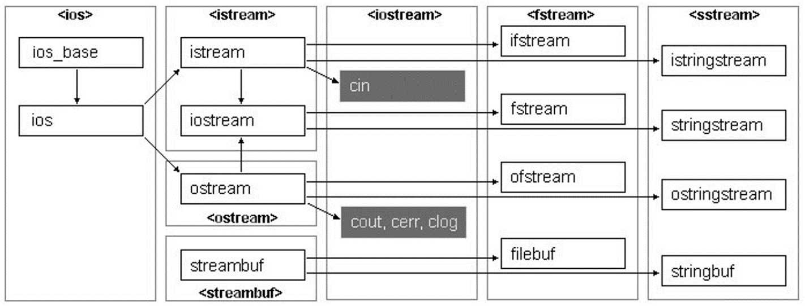
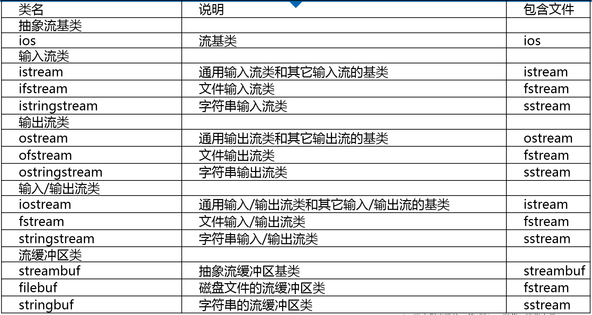

# 主要内容

- I/O流的概念
- 流类库结构
- 输出流
- 输入流
- 输入/输出流
- 读写文本文件的格式

# I/O流的概念及流类库结构

## 程序与外界环境的信息交换
- 当程序与外界环境进行信息交换时，存在着两个对象：**程序中的对象、文件对象**。

## 流
- 一种抽象，负责在数据的**生产者**和数据的**消费者**之间建立联系，并管理数据的流动。

## 流对象与文件操作
- 程序建立一个**流对象**
- 指定这个流对象与某个文件对象建立连接
- 程序操作流对象
- 流对象通过文件系统对所连接的文件对象产生作用

## 提取与插入
- 读操作在流数据抽象中被称为(从流中)**提取**
- 写操作被称为(向流中)插入。

## 流类库结构



## 流类列表


# 输出流概述

## 最重要的三个输出流
- ostream
- ofstream
- ostringstream

## 预先定义的输出流对象
- cout标准输出
- cerr标准错误输出，没有缓冲，发送给它的内容立即被输出
- clog类型于cerr，但是有缓冲，缓冲区满时被输出

## 标准输出换向

```c++
ofstream fout("b.out");
streambuf* pOld = cout.rdbuf(fout.rdbuf());
// ...
cout.rdbuf(pOld);
```

## 构造输出流对象
- ofstream类支持磁盘文件输出
- 如果在构造函数中指定一个文件名，当构造这个文件时该文件是自动打开的
    - ofstream myFile("filename");
- 可以在调用默认构造函数之后使用open成员函数打开文件
    - ofstream myFile; //声明一个静态文件输出流对象
    - myFile.open("filename"); //打开文件，使流对象与文件建立联系
- 在构造对象或用open打开文件时可以指定模式
    - ofstream myFile("filename", ios_base::out | ios_base::binary);    

## 文件输出流成员函数的三种类型
- 与操作符等价的成员函数
- 执行非格式化写操作的成员函数
- 其他修改流状态且不同于操作符或插入运算符的成员函数。

## 文件输出流成员函数
- open函数
    - 把流与一个特定的磁盘文件关联起来。
    - 需要指定打开模式。
- put函数
    - 把一个字符写到输出流中。
- write函数
    - 把内存中的一块内容写到一个文件输出流中
- seekp和tellp函数
    - 操作文件流的内部指针
- close函数
    - 关闭与一个文件输出流关联的磁盘文件
- 错误处理函数
    - 在写到一个流时进行错误处理

# 向文本文件输出
标准输出设备显示器被系统看作文本文件，所以我们以向标准设备输出为例，介绍文本文件输出格式控制
## 插入运算符
- 插入(<<)运算符
    - 为所有标准C++数据类型预先设计的，用于传送字节到一个输出流对象。
- 操纵符(manipulator)
    - 插入运算符与操纵符一起工作
        - 控制输出格式。
    - 很多操纵符都定义在
        - ios_base类中(如hex()）、<iomanip>头文件（如setprecision())。
    - 控制输出宽度
        - 在流中放入setw操纵符或调用width成员函数为每个项指定输出宽度。
    -  setw和width仅影响紧随其后的输出项，但其它流格式操纵符保持有效直到发生改变。
    -  dec、oct和hex操纵符设置输入和输出的默认进制。

## 例 11-1 使用 width 控制输出宽度
```c++
#include "stdafx.h"
#include <iostream>
using namespace std;

int main() {
    double value[] = {1.23, 35.34, 654.7, 3421.25};
    for (int i = 0; i < 4; i++) {
        cout.width(10);
        cout << value[i] << endl;
    }
    system("pause");
    return 0;
}
// 输出
/***
      1.23
     35.34
     654.7
   3421.25
请按任意键继续. . .
***/
```

## 例 11-2 使用 setw 操纵符指定宽度
```c++
//11_2.cpp
#include "stdafx.h"
#include <iostream>
#include <iomanip>
#include <string>
using namespace std;

int main() {
    double values[] = {1.23, 35.36, 653.7, 4358.24};
    string names[] = {"Zoot", "Jimmy", "Al", "Stan" };
    for (int i = 0; i < 4; i++)
        cout << setw(6) << names[i]
             << setw(10) << values[i] << endl;
    
    system("pause");
    return 0;
}
// 输出结果：
/***
  Zoot      1.23
 Jimmy     35.36
    Al     653.7
  Stan   4358.24
请按任意键继续. . .
***/
```

## 例 11-3 设置对齐方式
```c++
//11_3.cpp
#include "stdafx.h"
#include <iostream>
#include <iomanip>
#include <string>
using namespace std;

int main() {
    double values[] = { 1.23, 35.36, 653.7, 4358.24 };
    string names[] = { "Zoot", "Jimmy", "Al", "Stan" };
    for (int i=0;i<4;i++)
        cout << setiosflags(ios_base::left)//左对齐
             << setw(6) << names[i]
             << resetiosflags(ios_base::left)
             << setw(10) << values[i] << endl;
    system("pause");
    return 0;
}
//结果：
/***
Zoot        1.23
Jimmy      35.36
Al         653.7
Stan     4358.24
请按任意键继续. . .
***/
```

## setiosfalgs操纵符
- 这个程序中，通过使用带参数的setiosflags操纵符来设置左对齐，setiosflags定义在头文件iomanip中。
- 参数ios_base::left是ios_base的静态常量，因此引用时必须包括ios_base::前缀。
- 这里需要用resetiosflags操纵符关闭左对齐标志。setiosflags不同于width和setw，它的影响是持久的，直到用resetiosflags重新恢复默认值时为止。
- setiosflags的参数是该流的格式标志值，可用按位或（|）运算符进行组合

## setiosflags的参数(流的格式标识)
- ios_base::skipws 在输入中跳过空白 。
- ios_base::left 左对齐值，用填充字符填充右边。
- ios_base::right 右对齐值，用填充字符填充左边（默认对齐方式）
- ios_base::internal 在规定的宽度内，指定前缀符号之后，数值之前，插入指定的填充字符。
- ios_base::dec以十进制格式化数值(默认进制)。
- ios_base::oct 以八进制形式格式化数值。
- ios_base::hex 以十六进制形式格式化数值。
- ios_base::showbase 插入前缀符号以表明整数的数制。
- ios_base::showpoint 对浮点数值显示小数点和尾部的0 。
- ios_base::uppercase 对于十六进制数值显示大写字母A到F，对于科学格式显示大
写字母E 。
- ios_base::showpos 对于非负数显示正号（“+”）。
- ios_base::scientific 以科学格式显示浮点数值。
- ios_base::fixed 以定点格式显示浮点数值（没有指数部分） 。
- ios_base::unitbuf 在每次插入之后转储并清除缓冲区内容。

## 精度
- 浮点数输出精度的默认值是6，例如：3466.98。
- 要改变精度：setprecision操纵符(定义在头文件iomanip中)。
- 如果不指定fixed或scientific，精度值表示有效数字位数。
-  如果设置了ios_base::fixed或ios_base::scientific精度值表示小数点之后的位数。

## 例 11-4 控制输出精度——未指定 fixed 或 scientific
```c++
//11_4_1.cpp
#include "stdafx.h"
#include <iostream>
#include <iomanip>
#include <string>
using namespace std;
int main() {
    double values[] = { 1.23, 35.36, 653.7, 4358.24 };
    string names[] = { "Zoot", "Jimmy", "Al", "Stan" };
    for (int i=0;i<4;i++)
        cout << setiosflags(ios_base::left)
        << setw(6) << names[i]
    << resetiosflags(ios_base::left)//清除左对齐设置
        << setw(10) << setprecision(1) << values[i] << endl;

    system("pause");
    return 0;
}
// 输出结果：
/***
Zoot           1
Jimmy     4e+001
Al        7e+002
Stan      4e+003
请按任意键继续. . .
***/
```

## 例 11-4 控制输出精度——指定 fixed
```c++
//11_4_2.cpp
#include "stdafx.h"
#include <iostream>
#include <iomanip>
#include <string>
using namespace std;
int main(){
    double values[] = { 1.23, 35.36, 653.7, 4358.24 };
    string names[] = { "Zoot", "Jimmy", "Al", "Stan" };
    cout << setiosflags(ios_base::fixed);
    for (int i=0;i<4;i++)
        cout << setiosflags(ios_base::left)
             << setw(6) << names[i]
             << resetiosflags(ios_base::left)//清除左对齐设置
             << setw(10) << setprecision(1) << values[i] << endl;
    
    system("pause");
    return 0;
}
//结果：
/***
Zoot         1.2
Jimmy       35.4
Al         653.7
Stan      4358.2
请按任意键继续. . .
***/
```

## 例 11-4 控制输出精度——指定 scientific
```c++
//11_4_3.cpp
#include "stdafx.h"
#include <iostream>
#include <iomanip>
#include <string>
using namespace std;

int main() {
    double values[] = {1.23, 35.56, 653.7, 4358.24};
    string names[] = { "Zoot", "Jimmy", "Al", "Stan" };
    cout << setiosflags(ios_base::scientific);
    for (int i=0;i<4;i++)
        cout << setiosflags(ios_base::left)
             << setw(6) << names[i]
             << resetiosflags(ios_base::left)//清除左对齐设置
             << setw(10) << setprecision(1) << values[i] << endl;
    system("pause");
    return 0;
}
// 输出结果：
/***
Zoot    1.2e+000
Jimmy   3.6e+001
Al      6.5e+002
Stan    4.4e+003
请按任意键继续. . .
***/
```

# 向二进制文件输出
## 二进制文件流
- 使用ofstream构造函数中的模式参量指定二进制输出模式；
- 以通常方式构造一个流，然后使用setmode成员函数，在文件打开后改变模式；
- 通过二进制文件输出流对象完成输出。

## 例11-5 向二进制文件输出
```c++
//11_5.cpp
#include "stdafx.h"
#include <fstream>
using namespace std;
struct Date {
    int mon, day, year;
};
int main() {
    Date dt = { 6, 10, 92 };
    ofstream file("date.dat", ios_base::binary);
    file.write(reinterpret_cast<char *>(&dt),sizeof(dt));
    file.close();

    system("pause");
    return 0;
}
```

## 向字符串输出
将字符串作为输出流的目标，可以实现将其他数据类型转换为字符串的功能

## 字符串输出流(ostringstream)
- 用于构造字符串
- 功能
    - 支持ofstream类的除open、close外的所有操作
    - str函数可以返回当前已构造的字符串
- 典型应用
    - 将数值转换为字符串

## 例 11-6 用 ostringstream 将数值转换为字符串
```c++
//11_6.cpp
#include "stdafx.h"
#include <iostream>
#include <sstream>
#include <string>
using namespace std;
template <class T>
inline string toString(const T &v) { // 函数模板 toString 可以将各种支持"<<"插入符的类型的对象转换为字符串。
    ostringstream os; //创建字符串输出流
    os << v; //将变量v的值写入字符串流
    return os.str(); //返回输出流生成的字符串
}
int main() {
    string str1 = toString(5);
    cout << str1 << endl;
    string str2 = toString(1.2);
    cout << str2 << endl;

    system("pause");
    return 0;
}
//输出结果：
/***
5
1.2
请按任意键继续. . .
***/
```

# 输入流概述
## 重要的输入流类
- istream类最适合用于顺序文本模式输入。cin是其实例。
- ifstream类支持磁盘文件输入。
- istringstream

## 构造输入流对象
- 如果在构造函数中指定一个文件名，在构造该对象时该文件便自动打开。
    - ifstream myFile('filename');
- 在调用默认构造函数之后使用open函数来打开文件。
    - ifstream myFile; // 建立一个文件流对象
    - myFile.open("filename"); // 打开文件“filename”
- 打开文件时可以指定模式
    - ifstream myFile("filename", ios_base::in | ios_base::binary);      
## 使用提取运算符从文本文件输入
- 提取运算符(>>)对于所有标准C++数据类型都是预先设计好的。
- 是从一个输入流对象获取字节最容易的方法。
- ios类中的很多操纵符都是可以应用于输入流。但是只有少数几个对输入流对象具有实际影响，其中最重要的是进制操作符dec、oct和hex。

## 输入流相关函数
- open把该流与一个特定磁盘文件相关联。
- get功能与提取运算符(>>)很相像，主要的不同点是get函数在读入数据时包括空白字符。
- getline 功能是从输入流中读取多个字符，并且允许指定输入终止字符，读取完成后，从读取的内容中删除终止字符。
- read 从一个文件读字节到一个指定的内存区域，由长度参数确定要读的字节数。当遇到文件结束或者在文本模式文件中遇到文件结束标记字符时结束读取。
- seekg 用来设置文件输入流中读取数据位置的指针。
- tellg返回当前文件读指针的位置。
- close关闭与一个文件输入流关联的磁盘文件。

# 输入流应用举例

## 例 11-7 get 函数应用举例
```c++
//11_7.cpp
#include "stdafx.h"
#include <iostream>
using namespace std;
int main() {
    char ch;
    while ((ch = cin.get()) != EOF)
        cout.put(ch);

    system("pause");
    return 0;
}
```

## 例 11-8 为输入流指定一个终止字符
```c++
//11_8.cpp
#include "stdafx.h"
#include <iostream>
#include <string>
using namespace std;
int main() {
    string line;
    cout << "Type a line terminated by 't' " << endl;
    getline(cin, line, 't');
    cout << line << endl;

    system("pause");
    return 0;
}
```

## 例 11-9 从文件读一个二进制记录到一个结构中
```c++
//10_9.cpp
#include "stdafx.h"
#include <iostream>
#include <fstream>
#include <cstring>
using namespace std;

struct SalaryInfo {
    unsigned id;
    double salary;
};

int main() {
    SalaryInfo employee1 = {600001, 8000};
    ofstream os("payroll",  ios_base::out | ios_base::binary);
    os.write(reinterpret_cast<char*>(&employee1), sizeof(employee1));
    os.close();

    ifstream is("payroll", ios_base::in | ios_base::binary);
    if (is) {
        SalaryInfo employee2;
        is.read(reinterpret_cast<char*>(&employee2), sizeof(employee2));
        cout << employee2.id << " " << employee2.salary << endl;
    } else {
        cout << "ERROR: Cannot open file 'payroll'." << endl;
    }
    is.close();

    system("pause");
    return 0;
}
```
## 例 11-10 用 seekg 函数设置位置指针
```c++
//10_10.cpp
#include "stdafx.h"
#include <iostream>
#include <fstream>
#include <cstring>

using namespace std;

int main() {
    int values[] = {3, 7, 0, 5, 4, 0, 0, 1, 2, 3, 1, 0, 10, 0};
    ofstream os("integers", ios_base::out | ios_base::binary);
    os.write(reinterpret_cast<char*>(values), sizeof(values));
    os.close();

    ifstream is("integers", ios_base::in | ios_base::binary);
    if (is) {
        is.seekg(3*sizeof(int));
        int v;
        is.read(reinterpret_cast<char*>(&v), sizeof(int));
        cout << "The 4th integer in the file 'integers' is " << v << endl;
    } else {
        cout <<  "ERROR: Cannot open file 'integers'." << endl;
    }

    system("pause");
    return 0;
}
//输出结果:
/***
The 4th integer in the file 'integers' is 5
请按任意键继续. . .
***/
```

## 例 11-11 读一个文件并显示出其中 0 元素的位置
```c++
//11_11.cpp
#include "stdafx.h"
#include <iostream>
#include <fstream>
#include <cstring>

using namespace std;

int main() {
    ifstream file('integers', ios_base::in | ios_base::binary);
    if (file) {
        while (file) { // 读到文件尾file为0
            streampos here = file.tellg();
            int v;
            file.read(reinterpret_cast<char*>(&v), sizeof(int));
            if (file && v == 0)
                cout << "Position " << here << "is 0" << endl;
        } 
    } else {
        cout << "ERROR:Cannot open file 'integers'." << endl;
    }
    file.close();

    system("pause");
    return 0;
}

// 输出结果：
/***
Position 8 is 0
Position 20 is 0
Position 24 is 0
Position 44 is 0
Position 52 is 0
请按任意键继续. . .
***/
```

# 从字符串输入
将字符串作为文本输入流的源，可以将字符串转换为其他数据类型

## 字符串输入流(istringstream)
- 用于从字符串读取数据
- 在构造函数中设置要读取的字符串
- 功能
    - 支持ifstream类的除open、close外的所有操作
- 典型应用
    - 将字符串转换为数值

## 例11-12用istringstream将字符串转化为数值
```c++
//11_12.cpp
#include "stdafx.h"
#include <iostream>
#include <fstream>
#include <string>
#include <sstream>

using namespace std;

template <class T>
inline T fromString(const string &str) {
    istringstream is(str); //创建字符串输入流
    T v;is >> v;//从字符串输入流中读取变量v
    return v; //返回变量v
}
int main() {
    int v1 = fromString<int>("5");
    cout << v1 << endl;
    double v2 = fromString<double>("1.2");
    cout << v2 << endl;

    system("pause");
    return 0;
}
// 输出结果：
/***
5
1.2
请按任意键继续. . .
***/
```

# 输入/输出流
## 两个重要的输入/输出流
- 一个iostream对象可以是数据的源或目的。
- 两个重要的I/O流都是从iostream派生的，它们是fstream和stringstream。这些类继承了前面描述的istream和ostream类的功能。

## fstream类
- fstream类支持磁盘文件输入和输出。
- 如果需要在同一程序中从一个特定磁盘文件读并写到该磁盘文件，可以构造一个fstream对象。
- 一个fstream对象时有两个逻辑子流的单个流，两个子流一个用于输入，另一个用于输出。

## stringstream类
- stringstream类支持面向字符串的输入和输出。
- 可以用于对同一个字符串的内容交替读写，同样是由两个逻辑子流构成。

# 小结
- 主要内容:
    - I/O流的概念、流类库结构、输出流、输入流、输入/输出流、读写文本文件的格式控制。
- 达到的目标
    - 能够将数据持久化。
    - 能够处理文本文件和二进制文件。
    - 能够利用字符串流进行字符串与其他类型之间的转换。
- 参考
    - http://www.cplusplus.com/reference/

# 第十一章编程作业
## C11-1 浮点数输出

题目描述：

编写一个程序，输入一个浮点数和输出格式要求，按照格式要求将该浮点数输出。给定非负整数m和n，表示输出的浮点数小数点前的宽度为m，若宽度不够则在前面补0，小数点后的宽度为n，若宽度不够则在后面补0(补充说明：当n=0时，只需输出整数部分，当m,n都为0时，则输出0)。

```c++
#include "stdafx.h"
#include <iostream>
#include <iomanip>
#include <sstream>
#include <string>

using namespace std;

int main() {
    int m, n;
    string d;
    cin >> m >> n >> d;
    // cout << d << endl;
    string s;
    s = d.substr(0, d.find('.') + n + 1);
    // cout << s << endl;
    istringstream is(s); // 创建字符串输入流
    double v;
    is >> v; // 从字符串输入流中读取变量v
    // cout << v << endl;
    if (m == 0 && n == 0) 
        cout << 0 << endl;
    else {
        if(n==0) 
            cout << setw(m) << setfill('0') << int(v);
        else 
            cout << setiosflags(ios_base::fixed) << setw(m + n + 1) << setfill('0') << setprecision(n) << v << endl;
    }

    system("pause");
    return 0;
}
```

## C11-2 重载流运算符
题目描述：
实现一个学生类，包含学号（id），姓名（name），年级（grade）数据成员。为了输入输出的方便，
需要对这个学生类重载“>>”和“<<”运算符，同时为了对多个学生按照学号从小到大排序，还需要重载“<”运算符，以使用STL里的sort函数。类的声明与主函数的测试代码已给出，请将类的实现与相关重载补充完整，使得程序正确运行并输出正确结果。

```c++
#include <iostream>
#include <vector>
#include <string>
#include <algorithm>
using namespace std;

class Student
{
public:
    int id;
    string name, grade;
    Student() {};
    Student(int id, string name, string grade);
    bool operator < (const Student & s) const
    {
        return this->id < s.id;
    }
};
Student::Student(int id, string name, string grade)
{
    this->id = id;
    this->name = name;
    this->grade = grade;
}

istream & operator >> (istream & in, Student & s)
{
    in >> s.id >> s.name >> s.grade;
    return in;
}
ostream & operator << (ostream & out, Student & s)
{
    out << s.id << ' ' << s.name << ' ' << s.grade << endl;
    return out;
}

/*请在这里填充代码*/

int main()
{
    vector<Student> sv;
    Student temp;
    while (cin >> temp)
    {
        sv.push_back(temp);
    }
    sort(sv.begin(), sv.end());
    for (int i = 0; i < sv.size(); ++i)
        cout << sv[i];
    return 0;
}
```

