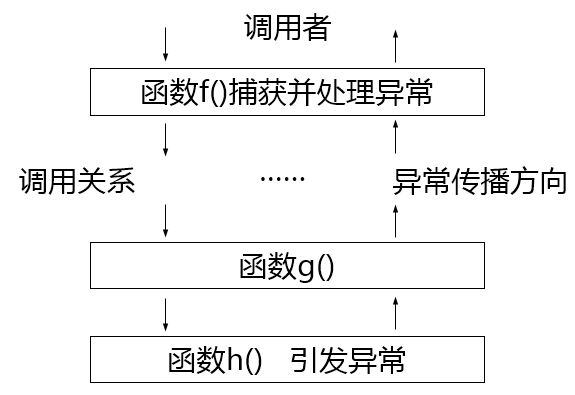
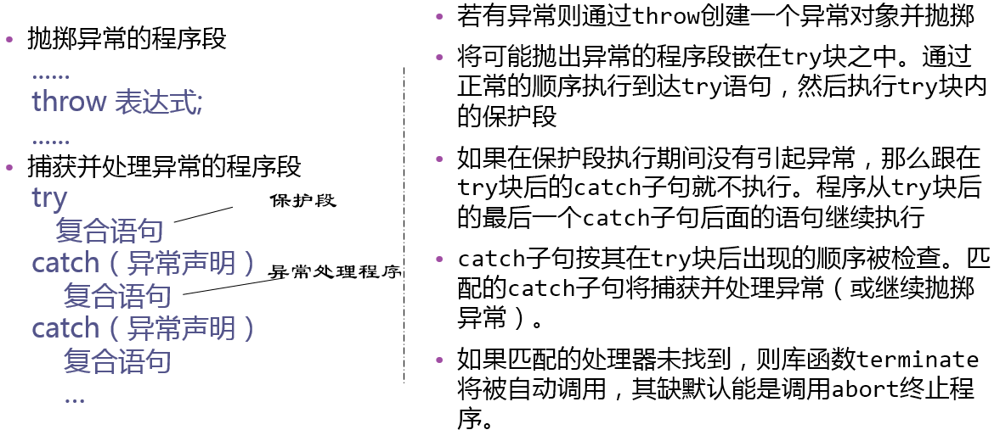
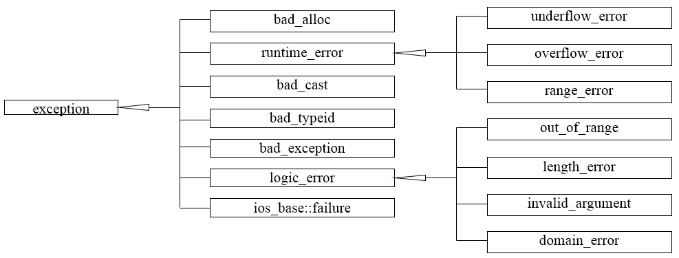
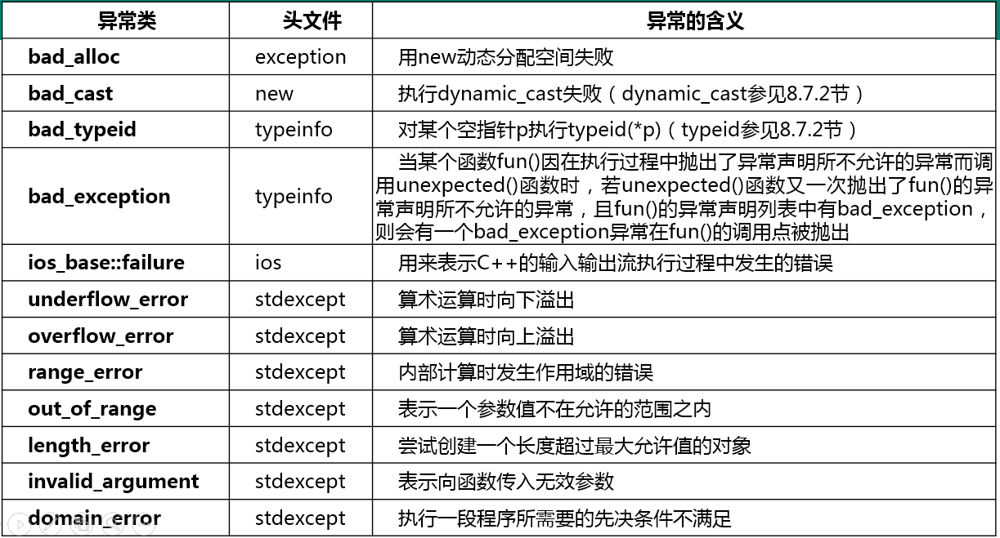

# 本章主要内容
- 异常处理的基本思想与程序实现
- 异常处理中的构造与析构
- 标准程序库异常处理
- 小结

# 异常处理的思想与程序实现
## 异常处理的基本思想


## 异常处理的语法


## 例12-1处理除零异常
```c++
//12_1.cpp
#include "stdafx.h"
#include <iostream>
using namespace std;
int divide(int x, int y) {
    if (y == 0)
        throw x;
    return x/y;
}

int main() {
    try {
        cout << "5/2= " << divide(5, 2) << endl;
        cout << "8/0= " << divide(8, 0) << endl;
        cout << "7/1= " << divide(7, 1) << endl; 
    } catch(int e) {
        cout << e << " is divided by zero!" << endl;
    }
    cout << "That is ok." << endl;

    system("pause");
    return 0;
}
```

## 异常接口声明
- 一个函数显式声明可能抛出的异常，有利于函数的调用者为异常处理做好准备
- 可以在函数的声明中列出这个函数可能抛掷的所有异常类型。
    - 例如：void fun() throw(A，B，C，D);
- 若无异常接口声明，则此函数可以抛掷任何类型的异常。 
- 不抛掷任何类型异常的函数声明如下：
    - void fun() throw();

# 异常处理中的构造与析构
## 自动的析构
- 找到一个匹配的catch异常处理后
    - 初始化异常参数。
    - 将从对应的try块开始到异常被抛掷处之间构造(且尚未析构)的所有自动对象进行析构。
    - 从最后一个catch处理之后开始恢复执行。

## 例 12-2 带析构语义的类的 C++异常处理
```c++
//12_2.cpp
#include "stdafx.h"
#include <iostream>
#include <string>
using namespace std;
class MyException {
public:
    MyException(const string &message):message(message){}
    ~MyException(){}
    const string &getMessage() const {return message;}
private:
    string message;
};

class Demo {
public:
    Demo() { cout << "Constructor of Demo" << endl; }
    ~Demo() { cout << "Destructor of Demo" << endl; }
};

void func() throw (MyException) {
    Demo d;
    cout << "Throw MyException in func()" << endl;
    throw MyException("exception thrown by func()");
}

int main() {
    cout << "In main function" << endl;
    try {
        func();
    } catch (MyException& e) {
        cout << "Caught an exception: " << e.getMessage() << endl;
    }
    cout << "Resume the execution of main()" << endl;

    system("pause");
    return 0;
}
//输出结果：
/***
In main function
Constructor of Demo
Throw MyException in func()
Destructor of Demo
Caught an exception: exception thrown by func()
Resume the execution of main()
请按任意键继续. . .
***/
```

# 标准程序库异常处理
## 标准异常类的继承关系


## C++标准库各种异常类所代表的异常


## 标准异常类的基础
- exception: 标准程序库异常类的公共基类
- logic_error表示可以在程序中被预先检测到的异常
    - 如果小心地编写程序，这类异常能够避免
- runtime_error表示难以被预先检测的异常

## 例 12-3 三角形面积计算
- 编写一个计算三角形面积的函数，函数的参数为三角形三边边长a、 b、 c，可以用Heron公式计算：
- 设 p = (a + b + c)/2，则三角形面积 s = sqrt(p(p-a)(p-b)(p-c))
```c++
//12_3.cpp
#include <iostream>
#include <cmath>
#include <stdexcept>
using namespace std;
//给出三角形三边长，计算三角形面积
double area(double a, double b, double c) throw (invalid_argument)
{
    //判断三角形边长是否为正
    if (a <= 0 || b <= 0 || c <= 0)
        throw invalid_argument("the side length should be positive");
    //判断三边长是否满足三角不等式
    if (a + b <= c || b + c <= a || c + a <= b)
        throw invalid_argument("the side length should fit the triangle
        inequation");
        //由Heron公式计算三角形面积
        double s = (a + b + c) / 2;
    return sqrt(s * (s - a) * (s - b) * (s - c));
}
int main() {
    double a, b, c; //三角形三边长
    cout << "Please input the side lengths of a triangle: ";
    cin >> a >> b >> c;
    try {
        double s = area(a, b, c); //尝试计算三角形面积
        cout << "Area: " << s << endl;
    } catch (exception &e) {
        cout << "Error: " << e.what() << endl;
    }
    return 0;
}
// 输出结果：
/***
• 运行结果1：
Please input the side lengths of a triangle: 3 4 5
Area: 6
• 运行结果2：
Please input the side lengths of a triangle: 0 5 5
Error: the side length should be positive
• 运行结果2：
Please input the side lengths of a triangle: 1 2 4
Error: the side length should fit the triangle inequation
***/
```

# 小结
- 主要内容
    - 异常处理的基本思想、C++异常处理的实现、异常处理中的构造与析构
- 达到的目标
    - 简单了解C++的异常处理机制  

# 第十二章编程作业
## C11-1 等腰三角形的面积

题目描述：
输入一个三角形三条边长，判断是否是等腰三角形并计算其面积。注意若输入数据非等腰三角形数据，要求使用exception处理。

```c++
#include "stdafx.h"
#include <iostream>
#include <stdexcept>
#include <cmath>
#include <iomanip>
using namespace std;

/*完善此函数*/
double calArea(double a, double b, double c) {
    if (a <= 0 || b <= 0 || c <= 0)
    {
        throw invalid_argument("The input is illegal");
    }
    if (a + b <= c || b + c <= a || a + c <= b)
    {
        throw invalid_argument("The input is illegal");
    }
    if (a == b || b == c || a == c)
    {
        double s = (a + b + c) / 2;
        return sqrt(s * (s - a) * (s - b) * (s - c));
    }
    throw invalid_argument("The input is illegal");
}

int main() {
    double a, b, c;
    cin >> a >> b >> c;
    try {
        double area = calArea(a, b, c);
        //其中一个坑点，题目要求是使用小数点后两位， setiosflags 和 setprecision 配合输出小数点后精度
        cout << setiosflags(ios::fixed) << setprecision(2) << area << endl;
    }
    catch (exception& e) {
        cout << e.what() << endl;
    }

    system("pause");
    return 0;
}
```

