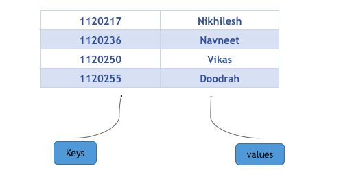
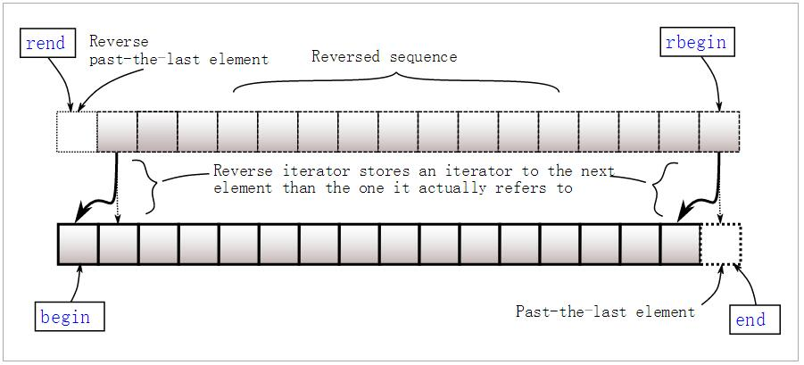

C++中map提供的是一种键值对容器，里面的数据都是成对出现的,如下图：每一对中的第一个值称之为关键字(key)，每个关键字只能在map中出现一次；第二个称之为该关键字的对应值。



# 一、 声明
```c++
//头文件
#include<map>

map<int, string> ID_Name;

// 使用{}赋值是从c++11开始的，因此编译器版本过低时会报错，如visual studio 2012
map<int, string> ID_Name = {
                { 2015, "Jim" },
                { 2016, "Tom" },
                { 2017, "Bob" } };
```

# 二、 插入操作

## 2.1 使用[ ]进行单个插入
```c++
map<int, string> ID_Name;

// 如果已经存在键值2015，则会作赋值修改操作，如果没有则插入
ID_Name[2015] = "Tom";
```

## 2.2 使用insert进行单个和多个插入
insert共有四个重载函数：
```c++
// 插入单个键值对，并返回插入位置和成功标志，插入位置已经存在值时，插入失败
pair<iterator,bool> insert (const value_type& val);

// 在指定位置插入，在不同位置插入效率是不一样的，因为涉及到重排
iterator insert (const_iterator position, const value_type& val);

// 插入多个
void insert (InputIterator first, InputIterator last);

// c++11开始支持，使用列表插入多个   
void insert (initializer_list<value_type> il);
```

下面是具体使用示例：
```c++
#include <iostream>
#include <map>

int main()
{
    std::map<char, int> mymap;

    // 插入单个值
    mymap.insert(std::pair<char, int>('a', 100));
    mymap.insert(std::pair<char, int>('z', 200));

    //返回插入位置以及是否插入成功
    std::pair<std::map<char, int>::iterator, bool> ret;
    ret = mymap.insert(std::pair<char, int>('z', 500));
    if (ret.second == false) {
        std::cout << "element 'z' already existed";
        std::cout << " with a value of " << ret.first->second << '\n';
    }

    //指定位置插入
    std::map<char, int>::iterator it = mymap.begin();
    mymap.insert(it, std::pair<char, int>('b', 300));  //效率更高
    mymap.insert(it, std::pair<char, int>('c', 400));  //效率非最高

    //范围多值插入
    std::map<char, int> anothermap;
    anothermap.insert(mymap.begin(), mymap.find('c'));

    // 列表形式插入
    anothermap.insert({ { 'd', 100 }, {'e', 200} });

    return 0;
}
```

# 三、 取值
Map中元素取值主要有at和[]两种操作，at会做下标检查，而[]不会。
```c++
map<int, string> ID_Name;

//ID_Name中没有关键字2016，使用[]取值会导致插入
//因此，下面语句不会报错，但打印结果为空
cout<<ID_Name[2016].c_str()<<endl;

//使用at会进行关键字检查，因此下面语句会报错
ID_Name.at(2016) = "Bob";
```

# 四、 容量查询
```c++
// 查询map是否为空
bool empty();

// 查询map中键值对的数量
size_t size();

// 查询map所能包含的最大键值对数量，和系统和应用库有关。
// 此外，这并不意味着用户一定可以存这么多，很可能还没达到就已经开辟内存失败了
size_t max_size();

// 查询关键字为key的元素的个数，在map里结果非0即1
size_t count( const Key& key ) const; //
```

# 五、 迭代器
共有八个获取迭代器的函数：**begin, end, rbegin,rend**以及对应的**cbegin, cend, crbegin,crend**。
二者的区别在于，后者一定返回 const_iterator，而前者则根据map的类型返回iterator或者 const_iterator。const情况下，不允许对值进行修改。如下面代码所示：
```c++
map<int,int>::iterator it;
map<int,int> mmap;
const map<int,int> const_mmap;

it = mmap.begin(); //iterator
mmap.cbegin(); //const_iterator

const_mmap.begin(); //const_iterator
const_mmap.cbegin(); //const_iterator
```
返回的迭代器可以进行加减操作，此外，如果map为空，则 begin = end。



# 六、 删除交换

## 6.1 删除
```c++
// 删除迭代器指向位置的键值对，并返回一个指向下一元素的迭代器
iterator erase( iterator pos )

// 删除一定范围内的元素，并返回一个指向下一元素的迭代器
iterator erase( const_iterator first, const_iterator last );

// 根据Key来进行删除， 返回删除的元素数量，在map里结果非0即1
size_t erase( const key_type& key );

// 清空map，清空后的size为0
void clear();
```

## 6.2 交换
```c++
// 就是两个map的内容互换
void swap( map& other );
```

# 七、 顺序比较
```c++
// 比较两个关键字在map中位置的先后
key_compare key_comp() const;
```
示例：
```c++
map<char,int> mymap;
map<char,int>::key_compare mycomp = mymap.key_comp();

mymap['a']=100;
mymap['b']=200;
mycomp('a', 'b');  // a排在b前面，因此返回结果为true
```

# 八、 查找
```c++
// 关键字查询，找到则返回指向该关键字的迭代器，否则返回指向end的迭代器
// 根据map的类型，返回的迭代器为 iterator 或者 const_iterator
iterator find (const key_type& k);
const_iterator find (const key_type& k) const;
```
举例：
```c++
std::map<char,int> mymap;
std::map<char,int>::iterator it;

mymap['a']=50;
mymap['b']=100;
mymap['c']=150;
mymap['d']=200;

it = mymap.find('b');
if (it != mymap.end())
    mymap.erase (it); // b被成功删除
```

# 九、 操作符
operator: == != < <= > >= 
注意 对于==运算符, 只有键值对以及顺序完全相等才算成立。
