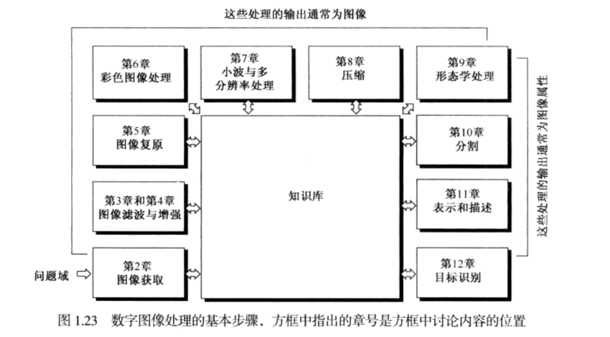

# 教材 
《数字图像处理》第三版

# 数字图像处理的概念
- 图像是一个二维亮度函数f(x,y),(x,y)定义了空间坐标，f(x,y)定义该点的亮度或灰度
- 数字图像是指图像f(x,y)在空间坐标和亮度的数字化。数字图像是由有限的元素组成的，每一个元素都有一个特定的位置和幅值,这些元素称为图像元素或像素。
- 数字图像处理是指借用数字计算机处理数字图像。

# 图像处理的起源
- 数字图像处理最早的应用之一是在报纸业
- 1929年，能够编码15个灰度级的图像
- 现代数字图像处理的历史与数字计算机的发展密切相关。要求非常大的存储和计算能力
- ......

# 数字图像处理的应用
- 天文：星云图
- 医学：X光图像；大脑CT图像；
- 工业生产：集成电路；胶囊；
- 遥感、遥测
- 安全、身份识别

# 数字图像处理的基本步骤
- 1. 第二章 图像获取
- 2. 第三章和第四章 图像增强
- 3. 第五章 图像复原
- 4. 第六章 彩色图像处理(非重点)
- 5. 第七章 小波变换和多分辨率处理(不讲)
- 6. 第八章 图形压缩
- 9. 第九章 形态学图像处理
- 10. 第十章 图像分割
- 11. 第十一章 表示与描述(不讲)
- 12. 第十二章 对象识别(不讲)

# 图像处理系统的部件

